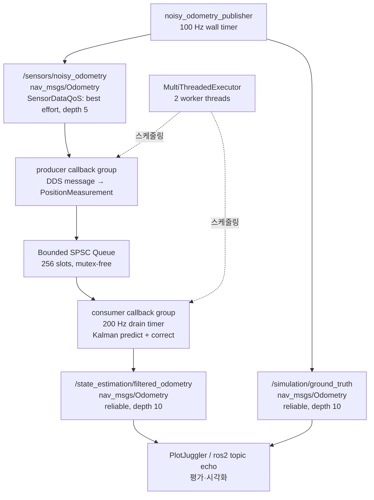

# 2026-09-02 — ROS 2 QoS·SPSC 큐·1D 칼만 필터

> **오늘의 핵심:** 센서 Topic을 발행/구독하는 기초에서 시작해, ROS 2 callback group과 고정 크기 lock-free SPSC 큐로 통신 콜백과 계산 경로를 분리하고, 위치 측정만으로 위치·속도를 추정하는 칼만 필터까지 연결한다.

## 학습 순서 (Reading Order)

1. 이 README의 구조도와 QoS 표로 ROS graph를 먼저 파악한다.
2. [`noisy_odometry_publisher.cpp`](src/noisy_odometry_publisher.cpp)에서 Node, Timer, Publisher, `nav_msgs/Odometry`를 읽는다.
3. [`../../knowledge/sensor_fusion/kalman_filter.md`](../../knowledge/sensor_fusion/kalman_filter.md)에서 predict/correct 수식을 익힌다.
4. [`rt_kalman_fusion.cpp`](src/rt_kalman_fusion.cpp)의 칼만 필터와 SPSC 큐를 수식/메모리 순서 주석과 함께 읽는다.
5. [`../../knowledge/realtime/ros2_realtime_patterns.md`](../../knowledge/realtime/ros2_realtime_patterns.md)로 “낮은 평균 지연”과 “보장된 deadline”의 차이를 정리한다.
6. [`paper_review.md`](paper_review.md)에서 ROS 2가 DDS/QoS/실행기 구조를 택한 이유와 제품 적용 한계를 검토한다.
7. 마지막으로 빌드·실행하고 `ros2 topic echo`, `ros2 topic hz`로 직접 관찰한다.

## 오늘의 세 영역

| 영역 | 학습 내용 | 코드에서 찾을 곳 |
|---|---|---|
| 기초 실무 | Node, Timer, Topic Pub/Sub, 표준 메시지, QoS | `NoisyOdometryPublisher` |
| 심화 및 RT | callback group, 2-thread executor, bounded SPSC queue, atomic acquire/release | `RtKalmanFusionNode`, `BoundedSpscQueue` |
| 알고리즘 | 등속도 모델의 1D Kalman Filter, Q/R/P/K의 의미 | `ConstantVelocityKalmanFilter` |

## 시스템 아키텍처



핵심 경계는 `SUB → QUEUE → FILTER`다. DDS 콜백은 메시지를 작은 값 객체로 복사해 즉시 반환하고, 필터 계산은 별도 콜백에서 수행한다. 큐가 가득 차면 입력을 버려 생산자가 무한정 대기하지 않는다. 단, ROS 2 publish와 DDS 내부 할당까지 포함해 **hard real-time이 보장된다는 뜻은 아니다.**

## QoS를 왜 다르게 쓰는가

- 센서 입력: `SensorDataQoS().keep_last(5)` — 오래된 모든 샘플의 완전 전달보다 최신 샘플과 낮은 지연이 중요하다.
- 추정/참값 출력: `reliable`, depth 10 — 관찰·평가 노드가 결과를 잃지 않는 쪽을 우선한다.
- QoS 호환성 주의: reliable subscriber는 best-effort publisher와 연결되지 않을 수 있다. 양 끝의 reliability를 함께 확인한다.

## 칼만 필터 직관

상태는 `x=[p, v]^T`이고, 짧은 시간 `dt` 동안 속도가 일정하다고 보면 다음 위치는 `p + v*dt`다.

```text
예측: x⁻ = F x,       P⁻ = F P Fᵀ + Q
보정: y  = z - Hx⁻,   K  = P⁻Hᵀ(HP⁻Hᵀ + R)⁻¹
      x  = x⁻ + Ky
```

- `Q`가 크면 운동 모델을 덜 신뢰하여 측정 변화에 빨리 반응한다.
- `R`이 크면 센서를 덜 신뢰하여 결과가 더 부드럽지만 늦게 따라간다.
- 한 번에 하나만 바꾸고 truth 대비 오차와 지연을 함께 관찰한다.

## 빌드와 실행

Ubuntu + ROS 2 Humble/Jazzy 계열의 source가 완료된 셸을 가정한다. 이 날짜 폴더 자체가 하나의 `ament_cmake` 패키지다.

```bash
mkdir -p ~/robotics_ws/src
ln -s "$(pwd)/daily_robotics/2026-09-02" ~/robotics_ws/src/daily_robotics_2026_09_02
cd ~/robotics_ws
colcon build --packages-select daily_robotics_2026_09_02 --symlink-install
source install/setup.bash
```

터미널 1:

```bash
ros2 run daily_robotics_2026_09_02 noisy_odometry_publisher
```

터미널 2:

```bash
ros2 run daily_robotics_2026_09_02 rt_kalman_fusion
```

터미널 3:

```bash
ros2 topic hz /sensors/noisy_odometry
ros2 topic echo /state_estimation/filtered_odometry --once
```

파라미터 실험 예:

```bash
ros2 run daily_robotics_2026_09_02 noisy_odometry_publisher \
  --ros-args -p noise_stddev:=0.7 -p motion_frequency_hz:=0.35

ros2 run daily_robotics_2026_09_02 rt_kalman_fusion \
  --ros-args -p acceleration_variance:=5.0
```

## 자동 검증 기록

- 검증 환경: 공식 `ros:jazzy-ros-base` 컨테이너, GCC 13.3, `rmw_fastrtps_cpp`
- `colcon build --packages-select daily_robotics_2026_09_02`: 성공
- 두 노드 동시 실행 및 `/sensors/noisy_odometry` endpoint 연결: publisher 1 / subscriber 1 확인
- `/state_estimation/filtered_odometry` 샘플 수신: 위치·속도·공분산 출력 확인
- 저장소의 `build/`, `install/`, `log/`: `.gitignore`에 등록하고 컨테이너 밖에는 생성하지 않음

## 실습 체크리스트

- [ ] `ros2 node list`에 두 노드가 보이는가?
- [ ] `ros2 topic info -v /sensors/noisy_odometry`에서 QoS가 기대와 같은가?
- [ ] 노이즈 표준편차를 두 배로 했을 때 raw/filtered 위치의 차이는 어떻게 변하는가?
- [ ] `acceleration_variance`를 0.1과 10.0으로 바꾸면 추종성과 평활성은 어떻게 달라지는가?
- [ ] `kQueueCapacity`를 매우 작게 했을 때 drop 정책이 시스템 안정성에 어떤 영향을 주는가?
- [ ] Linux에서 `cyclictest`로 커널 jitter를 측정하고 평균이 아니라 worst case를 기록했는가?

## RT 관점의 다음 개선

1. PREEMPT_RT 커널에서 worker thread의 `SCHED_FIFO` 우선순위와 CPU affinity를 설정한다.
2. `mlockall`과 prefault로 page fault를 억제하고 전/후 `getrusage`로 검증한다.
3. loaned message 지원 여부를 RMW별로 확인해 publish 경로 복사/할당을 줄인다.
4. `ros2_tracing`으로 callback 시작·종료와 deadline miss의 최악값을 측정한다.
5. 센서 timestamp 역행을 clamp로 숨기지 말고 진단 Topic/metric으로 노출한다.

## 참고 자료

- [ROS 2 C++ publisher/subscriber tutorial](https://docs.ros.org/en/humble/Tutorials/Beginner-Client-Libraries/Writing-A-Simple-Cpp-Publisher-And-Subscriber.html)
- [ROS 2 executors and callback groups](https://docs.ros.org/en/rolling/Concepts/Intermediate/About-Executors.html)
- [ROS 2 QoS concepts](https://docs.ros.org/en/rolling/Concepts/Intermediate/About-Quality-of-Service-Settings.html)
- [ROS 2 real-time systems design article](https://design.ros2.org/articles/realtime_background.html)
- [ROS 2 design, architecture, and uses in the wild (arXiv)](https://arxiv.org/abs/2211.07752)
