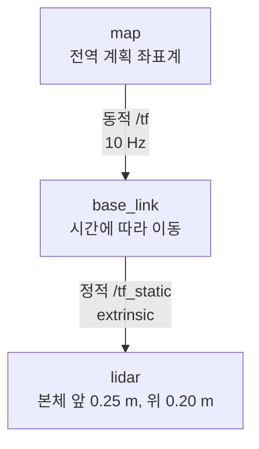
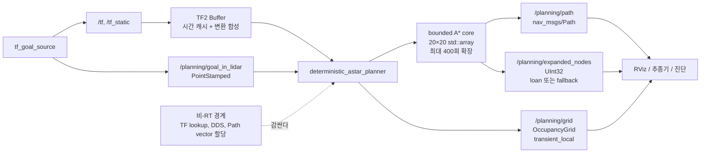

# 2026-09-03 — TF2·결정론적 메모리·A* 경로계획

> **오늘의 핵심:** LiDAR 좌표의 목표점을 TF2로 `map` 좌표에 투영하고, 고정 크기 배열 기반 A*로 장애물을 우회하는 경로를 만든다. 탐색 메모리 상한, 가변 길이 메시지의 비-RT 경계, RMW별 loaned-message fallback을 함께 구분한다.

## 학습 순서 (Reading Order)

1. 이 README의 TF tree와 ROS graph를 보고 데이터가 어느 좌표계·스레드 경계를 지나는지 파악한다.
2. [`../../knowledge/kinematics/tf2_coordinate_frames.md`](../../knowledge/kinematics/tf2_coordinate_frames.md)에서 `target ← source` 변환과 timestamp 원칙을 익힌다.
3. [`src/tf_goal_source.cpp`](src/tf_goal_source.cpp)에서 동적/정적 TF broadcaster와 `PointStamped`를 읽는다.
4. [`../../knowledge/planning/astar.md`](../../knowledge/planning/astar.md)에서 `f(n)=g(n)+h(n)`과 admissible/consistent heuristic을 이해한다.
5. [`src/deterministic_astar_planner.cpp`](src/deterministic_astar_planner.cpp)의 TF 변환, 배열 기반 A*, Path 발행을 수식 주석과 연결한다.
6. [`../../knowledge/realtime/deterministic_memory.md`](../../knowledge/realtime/deterministic_memory.md)에서 bounded memory와 loaned message의 보장 범위를 정리한다.
7. [`paper_review.md`](paper_review.md)에서 1968년 A* 근간 논문과 1972년 정정의 실무 의미를 검토한다.
8. 빌드·실행 후 TF tree, occupancy grid, path, RMW loan 지원 여부를 직접 관찰한다.

## 오늘의 세 영역

| 영역 | 학습 내용 | 코드에서 찾을 곳 |
|---|---|---|
| 기초 실무 | TF2 broadcaster/listener, 정적·동적 frame, `PointStamped`, timestamp | `TfGoalSource`, `on_goal()` |
| 심화 및 RT | 고정 배열, 유한 탐색 상한, RT/비-RT 경계, loaned message와 fallback | `run_astar()`, `publish_path()`, `publish_expansion_count()` |
| 알고리즘 | 4-connected A*, Manhattan heuristic, parent 역추적 | `heuristic()`, `run_astar()` |

## TF Tree



`map ← base_link ← lidar`의 두 변환을 TF2가 합성한다. LiDAR 점 `p_lidar`는 다음 식으로 `map`에 들어온다.

```text
p_map = R_map_lidar · p_lidar + t_map_lidar
R_map_lidar = R_map_base · R_base_lidar
```

## ROS Graph와 RT 경계



핵심은 “배열을 썼으니 전체 노드가 hard real-time”이라고 착각하지 않는 것이다. `run_astar()`의 작업 공간과 반복 상한은 제한했지만, TF buffer 조회, logging, `nav_msgs/Path::poses`, DDS publish에는 동적 할당과 middleware jitter가 남아 있다. 제품에서는 planner를 비-RT thread에 두고, 고정 크기 setpoint만 고우선순위 제어 loop로 넘긴다.

## A* 직관과 오늘의 구현

```text
평가 함수: f(n) = g(n) + h(n)
g(n): 시작점에서 n까지 이미 지불한 비용
h(n): n에서 목표까지 남았다고 추정한 비용
```

- 상하좌우 이동 비용이 모두 1이므로 `h=|dx|+|dy|`인 Manhattan 거리는 실제 최단 비용을 넘지 않는다.
- admissible `h`는 최단 경로 발견을 보장하고, consistent `h`는 닫은 노드를 다시 열지 않는 구현을 정당화한다.
- 오늘 구현은 `std::priority_queue` 대신 400개 open 상태를 선형 스캔한다. 큰 지도에는 느리지만 메모리와 최악 반복 횟수를 읽기 쉽다.
- 벽에는 한 칸의 문이 있다. 시작과 목표를 잇는 직선이 아니라 문을 통과하는 경로가 나와야 한다.

## 빌드와 실행

Ubuntu + ROS 2 Jazzy 환경에서 이 날짜 폴더 자체를 하나의 `ament_cmake` 패키지로 빌드한다.

```bash
mkdir -p ~/robotics_ws/src
ln -s "$(pwd)/daily_robotics/2026-09-03" ~/robotics_ws/src/daily_robotics_2026_09_03
cd ~/robotics_ws
colcon build --packages-select daily_robotics_2026_09_03 --symlink-install
source install/setup.bash
ros2 launch daily_robotics_2026_09_03 daily_demo.launch.py
```

다른 터미널에서:

```bash
source ~/robotics_ws/install/setup.bash
ros2 run tf2_tools view_frames
ros2 topic echo /planning/path --once
ros2 topic echo /planning/expanded_nodes --once
ros2 topic info -v /planning/grid
```

RViz2에서는 Fixed Frame을 `map`으로 두고 `Map` display에 `/planning/grid`, `Path` display에 `/planning/path`를 선택한다.

목표를 바꾸는 실험:

```bash
ros2 launch daily_robotics_2026_09_03 daily_demo.launch.py

# launch 대신 노드를 따로 실행할 때 LiDAR 기준 목표를 변경할 수 있다.
ros2 run daily_robotics_2026_09_03 tf_goal_source \
  --ros-args -p goal_x_in_lidar:=9.0 -p goal_y_in_lidar:=1.0
```

## 자체 검증 기록

- 검증 환경: 공식 `ros:jazzy-ros-base` 컨테이너, GCC 13.3, `rmw_fastrtps_cpp`
- `colcon build --packages-select daily_robotics_2026_09_03`: 경고 없이 성공
- 런타임: 두 노드와 TF listener가 실행되고 `map → base_link → lidar` 합성 변환 수신 성공
- `/planning/path`: 벽의 문을 통과하는 17셀 경로 샘플 수신
- `/planning/expanded_nodes`: `data: 17` 수신, 해당 Fast DDS 환경의 publisher loan 지원 `true`
- 빌드 산출물은 컨테이너 내부 임시 workspace에만 만들고 저장소에는 생성하지 않는다.

## 실습 체크리스트

- [ ] `view_frames`에서 모든 frame이 하나의 loop 없는 tree로 연결되는가?
- [ ] `goal_in_lidar`를 `map`으로 바꾼 값이 로봇 yaw 변화에 따라 합리적으로 변하는가?
- [ ] 장애물 문을 닫았을 때 `no route`가 나오며 배열 범위를 넘지 않는가?
- [ ] 휴리스틱을 0으로 바꾸면 Dijkstra처럼 같은 최단 경로를 찾되 확장 노드 수가 늘어나는가?
- [ ] 휴리스틱에 2를 곱해 inadmissible하게 만들면 더 빠르지만 최단성 보장이 사라짐을 설명할 수 있는가?
- [ ] 실행 로그의 `publisher loan support`가 RMW를 바꿀 때 달라지는가?
- [ ] Path 생성과 logging을 고우선순위 제어 thread에서 제거해야 하는 이유를 말할 수 있는가?

## 참고 자료

- [ROS 2 Jazzy tf2_ros API](https://docs.ros.org/en/jazzy/p/tf2_ros/)
- [ROS 2 TF2 broadcaster tutorial](https://docs.ros.org/en/kilted/Tutorials/Intermediate/Tf2/Writing-A-Tf2-Broadcaster-Cpp.html)
- [ROS 2 TF2 listener tutorial](https://docs.ros.org/en/kilted/Tutorials/Intermediate/Tf2/Writing-A-Tf2-Listener-Cpp.html)
- [ROS 2 zero-copy via loaned messages design](https://design.ros2.org/articles/zero_copy.html)
- [ROS 2 real-time systems design](https://design.ros2.org/articles/realtime_proposal.html)
- [Hart, Nilsson, Raphael, A* 논문 DOI](https://doi.org/10.1109/TSSC.1968.300136)
- [A* 논문 공개 PDF](https://people.stfx.ca/jdelamer/courses/csci-564/_downloads/b2220c66675ddde471ca1795147b8e86/A_Formal_Basis_for_the_Heuristic_Determination_of_Minimum_Cost_Paths.pdf)
- [1972년 저자 정정 PDF](https://cse.sc.edu/~MGV/csce580f11/astarHNR1972.pdf)
