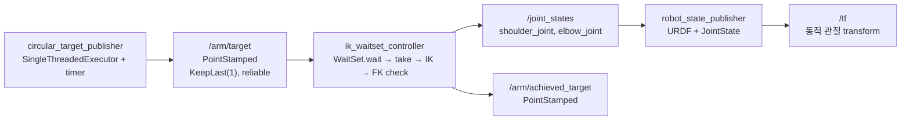
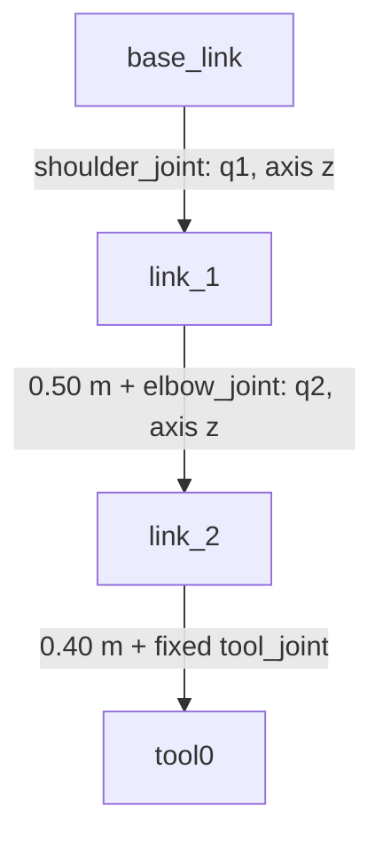

# 2026-09-04 — URDF, WaitSet, 평면 2R 역기구학

> **오늘의 핵심:** 두 링크 로봇을 URDF로 모델링하고, `rclcpp::WaitSet`으로 목표 메시지를 직접 꺼내 닫힌형 역기구학을 계산한 뒤 `/joint_states`와 TF로 연결한다. 마지막에는 순기구학 오차로 해를 검증한다.

## 학습 순서 (Reading Order)

1. 이 README의 구조도와 핵심 개념을 읽는다.
2. [`urdf/two_link_arm.urdf`](urdf/two_link_arm.urdf)에서 link/joint/axis/origin 관계를 확인한다.
3. [`src/circular_target_publisher.cpp`](src/circular_target_publisher.cpp)로 기본 Topic·QoS·`spin` 흐름을 익힌다.
4. [`src/ik_waitset_controller.cpp`](src/ik_waitset_controller.cpp)에서 WaitSet 수동 실행과 IK 수식-코드 연결을 따라간다.
5. 빌드·실행 후 `/arm/target`, `/joint_states`, `/tf`, `/arm/achieved_target`을 관찰한다.
6. [`paper_review.md`](paper_review.md)에서 2025년 6-DOF 해석 IK 연구를 읽고 2R 예제와의 차이를 정리한다.

## 오늘의 세 영역

| 영역 | 내용 | 완료 기준 |
|---|---|---|
| 기초 실무 | URDF link/joint, `JointState`, `robot_state_publisher`, TF tree | `base_link → link_1 → link_2 → tool0` 확인 |
| 심화·RT | executor를 우회한 `rclcpp::WaitSet`, KeepLast(1), 선할당의 경계 | readiness 확인 후 `take()`하는 흐름 설명 |
| 알고리즘 | 2R 평면 팔의 닫힌형 IK와 FK 잔차 검증 | 목표-도달 오차가 부동소수점 수준인지 확인 |

## 통신 및 실행 구조





## 1. 기초 실무 — URDF에서 TF까지

URDF는 로봇을 **link(강체)**와 **joint(강체 사이 운동 제약)**의 트리로 표현한다. 이 예제에서 `shoulder_joint`와 `elbow_joint`는 z축 회전 관절이며, `tool_joint`는 두 번째 링크 끝을 나타내는 고정 관절이다.

`robot_state_publisher`는 다음 두 입력을 결합한다.

- `robot_description`: 어떤 link와 joint가 어떤 `origin`, `axis`로 연결되는가
- `/joint_states`: 현재 `shoulder_joint=q1`, `elbow_joint=q2`가 얼마인가

결과적으로 가동 관절은 `/tf`, 고정 관절은 `/tf_static`에 게시된다. `JointState.name[i]`와 URDF의 joint 이름이 다르면 해당 관절은 갱신되지 않는다는 점이 흔한 실수다.

## 2. 심화·RT — 왜 WaitSet인가

일반적인 `rclcpp::spin(node)`은 executor가 준비된 콜백을 선택하고 호출한다. `WaitSet`은 더 낮은 수준에서 subscription/timer/service의 **준비 상태(readiness)**를 기다리고, 애플리케이션이 `take()` 순서와 실행 조건을 정한다.

오늘 코드의 실행 주기는 다음과 같다.

1. `wait_set.wait(1s)`로 데이터 도착 또는 timeout을 기다린다.
2. 첫 subscription이 ready인지 확인한다.
3. `target_subscription->take(...)`로 미들웨어 큐에서 직접 메시지를 꺼낸다.
4. IK → FK 검증 → 두 publisher 순서로 처리한다.

이 방식은 여러 센서가 모두 준비됐을 때만 계산하거나, 입력 처리 순서를 고정할 때 유용하다. 그러나 **WaitSet 사용 자체가 hard real-time을 보장하지는 않는다.** DDS 구현, 로깅, 직렬화, OS 스케줄러, page fault, 동적 할당을 함께 측정하고 통제해야 한다. `JointState` 배열을 루프 전에 잡은 것은 애플리케이션 레벨 할당을 줄이는 한 단계일 뿐이다.

## 3. 알고리즘 — 평면 2R 닫힌형 IK

순기구학은 다음과 같다.

\[
x=L_1\cos q_1 + L_2\cos(q_1+q_2),\qquad
y=L_1\sin q_1 + L_2\sin(q_1+q_2)
\]

코사인 법칙으로 팔꿈치 각을 먼저 구한다.

\[
c_2=\cos q_2=\frac{x^2+y^2-L_1^2-L_2^2}{2L_1L_2},\qquad
s_2=\pm\sqrt{1-c_2^2}
\]

\[
q_2=\operatorname{atan2}(s_2,c_2),\qquad
q_1=\operatorname{atan2}(y,x)-\operatorname{atan2}(L_2s_2,L_1+L_2c_2)
\]

`±`는 두 IK 분기다. 이 실습은 `positive_elbow_branch` 파라미터로 부호를 고른다. 목표 반경이 `|L1-L2| ≤ r ≤ L1+L2`를 벗어나면 실수해가 없으며, 코드는 `std::nullopt`로 실패를 명시한다. 계산 후 같은 순기구학을 적용한 `position_error`는 해 검증 장치다.

## 빌드와 실행

ROS 2 Jazzy 환경에서 저장소 루트를 workspace로 사용한다.

```bash
colcon build --packages-select daily_robotics_2026_09_04 --event-handlers console_direct+
source install/setup.bash
ros2 launch daily_robotics_2026_09_04 daily_demo.launch.py
```

다른 터미널에서:

```bash
source install/setup.bash
ros2 topic echo /arm/target geometry_msgs/msg/PointStamped --once
ros2 topic echo /joint_states sensor_msgs/msg/JointState --once
ros2 topic echo /arm/achieved_target geometry_msgs/msg/PointStamped --once
ros2 run tf2_ros tf2_echo base_link tool0
```

정상이라면 노드 로그의 `FK error`는 대략 `1e-16 m` 부근이고, TF의 `tool0` x/y는 `/arm/achieved_target`과 일치한다.

## 직접 해볼 실험

1. `positive_elbow_branch`를 `False`로 바꾸고 같은 목표에 대한 두 관절 구성을 비교한다.
2. 목표를 `(1.0, 0.0)`으로 보내 도달 불가 경고가 나는지 확인한다.
3. 두 개의 센서 subscription을 WaitSet에 추가하고 “둘 다 ready일 때만 계산”하는 trigger를 설계한다.
4. 루프 안의 `RCLCPP_INFO`를 끈 전후로 `ros2_tracing` 지연 분포를 비교한다.

## 참고 자료

- [ROS 2 Jazzy: Using URDF with robot_state_publisher](https://docs.ros.org/en/jazzy/Tutorials/Intermediate/URDF/Using-URDF-with-Robot-State-Publisher.html)
- [robot_state_publisher package documentation](https://docs.ros.org/en/jazzy/p/robot_state_publisher/)
- [ROS 2 Jazzy WaitSet examples](https://docs.ros.org/en/ros2_packages/jazzy/api/examples_rclcpp_wait_set/)
- [rclcpp WaitSetTemplate API](https://docs.ros.org/en/jazzy/p/rclcpp/generated/classrclcpp_1_1WaitSetTemplate.html)
- [ROS 2 examples: WaitSet subscriber patterns](https://github.com/ros2/examples/tree/jazzy/rclcpp/wait_set)
- [REP-103: Standard Units and Coordinate Conventions](https://www.ros.org/reps/rep-0103.html)
- [Okazaki et al., 2025, arXiv:2509.00823](https://arxiv.org/abs/2509.00823)

## 누적 지식 노트

- [`../../knowledge/kinematics/urdf_and_joint_states.md`](../../knowledge/kinematics/urdf_and_joint_states.md)
- [`../../knowledge/kinematics/inverse_kinematics.md`](../../knowledge/kinematics/inverse_kinematics.md)
- [`../../knowledge/realtime/rclcpp_waitset.md`](../../knowledge/realtime/rclcpp_waitset.md)
