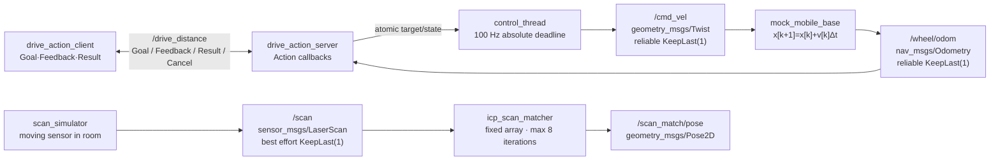
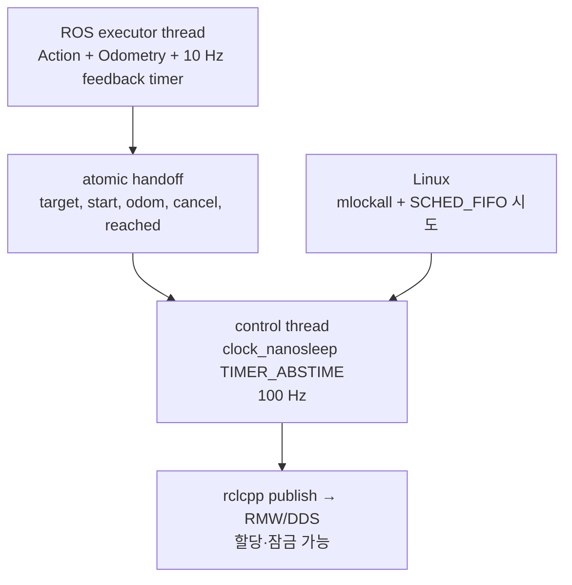

# 2026-09-05 — ROS 2 Action, PREEMPT_RT 경계, 2D ICP

> **오늘의 핵심:** 장시간 이동 명령을 ROS 2 Action의 Goal·Feedback·Result·Cancel로 모델링하고, 비실시간 Action 콜백과 100 Hz 제어 루프를 원자 상태 전달로 분리한다. 동시에 연속 `LaserScan`을 고정 반복 2D ICP로 정합해 센서 프레임 사이의 상대 SE(2) 자세를 추정한다.

## 학습 순서 (Reading Order)

1. 아래 통신 구조에서 Action 경로와 scan matching 경로를 분리해 읽는다.
2. [`action/DriveDistance.action`](action/DriveDistance.action)에서 Goal/Result/Feedback의 세 구역을 확인한다.
3. [`src/drive_action_client.cpp`](src/drive_action_client.cpp)와 [`src/drive_action_server.cpp`](src/drive_action_server.cpp)에서 Action 수명주기를 따라간다.
4. 서버의 `control_loop()`에서 절대 시각 sleep, `mlockall`, `SCHED_FIFO`, atomic handoff의 목적과 한계를 읽는다.
5. [`src/scan_simulator.cpp`](src/scan_simulator.cpp)의 좌표 변환 뒤 [`src/icp_scan_matcher.cpp`](src/icp_scan_matcher.cpp)의 최근접점·SE(2) 최소제곱을 수식과 연결한다.
6. 빌드·실행해 Action Result와 `/scan_match/pose`를 확인한다.
7. [`paper_review.md`](paper_review.md)에서 ICP 근간 논문의 기여와 실무 한계를 정리한다.

대화형 고해상도 구조도는 [`architecture.html`](architecture.html), 재생성 가능한 원본은 [`architecture.archify.json`](architecture.archify.json)이다.

## 오늘의 세 영역

| 영역 | 내용 | 완료 기준 |
|---|---|---|
| 기초 실무 | ROS 2 custom Action, Client/Server, Goal·Feedback·Result·Cancel | 0.30 m Goal이 약 0.295 m에서 성공 Result 반환 |
| 심화·RT | PREEMPT_RT, `SCHED_FIFO`, memory locking, 절대 deadline, RT/비 RT 경계 | 권한 성공/실패를 해석하고 DDS publish가 남긴 한계를 설명 |
| 알고리즘 | point-to-point 2D ICP, 최근접 대응, SE(2) 닫힌형 최소제곱 | 360 대응쌍과 유한한 상대 자세·RMSE 확인 |

## ROS 통신 구조



## 실행 문맥과 실시간 경계



핵심은 “RT 스레드를 만들었다”가 아니라 **어디까지 지연 상한을 통제했는가**다. 이 예제는 Goal 관리용 mutex와 Action 객체를 executor 쪽에 남기고, RT 루프에는 고정 크기 산술과 atomic 값만 넘긴다. 그러나 RT 루프가 `rclcpp::Publisher::publish()`를 직접 호출하므로 RMW/DDS 내부 할당·직렬화·잠금의 상한은 아직 보장하지 않는다. 제품에서는 RT 루프→lock-free queue→비 RT publisher 또는 검증된 loaned message 경로를 측정해 선택해야 한다.

## 1. 기초 실무 — Topic, Service, Action을 언제 쓰는가

- **Topic**: 센서나 상태처럼 연속 스트림을 여러 구독자에게 보낼 때 적합하다. 완료 응답과 취소 의미는 없다.
- **Service**: 즉시 끝나는 질의/설정에 적합하다. 긴 이동을 Service 콜백 안에서 기다리면 executor를 막기 쉽다.
- **Action**: 수 초 이상 걸리는 작업에 Goal 수락/거부, 중간 Feedback, Cancel, 최종 Result가 필요할 때 적합하다.

`DriveDistance.action`은 `---` 두 줄로 세 영역을 나눈다.

```text
distance_m, max_speed_mps           # Goal
---
reached, final_distance_m, message  # Result
---
distance_traveled_m, remaining_m    # Feedback
```

서버는 동시에 하나의 Goal만 허용한다. `compare_exchange_strong`으로 자리를 예약하므로 거의 동시에 두 Goal이 와도 하나만 수락된다. `handle_accepted()`는 목표값을 atomic에 기록하고 RT 루프를 활성화한다. 10 Hz timer는 진행률을 게시하고 `succeed()` 또는 `canceled()`로 Goal을 끝낸다.

## 2. 심화·RT — PREEMPT_RT를 코드와 연결하기

PREEMPT_RT는 커널의 많은 잠금과 인터럽트 처리 경로를 선점 가능하게 바꿔, 높은 우선순위 작업이 runnable이 된 뒤 실제 실행될 때까지의 지연을 줄인다. 애플리케이션에서는 다음 조치가 함께 필요하다.

1. `pthread_setschedparam(..., SCHED_FIFO, priority)`로 제어 스레드의 정책을 요청한다.
2. `mlockall(MCL_CURRENT | MCL_FUTURE)`와 stack prefault로 제어 중 major/minor page fault 가능성을 줄인다.
3. `clock_nanosleep(..., TIMER_ABSTIME, ...)`로 매 주기 deadline을 절대 시각에 맞춰 누적 drift를 막는다.
4. 루프 안에서 동적 할당, 파일 I/O, 무제한 lock 대기, 로그 출력을 피한다.
5. deadline miss의 정의와 안전 동작을 정한 뒤 `cyclictest`, `ros2_tracing`, 애플리케이션 timestamp로 분포를 측정한다.

일반 컨테이너에서는 다음 경고가 정상적으로 나올 수 있다.

```text
mlockall failed (Cannot allocate memory): continuing without locked memory
SCHED_FIFO priority 60 failed (Operation not permitted): using normal scheduler
```

이는 코드가 RT가 됐다는 뜻도, 고장났다는 뜻도 아니다. 컨테이너에 `CAP_SYS_NICE`, 충분한 `memlock`, RT runtime을 주고 호스트 커널이 PREEMPT_RT인지 별도로 확인해야 한다. 권한만 줬다고 deadline이 보장되는 것도 아니므로 부하 조건에서 최악 지연을 측정해야 한다.

오늘의 속도 제어식은 다음과 같다.

\[
e = d_{target} - (x-x_0),\qquad
v = \operatorname{sign}(d_{target})\min(v_{max}, 2|e|)
\]

멀리서는 `v_max`로 포화되고 가까이서는 비례 감속한다. `|e|≤0.005 m`이면 0 속도를 게시하고 성공 상태를 executor 쪽에 전달한다.

## 3. 알고리즘 — 2D point-to-point ICP

현재 scan 점 \(q_i\)를 이전 scan 점 \(p_i\)에 정합하는 목표는 다음 최소제곱 문제다.

\[
(R^*,t^*)=\arg\min_{R\in SO(2),t\in\mathbb{R}^2}
\sum_i \lVert p_i-(Rq_i+t)\rVert^2
\]

ICP 한 반복은 다음 순서다.

1. 현재 추정 변환으로 각 \(q_i\)를 옮긴다.
2. 이전 점군에서 거리 0.35 m 이내의 최근접점 \(p_i\)를 찾는다.
3. 대응쌍 중심 \(\bar q,\bar p\)를 계산한다.
4. 2D 회전과 이동의 닫힌형 해를 계산한다.

\[
\theta=\operatorname{atan2}\left(
\sum_i(q_{ix}p_{iy}-q_{iy}p_{ix}),
\sum_i(q_{ix}p_{ix}+q_{iy}p_{iy})
\right)
\]

\[
t=\bar p-R(\theta)\bar q
\]

5. 변화량이 작으면 조기 종료하고, 아니면 최대 8회까지만 반복한다.

`std::array<Point2, 720>`을 사용해 알고리즘 내부 heap 할당과 입력 크기를 제한했다. 다만 최근접점 탐색은 전수 비교라 \(O(N^2)\)이고, ROS `LaserScan` 메시지와 publish 경로까지 할당이 없는 것은 아니다. 실무에서는 kd-tree, voxel/downsample, correspondence rejection, point-to-line 오차, 강건 손실, 좋은 초기값을 검토한다.

## 빌드와 실행

ROS 2 Jazzy workspace 루트에서:

```bash
colcon build --packages-select daily_robotics_2026_09_05 --event-handlers console_direct+
source install/setup.bash
ros2 launch daily_robotics_2026_09_05 daily_demo.launch.py
```

다른 터미널에서 인터페이스와 출력 확인:

```bash
source install/setup.bash
ros2 interface show daily_robotics_2026_09_05/action/DriveDistance
ros2 action info /drive_distance
ros2 topic echo /wheel/odom nav_msgs/msg/Odometry --once
ros2 topic echo /scan_match/pose geometry_msgs/msg/Pose2D --once
```

2026-09-05 검증에서는 GCC 13.3/ROS 2 Jazzy로 경고 없이 빌드됐다. 통합 실행 결과는 다음 범위였다.

- Action: `distance=0.300 m`, `max_speed=0.150 m/s` Goal 수락
- Result: `reached=true`, `final≈0.295 m`, 5 mm 허용오차 성공
- ICP: 360 대응쌍, 프레임별 유한한 `Pose2D`, `RMSE≈0.006~0.010 m`
- RT 권한: 일반 컨테이너에서는 memory lock과 `SCHED_FIFO`가 거부되어 명시적 폴백

## 직접 해볼 실험

1. `drive_action_client.cpp`에서 음수 거리를 보내 후진 Goal의 부호와 종료 조건을 확인한다.
2. `ros2 action send_goal`의 `--feedback` 옵션으로 Goal을 보내고 중간에 cancel한다.
3. 컨테이너/호스트 RT 권한을 설정하기 전후에 제어 주기의 wake-up jitter histogram을 비교한다.
4. ICP 최대 대응 거리를 0.10/0.70 m로 바꾸고 대응쌍 수와 RMSE, 오정합을 비교한다.
5. 현재 \(O(N^2)\) 최근접점 탐색을 kd-tree로 교체하되, build/update 비용과 메모리 할당도 함께 측정한다.
6. 방의 대칭 구조에 비대칭 landmark를 추가해 회전 추정이 어떻게 안정되는지 확인한다.

## 참고 자료

- [ROS 2 Jazzy: Topics, Services, Actions의 선택 기준](https://docs.ros.org/en/jazzy/How-To-Guides/Topics-Services-Actions.html)
- [ROS 2 C++ Action Server/Client 튜토리얼](https://docs.ros.org/en/ros2_documentation/rolling/Tutorials/Intermediate/Writing-an-Action-Server-Client/Cpp.html)
- [ROS 2 Jazzy action_tutorials_cpp API](https://docs.ros.org/en/jazzy/p/action_tutorials_cpp/)
- [ROS 2 Real-time 시스템 구현 제안](https://design.ros2.org/articles/realtime_proposal.html)
- [Linux kernel: PREEMPT_RT 동작 원리](https://docs.kernel.org/core-api/real-time/theory.html)
- [Besl & McKay, 1992, A Method for Registration of 3-D Shapes](https://doi.org/10.1109/34.121791)

## 누적 지식 노트

- [`../../knowledge/ros2/actions.md`](../../knowledge/ros2/actions.md)
- [`../../knowledge/realtime/preempt_rt_control_loop.md`](../../knowledge/realtime/preempt_rt_control_loop.md)
- [`../../knowledge/slam/icp_scan_matching.md`](../../knowledge/slam/icp_scan_matching.md)
