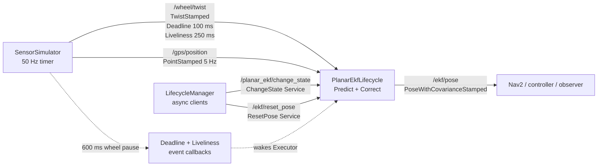
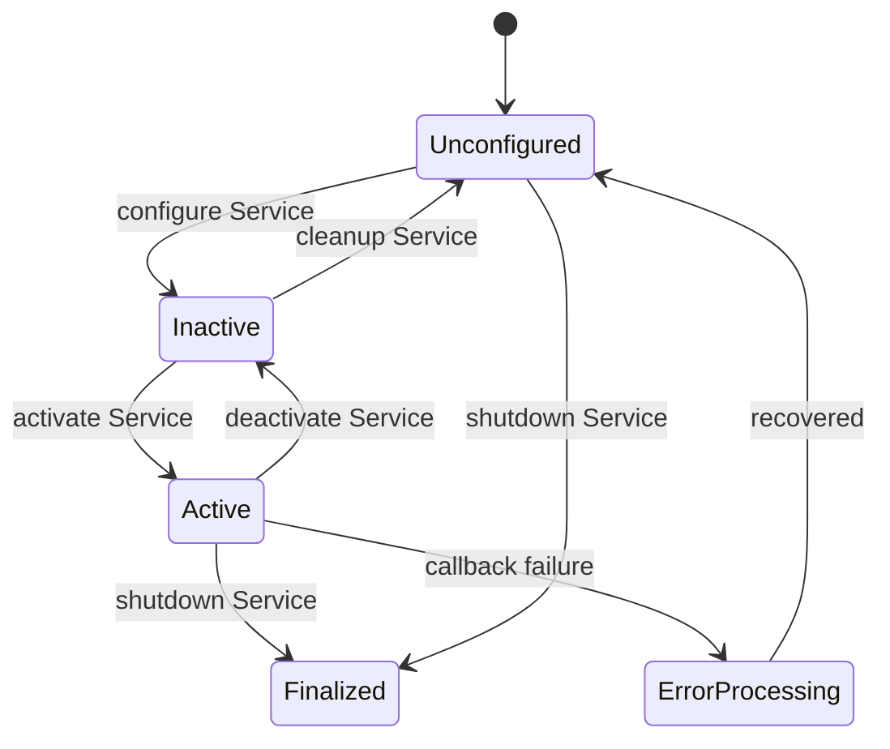

# 2026-09-06 — ROS 2 Service·Lifecycle, QoS 감시, 평면 EKF

오늘은 **짧은 요청/응답에는 Service**, **안전한 기동 순서에는 Lifecycle**, **센서 통신 이상에는 Deadline/Liveliness**, **비선형 이동로봇 위치 추정에는 EKF**를 적용한다. 하나씩 외우는 대신 “센서 준비 → 추정기 활성화 → 통신 이상 감시 → 즉시 측정 보정”이라는 실제 제품 흐름으로 연결한다.

## 학습 순서 (Reading Order)

1. 이 README의 통신 구조와 Lifecycle 상태도를 보고 전체 흐름을 잡는다.
2. [`srv/ResetPose.srv`](srv/ResetPose.srv)에서 Service의 Request/Response 경계를 확인한다.
3. [`src/lifecycle_manager.cpp`](src/lifecycle_manager.cpp)에서 비동기 Service client와 configure→activate 순서를 읽는다.
4. [`src/sensor_simulator.cpp`](src/sensor_simulator.cpp)에서 Deadline 100 ms, Liveliness lease 250 ms와 장애 주입을 읽는다.
5. [`src/lifecycle_ekf_node.cpp`](src/lifecycle_ekf_node.cpp)에서 EKF Predict→Correct→Joseph form을 수식과 코드로 연결한다.
6. [`paper_review.md`](paper_review.md)에서 2025 MSCKF 즉시 업데이트 논문이 “측정을 언제 반영할 것인가”를 어떻게 다루는지 읽는다.
7. 빌드와 통합 실행 후 QoS 이벤트, Lifecycle 상태, `/ekf/pose`를 직접 관찰한다.

## 오늘의 세 축

| 영역 | 핵심 질문 | 오늘의 답 |
|---|---|---|
| 기초 실무 | Topic 대신 Service는 언제 쓰는가? | 즉시 끝나는 상태 조회/재설정처럼 결과가 필요한 짧은 RPC에 쓴다. |
| 심화·RT | 센서 프로세스가 늦거나 죽은 것을 어떻게 구분하는가? | Deadline은 샘플 간격, Liveliness는 발행자 생존 계약으로 감시한다. |
| 알고리즘 | 속도 적분의 drift를 절대 위치로 어떻게 줄이는가? | 비선형 운동 모델을 EKF로 예측하고 GPS가 올 때마다 즉시 보정한다. |

## 시스템 아키텍처



연속 센서 데이터는 Topic, configure/activate와 reset은 Service다. `SensorSimulator`가 5초마다 600 ms 동안 `/wheel/twist` 게시와 `assert_liveliness()`를 멈추면, 구독자는 약 100 ms 이후 Deadline 위반을 보고하고 약 250 ms 이후 발행자 비생존 전이를 보고한다. 두 이벤트는 같은 장애를 다른 의미와 시간축으로 관찰한다.

## Lifecycle 상태도



- `UNCONFIGURED`: 생성자만 실행되며 EKF 통신 자원은 아직 없다.
- `INACTIVE`: `on_configure()`가 고정 크기 행렬, 구독, Service, LifecyclePublisher를 준비했지만 출력은 금지된다.
- `ACTIVE`: 센서 콜백이 상태를 갱신하고 `/ekf/pose`를 게시한다.
- `LifecycleManager`: 표준 `/planar_ekf/change_state` Service 응답을 확인한 뒤 다음 단계로 간다. 프로세스 시작 순서에 기대지 않는다.

## Service 문법 읽기

`ResetPose.srv`에서 `---` 위는 Request, 아래는 Response다.

```text
float64 x
float64 y
float64 yaw
---
bool accepted
string message
```

서버 콜백은 세 목표값을 받아 상태와 공분산을 함께 재초기화하고 성공 여부를 돌려준다. 이 작업은 짧고 취소/진행률이 필요 없으므로 Service가 적합하다. 수 초 걸리는 교정이나 이동 명령에는 Action을 써야 Executor 정체와 취소 불가능 문제를 피할 수 있다.

## QoS Deadline과 Liveliness

```text
정상 50 Hz:  ●─20ms─●─20ms─●─20ms─●
장애 주입:  ●──────────── 600 ms ────────────●
                        ↑ 약 100 ms: Deadline miss
                                  ↑ 약 250 ms: not alive
```

- `deadline(100ms)`: 연속 샘플 사이 허용되는 최대 시간이다. 처리 완료시간을 보장하는 OS 실시간 deadline이 아니다.
- `MANUAL_BY_TOPIC`: 각 Publisher가 `assert_liveliness()`로 자신의 생존을 증명한다.
- `liveliness_lease_duration(250ms)`: 이 기간 생존 증명이 없으면 구독자는 `not_alive`로 본다.
- Publisher와 Subscription의 QoS가 호환되어야 연결된다. 특히 Reliability와 Liveliness 종류를 양쪽에 일치시킨다.
- QoS 이벤트 콜백에서도 로깅이나 원자적 상태 플래그만 수행하고, 복구 Service 호출·파일 I/O 같은 긴 작업은 별도 비 RT 경로로 넘긴다.

## EKF 수식과 코드 연결

상태와 입력을 다음처럼 둔다.

```text
x = [p_x, p_y, yaw]^T
u = [v, omega]^T
```

### 1. Predict — `/wheel/twist`

```text
p_x' = p_x + v cos(yaw) dt
p_y' = p_y + v sin(yaw) dt
yaw' = yaw + omega dt

F = df/dx = [[1, 0, -v sin(yaw)dt],
             [0, 1,  v cos(yaw)dt],
             [0, 0,              1]]
P' = F P F^T + Q
```

코드의 `jacobian_f`가 `F`, 두 번의 고정 크기 행렬 곱이 `F P F^T`, 대각 성분 추가가 `+Q`다. 긴 통신 공백 뒤 `dt`는 0.20 s로 제한해 한 번의 잘못된 적분이 추정기를 날려버리는 것을 막는다. 제품에서는 단순 clamp만 하지 말고 “센서 stale” 상태를 상위 supervisor에 전달해야 한다.

### 2. Correct — `/gps/position`

```text
z = [gps_x, gps_y]^T,  h(x) = [p_x, p_y]^T
y = z - h(x)
S = H P' H^T + R
K = P' H^T S^-1
x = x' + K y
P = (I-KH)P'(I-KH)^T + K R K^T
```

마지막 식은 수치적으로 안정적인 Joseph form이다. 위치 측정만 들어와도 `P(x,yaw)`, `P(y,yaw)` 교차공분산이 있으면 Kalman gain을 통해 yaw가 함께 보정된다. GPS 표준편차를 0.20 m로 가정했으므로 `R`에는 표준편차가 아닌 분산 `0.20² = 0.04 m²`를 넣는다.

## 빌드와 실행

ROS 2 Jazzy가 설치된 워크스페이스의 `src` 아래에 이 폴더를 둔다.

```bash
cd ~/ros2_ws
colcon build --packages-select daily_robotics_2026_09_06 --event-handlers console_direct+
source install/setup.bash
ros2 launch daily_robotics_2026_09_06 daily_demo.launch.py
```

다른 터미널에서 다음을 확인한다.

```bash
source ~/ros2_ws/install/setup.bash
ros2 lifecycle get /planar_ekf
ros2 topic echo /ekf/pose --once
ros2 service type /ekf/reset_pose
ros2 service call /ekf/reset_pose daily_robotics_2026_09_06/srv/ResetPose \
  "{x: 1.0, y: -0.5, yaw: 0.2}"
```

예상 관찰값:

1. Manager 로그에서 `configure transition succeeded`, `activate transition succeeded`, `ResetPose accepted`가 순서대로 나온다.
2. `/planar_ekf` 상태는 `active [3]`이다.
3. `/ekf/pose`의 x, y가 계속 변하며 5 Hz GPS가 들어올 때 drift가 보정된다.
4. 약 3초 뒤 `[subscriber] requested deadline missed`와 `liveliness changed ... not_alive=1`이 나온다.
5. 600 ms 공백이 끝나면 `alive=1`로 복귀하고 추정이 계속된다.

## 검증 기록 (2026-09-06, ROS 2 Jazzy)

- 공식 `ros:jazzy-ros-base` 이미지, GCC 13.3에서 `colcon build --packages-select daily_robotics_2026_09_06` 성공
- `-Wall -Wextra -Wpedantic` 컴파일 경고 없음
- 생성된 `ResetPose.srv` C/C++/Python type support와 세 실행 파일 설치 성공
- 통합 launch에서 `configure → activate → ResetPose` 세 응답 모두 성공
- `ros2 lifecycle get /planar_ekf` 결과: `active [3]`
- `/ekf/pose` 1회 수신 및 6x6 covariance에서 평면 `x,y,yaw` 교차항 확인
- Fast DDS에서 Publisher/Subscription Deadline 이벤트, Liveliness 상실과 복귀 이벤트 모두 관찰

검증 컨테이너의 `/ws/build`, `/ws/install`, `/ws/log`는 임시 파일시스템에만 생성했으며 저장소에는 남기지 않았다.

## 실패를 의도적으로 읽는 법

- QoS 이벤트가 전혀 없다면 RMW 구현이 해당 이벤트를 지원하는지와 양쪽 QoS 호환성을 확인한다.
- `/ekf/pose`가 없다면 `ros2 lifecycle get /planar_ekf`로 ACTIVE 여부를 먼저 본다.
- Service가 보이지 않으면 configure가 성공했는지 확인한다. 이 예제는 `on_configure()`에서 `/ekf/reset_pose`를 만든다.
- 추정이 튄다면 `header.stamp` 단조성, 단위(m/rad), `R`의 분산 단위, 2x2 `S`의 determinant를 확인한다.
- 실시간 시스템에서 이 코드를 그대로 RT thread에 넣지 않는다. DDS callback, Service, 로깅은 비결정적일 수 있으므로 RT 제어 루프와 lock-free/고정 버퍼 경계를 둔다.

## 파일 지도

```text
daily_robotics/2026-09-06/
├── CMakeLists.txt
├── package.xml
├── README.md
├── paper_review.md
├── srv/ResetPose.srv
├── launch/daily_demo.launch.py
└── src/
    ├── sensor_simulator.cpp
    ├── lifecycle_ekf_node.cpp
    └── lifecycle_manager.cpp
```

## 누적 지식 연결

- [`../../knowledge/ros2/services_and_lifecycle.md`](../../knowledge/ros2/services_and_lifecycle.md)
- [`../../knowledge/realtime/qos_deadline_liveliness.md`](../../knowledge/realtime/qos_deadline_liveliness.md)
- [`../../knowledge/sensor_fusion/kalman_filter.md`](../../knowledge/sensor_fusion/kalman_filter.md)

## 공식·원문 레퍼런스

- [ROS 2 Jazzy: Topics, Services, Actions](https://docs.ros.org/en/jazzy/How-To-Guides/Topics-Services-Actions.html)
- [ROS 2 Design: Managed nodes](https://design.ros2.org/articles/node_lifecycle.html)
- [ROS 2 Jazzy: Quality of Service settings](https://docs.ros.org/en/jazzy/Concepts/Intermediate/About-Quality-of-Service-Settings.html)
- [rclcpp Jazzy: PublisherEventCallbacks](https://docs.ros.org/en/jazzy/p/rclcpp/generated/structrclcpp_1_1PublisherEventCallbacks.html)
- [rclcpp_lifecycle Jazzy: LifecyclePublisher](https://docs.ros.org/en/jazzy/p/rclcpp_lifecycle/generated/classrclcpp__lifecycle_1_1LifecyclePublisher.html)
- [Zhang et al., Immediate Update MSCKF, arXiv:2411.02028](https://arxiv.org/abs/2411.02028)
- [IEEE RA-L publication, DOI 10.1109/LRA.2025.3549664](https://doi.org/10.1109/LRA.2025.3549664)
