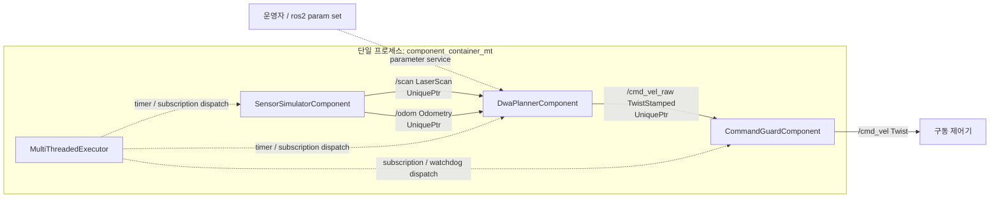

# 2026-09-07 — ROS 2 Composition·Parameters, Intra-process, DWA

오늘은 **여러 ROS 2 노드를 한 프로세스에 조합하고**, **실행 중 파라미터를 안전하게 검증하며**, **메시지 소유권과 고정 용량 자료구조로 제어 경로의 할당을 줄이고**, **Dynamic Window Approach(DWA)로 충돌 전 제동 가능한 속도 명령을 고른다**. 핵심은 빠른 알고리즘 하나가 아니라 `센서 → 지역 계획 → 독립 명령 가드`의 경계를 측정 가능하고 실패에 안전하게 만드는 것이다.

## 학습 순서 (Reading Order)

1. 아래 Mermaid 구조도에서 단일 프로세스 경계와 Topic 흐름을 먼저 본다.
2. [`launch/daily_demo.launch.py`](launch/daily_demo.launch.py)에서 `ComposableNodeContainer`, plugin 이름, `use_intra_process_comms`를 읽는다.
3. [`src/sensor_simulator_component.cpp`](src/sensor_simulator_component.cpp)에서 `NodeOptions`, `unique_ptr` publish, LaserScan 극좌표 생성을 읽는다.
4. [`src/dwa_planner_component.cpp`](src/dwa_planner_component.cpp)에서 Parameter 검증/commit, 동적 속도창, 궤적 rollout, 제동 가능성 식을 연결한다.
5. [`src/command_guard_component.cpp`](src/command_guard_component.cpp)에서 planner와 actuator 사이의 속도·가속도 clamp와 watchdog을 확인한다.
6. [`paper_review.md`](paper_review.md)에서 1997 DWA 원 논문의 문제, 속도공간 직관, 제품 한계를 읽는다.
7. 빌드·실행 후 pointer 주소, 후보 수, 파라미터 거부, `/cmd_vel`을 직접 관찰한다.

## 오늘의 세 축

| 영역 | 핵심 질문 | 오늘의 답 |
|---|---|---|
| 기초 실무 | 노드마다 프로세스를 꼭 하나씩 써야 하는가? | 아니다. Component 공유 라이브러리를 container에 로드해 한 프로세스로 조합할 수 있다. |
| 심화·RT | 통신 복사와 제어 callback의 동적 할당을 어떻게 줄이는가? | intra-process `unique_ptr` 소유권 전달과 `std::array` 고정 용량 후보/장애물 버퍼를 쓴다. |
| 알고리즘 | 모터가 지금 도달 가능하고 충돌 전에 멈출 수 있는 속도는 어떻게 고르는가? | 가속도 기반 dynamic window를 샘플링하고, admissible 후보만 목표·여유도·속도로 채점한다. |

## 시스템 아키텍처



브라우저에서 검색·테마·경로 강조가 가능한 검증된 확장 구조도는 [`architecture.html`](architecture.html)에 생성된다. 다이어그램 본문은 한국어이며, Archify 뷰어의 고정 UI는 지원 로케일 제약으로 영어 fallback을 사용한다.

`component_container_mt`는 세 노드를 같은 주소 공간에 올린다. 각 노드는 기본 `MutuallyExclusive` callback group을 사용하므로 한 노드의 timer와 subscription callback은 동시에 실행되지 않는다. 서로 다른 노드의 callback은 executor worker에서 병렬 실행될 수 있다. 실제 RT 우선순위가 필요하면 제어 callback group을 별도 executor/thread에 배치하고 OS scheduler 정책까지 설계해야 한다.

## ROS 2 Component 문법

Component가 일반 실행 노드와 다른 지점은 세 가지다.

1. 생성자가 `const rclcpp::NodeOptions &`를 받는다. container가 namespace, parameter override, intra-process 설정을 주입하는 통로다.
2. `RCLCPP_COMPONENTS_REGISTER_NODE(...)`가 클래스 생성 함수를 plugin index에 등록한다.
3. `rclcpp_components_register_nodes(...)`가 CMake 설치 시 plugin metadata를 만든다.

launch의 `plugin` 문자열은 C++의 완전 수식 클래스 이름과 정확히 같아야 한다. Component는 장애 격리가 약해지는 대신 프로세스·serialization·메모리 복사 비용을 줄일 수 있다. 한 컴포넌트의 segmentation fault가 container 전체를 죽일 수 있으므로 안전 등급과 장애 도메인이 다른 기능을 무조건 합치면 안 된다.

## Parameter: 검증과 반영을 나누기

`DwaPlannerComponent`는 두 callback을 사용한다.

```text
ros2 param set 요청
  → add_on_set_parameters_callback: 타입·범위·가중치 합 검증
  → 성공한 값이 Node parameter store에 반영
  → add_post_set_parameters_callback: std::atomic<double> runtime config 갱신
```

`on-set`에서 side effect를 만들면 뒤에 등록된 다른 callback이 요청을 거부해도 내부 상태만 먼저 바뀔 수 있다. 그래서 이 예제는 검증과 commit을 분리한다. 여러 스칼라 atomic은 lock 대기를 없애지만, timer가 업데이트 중간의 혼합 snapshot을 볼 수 있다. 여러 필드의 원자적 일관성이 반드시 필요하면 double-buffered immutable config + 단일 atomic pointer/index swap을 사용한다.

잘못된 값은 다음처럼 거부된다.

```bash
ros2 param set /dwa_planner robot_radius -0.1
# Set parameter failed: robot_radius is outside its safe study range
```

## Intra-process와 메모리 경계

`SensorSimulatorComponent`와 `DwaPlannerComponent`는 메시지를 `std::unique_ptr`로 게시/수신한다. 다음 조건이 맞을 때 ROS 2 intra-process manager가 payload를 serialization하지 않고 소유권으로 전달할 수 있다.

- Publisher와 Subscription이 같은 process에 있다.
- 양쪽 NodeOptions에서 `use_intra_process_comms=true`다.
- 단일 소유권 경로에 맞는 callback signature를 쓴다.
- QoS가 호환된다.

로그의 `published scan unique_ptr=0x...`와 `received scan unique_ptr=0x...`, planner와 guard의 command 주소가 같으면 이 실행에서 같은 message object가 넘어온 관찰 증거다. 주소 비교는 기능 로직에 사용하지 않는다. 구독자가 여러 개이거나 RMW/메시지 조건이 바뀌면 복사가 생길 수 있으므로 “같은 프로세스 = 언제나 zero-copy”라고 일반화하면 안 된다.

DWA callback 내부는 다음 용량을 컴파일 시 고정한다.

```text
장애물 점:  std::array<ObstaclePoint, 360>
속도 후보:  7 linear × 15 angular = 105 candidates
기본 rollout: 1.5 s / 0.1 s = 15 steps
거리 비교 상한: 105 × 15 × 360 = 567,000 / planning tick
```

이 상한은 DDS, logging, parameter service, `LaserScan.ranges`의 할당까지 없앤다는 뜻이 아니다. 완전한 hard RT 경로는 사전 할당 allocator, executor scheduling, RMW 지원, page fault/lock, WCET 측정을 함께 다뤄야 한다.

## DWA 수식과 코드 연결

### 1. Dynamic window

현재 속도를 `(v_c, w_c)`, 가속도 한계를 `(a_v, a_w)`, 제어 주기를 `dt`라 하면 이번 tick에 도달 가능한 범위는 다음과 같다.

```text
v ∈ [v_c - a_v dt, v_c + a_v dt] ∩ [0, v_max]
w ∈ [w_c - a_w dt, w_c + a_w dt] ∩ [-w_max, w_max]
```

코드의 `build_dynamic_window()`가 이 교집합을 만들고 105개 `(v,w)`를 `std::array`에 채운다. 전 속도 범위를 매번 뒤지는 것보다 물리적으로 도달 가능한 명령에 계산을 집중한다.

### 2. Circular-arc rollout

각 후보를 짧은 시간 동안 unicycle 운동학으로 전개한다.

```text
x_(k+1)   = x_k + v cos(yaw_k) dt
y_(k+1)   = y_k + v sin(yaw_k) dt
yaw_(k+1) = yaw_k + w dt
```

원 논문은 일정한 `(v,w)`가 만드는 원호를 속도공간에서 평가한다. 이 학습 코드는 이해하기 쉬운 0.1 s 이산 rollout으로 같은 직관을 구현한다.

### 3. Admissible velocity

가장 가까운 장애물까지 중심 거리 `d_min`, 로봇 반지름 `r`, 최대 감속 크기 `a`에 대해 다음을 만족하지 못하면 버린다.

```text
v² / (2a) + r < d_min
```

`v²/(2a)`는 등가속도 정지거리다. 이 예제는 선형 제동만 검사한다. 제품에서는 footprint sweep, 각속도 제동, latency 동안 추가 이동, 안전 margin을 포함해야 한다.

### 4. Objective

통과한 후보는 다음으로 비교한다.

```text
score(v,w) = α·heading + β·clearance + γ·speed
```

- `heading`: rollout 끝 자세가 목표 방향을 바라보는 정도
- `clearance`: 궤적과 장애물 사이 최소 여유도
- `speed`: 허용 최고속도 대비 전진 속도

가중치는 실행 중 바꿀 수 있지만, 데이터셋별 평균 성공률만 보지 말고 최소 clearance, oscillation, stop distance, callback WCET를 함께 기록한다.

## 빌드와 실행

ROS 2 Jazzy 워크스페이스의 `src` 아래에 이 폴더를 둔다.

```bash
cd ~/ros2_ws
colcon build --packages-select daily_robotics_2026_09_07 --event-handlers console_direct+
source install/setup.bash
ros2 launch daily_robotics_2026_09_07 daily_demo.launch.py
```

다른 터미널에서 graph, component, 출력 명령을 확인한다.

```bash
source ~/ros2_ws/install/setup.bash
ros2 component list
ros2 topic echo /cmd_vel --once
ros2 param get /dwa_planner clearance_weight
ros2 param set /dwa_planner clearance_weight 0.70
ros2 param set /dwa_planner robot_radius -0.10
```

예상 관찰:

1. `/dwa_component_container` 아래에 세 component가 등록된다.
2. 센서 publisher와 DWA subscriber의 scan pointer 주소가 대응한다.
3. DWA가 tick마다 105개 후보를 만들고 admissible 후보 수, `v`, `w`, 최소 여유도를 출력한다.
4. planner와 guard의 `/cmd_vel_raw` pointer 주소가 대응한다.
5. 유효한 `clearance_weight=0.70`은 commit되고, 음수 `robot_radius`는 이유와 함께 거부된다.
6. `/cmd_vel`은 guard의 절대 속도와 가속도 제한을 만족한다.

## 검증 기록 (2026-09-07, ROS 2 Jazzy)

- 공식 `ros:jazzy-ros-base` 이미지, GCC 13.3에서 `colcon build --packages-select daily_robotics_2026_09_07` 성공
- `-Wall -Wextra -Wpedantic` 컴파일 경고 없음, 세 component plugin과 launch 파일 설치 확인
- `/dwa_component_container`에 `sensor_simulator`, `dwa_planner`, `command_guard` 세 노드 로드 확인
- `/cmd_vel` 1회 수신: `linear.x=0.1201 m/s`, `angular.z=0.1920 rad/s`
- 같은 tick에서 scan publisher/subscriber 주소와 raw command publisher/subscriber 주소가 각각 일치
- DWA 105개 후보 중 장애물·제동 gate를 통과한 후보가 운전 상태에 따라 60~75개로 제한됨
- `clearance_weight=0.70`은 commit되고 `robot_radius=-0.10`은 범위 오류로 거부됨
- Archify showcase artifact 검사 9/9, 오류 0, 경고 0
- Chrome 자동 검증에서 1440×900, 1600×1000, 1920×1080, 2048×1320 모두 overflow 없이 통과
- 1440×900 light와 2048×1320 dark 캡처를 직접 확인해 label, boundary, card, 양쪽 theme 가독성 통과

검증 컨테이너의 `/ws/build`, `/ws/install`, `/ws/log`는 임시 파일시스템에만 생성했으며 저장소에는 남기지 않았다.

## 실패를 의도적으로 읽는 법

- Component load가 실패하면 `ros2 component types`에서 완전 수식 plugin 이름을 먼저 확인한다.
- Topic이 연결되지 않으면 양쪽 QoS reliability와 intra-process option을 확인한다.
- pointer 주소가 다르면 구독자 수, callback의 SharedPtr/UniquePtr signature, process 경계를 확인한다.
- admissible 후보가 0이면 `robot_radius`, 감속 한계, scan frame, 장애물 단위가 일치하는지 본다.
- DWA가 좌우로 흔들리면 후보 해상도, 목표 heading, 이전 명령 hysteresis, 비용 정규화를 점검한다.
- `component_container_mt`만으로 RT가 되지는 않는다. callback 실행 순서와 우선순위, WCET, page fault는 별도 증거가 필요하다.

## 파일 지도

```text
daily_robotics/2026-09-07/
├── CMakeLists.txt
├── package.xml
├── README.md
├── paper_review.md
├── architecture.archify.json
├── architecture.html
├── launch/daily_demo.launch.py
└── src/
    ├── sensor_simulator_component.cpp
    ├── dwa_planner_component.cpp
    └── command_guard_component.cpp
```

## 누적 지식 연결

- [`../../knowledge/ros2/components_and_parameters.md`](../../knowledge/ros2/components_and_parameters.md)
- [`../../knowledge/realtime/intra_process_fixed_capacity.md`](../../knowledge/realtime/intra_process_fixed_capacity.md)
- [`../../knowledge/planning/dynamic_window_approach.md`](../../knowledge/planning/dynamic_window_approach.md)

## 공식·원문 레퍼런스

- [ROS 2: Composing multiple nodes in a single process](https://docs.ros.org/en/rolling/Tutorials/Intermediate/Composition.html)
- [ROS 2 Jazzy: intra_process_demo](https://docs.ros.org/en/ros2_packages/jazzy/api/intra_process_demo/)
- [ROS 2: Executors and callback groups](https://docs.ros.org/en/rolling/Concepts/Intermediate/About-Executors.html)
- [rclcpp Jazzy API index: parameter callbacks](https://docs.ros.org/en/jazzy/p/rclcpp/genindex.html)
- [Fox, Burgard, Thrun: DWA publication page, CMU Robotics Institute](https://publications.ri.cmu.edu/the-dynamic-window-approach-to-collision-avoidance)
- [IEEE DOI: 10.1109/100.580977](https://doi.org/10.1109/100.580977)
