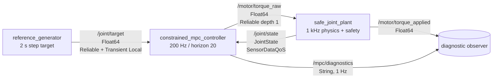
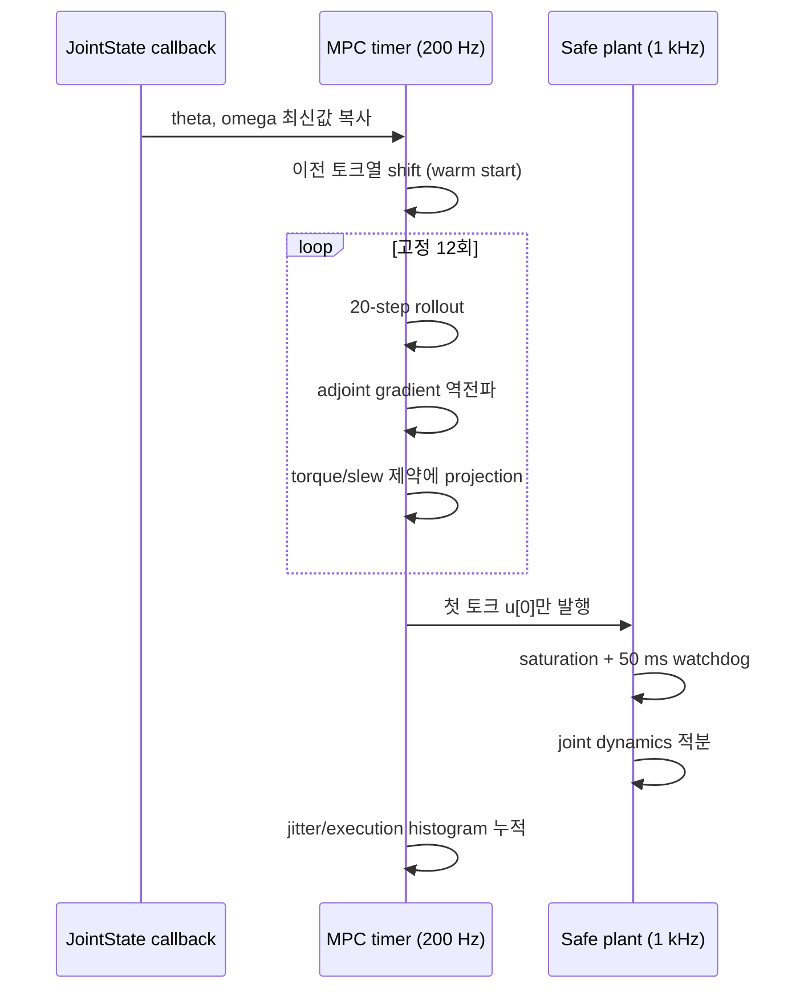

# 2026-09-09 — 모터 폐루프, 실행시간 예산, 제약 MPC

## 오늘의 핵심 요약

오늘은 **ROS 2 Topic/QoS로 1축 모터 폐루프를 연결하고**, **200 Hz callback의 jitter와 실행시간을 고정 크기 histogram으로 측정하며**, **토크와 토크 변화율 제약이 있는 Model Predictive Control(MPC)** 을 직접 구현한다.

- **기초 실무:** `target → controller → motor → joint state` 폐루프, `JointState`, Reliable/Best Effort, Transient Local, 토크 포화와 watchdog
- **심화·RT:** `StaticSingleThreadedExecutor`, hot path의 `std::array`, 고정 12회 최적화, 제어 callback 시간 예산과 jitter histogram
- **알고리즘:** 선형 이산 모델, 유한 예측 지평, adjoint gradient, projected-gradient, warm start, receding horizon

> 이 예제는 학습용 소프트웨어 시뮬레이터다. 실제 모터에서는 독립 하드웨어 E-stop, 드라이브 전류 제한, joint limit, 열 보호, encoder 이상 감지가 추가되어야 한다.

## 학습 순서 (Reading Order)

1. 이 README의 구조도와 Topic/QoS 표를 읽고 폐루프의 데이터 방향을 그린다.
2. [`src/reference_generator.cpp`](src/reference_generator.cpp)에서 Transient Local 목표 전달을 확인한다.
3. [`src/safe_joint_plant.cpp`](src/safe_joint_plant.cpp)에서 토크 포화·50 ms watchdog·관절 동역학의 연결을 찾는다.
4. [`src/constrained_mpc_controller.cpp`](src/constrained_mpc_controller.cpp)에서 `predict → rollout → adjoint gradient → projection → 첫 입력 적용` 순서를 따라간다.
5. 빌드·실행 후 `/mpc/diagnostics`와 `/motor/torque_applied`를 관찰한다.
6. [`paper_review.md`](paper_review.md)를 읽고 학습용 1축 MPC와 Cheetah 3의 convex MPC가 어디서 같고 다른지 비교한다.
7. 누적 지식 문서인 [`../../knowledge/dynamics/single_joint_motor_model.md`](../../knowledge/dynamics/single_joint_motor_model.md), [`../../knowledge/control/model_predictive_control.md`](../../knowledge/control/model_predictive_control.md), [`../../knowledge/realtime/callback_budget_measurement.md`](../../knowledge/realtime/callback_budget_measurement.md)를 복습한다.

## ROS 통신 구조 (`rqt_graph` 관점)



## 한 번의 5 ms 제어 주기



## Topic과 QoS를 이렇게 고른 이유

| Topic | 의미 | QoS | 판단 기준 |
|---|---|---|---|
| `/joint/target` | 저주기 목표 각도 | Reliable, Transient Local, depth 1 | 드문 명령은 잃지 않고 늦게 뜬 Controller도 마지막 값을 받아야 함 |
| `/joint/state` | 200 Hz 위치·속도·토크 | SensorDataQoS | 오래된 표본 재전송보다 최신 표본이 중요함 |
| `/motor/torque_raw` | 200 Hz MPC 출력 | Reliable, depth 1 | 최신 명령 하나만 필요하며 safety 경계까지 안정적으로 전달 |
| `/motor/torque_applied` | 안전 제약 뒤 실제 입력 | Reliable, depth 1 | raw/applied 차이를 감사(audit)하는 저용량 telemetry |
| `/mpc/diagnostics` | 1 Hz 시간 통계 | Reliable, depth 1 | 사람/monitoring용이며 최신 요약만 필요함 |

QoS는 Publisher와 Subscription 양쪽이 호환되어야 한다. 특히 `Transient Local` 데이터를 받으려면 Subscription도 같은 durability를 요청해야 한다.

## 제약 MPC의 수학과 코드

상태와 입력을 다음처럼 둔다.

\[
x_k = [\theta_k,\;\omega_k]^T, \qquad u_k = \tau_k
\]

Controller의 선형 예측 모델은 다음이다.

\[
x_{k+1}=Ax_k+Bu_k,
\quad
A=\begin{bmatrix}1&\Delta t\\0&1-b\Delta t/I\end{bmatrix},
\quad
B=\begin{bmatrix}\frac{1}{2}\Delta t^2/I\\\Delta t/I\end{bmatrix}
\]

20 step × 5 ms = 100 ms 미래에 대해 다음 비용을 줄인다.

\[
J=\sum_{k=0}^{N-1}
\left(q_p(\theta_k-r)^2+q_v\omega_k^2+r_u u_k^2\right)
+q_{p,N}(\theta_N-r)^2+q_{v,N}\omega_N^2
\]

제약은 `|u_k| ≤ 2.0 N·m`, `|u_k-u_{k-1}| ≤ 30 N·m/s × 0.005 s`다. 코드는 adjoint로 gradient를 계산하고 각 update를 feasible set에 투영한다. 완전한 QP solver보다 기능은 제한되지만, 배열 크기와 반복 횟수가 고정되어 계산량 상한을 설명하기 쉽다.

Plant에는 Controller가 일부러 생략한 `0.55 sin(theta)` 중력 토크가 있다. 즉, 모델은 현실과 다르며 MPC는 매 주기 실제 상태를 다시 받아 이 오차를 보정한다.

## 빌드

ROS 2 Jazzy 환경에서 저장소 루트 기준으로 실행한다.

```bash
colcon --log-base log/2026-09-09 build \
  --base-paths daily_robotics/2026-09-09 \
  --build-base build/2026-09-09 \
  --install-base install/2026-09-09 \
  --event-handlers console_direct+
source install/2026-09-09/setup.bash
```

산출물 `build/`, `install/`, `log/`는 저장소 `.gitignore`에 포함되어 커밋되지 않는다.

## 실행과 관찰

```bash
ros2 launch daily_robotics_2026_09_09 daily_demo.launch.py
```

다른 터미널에서:

```bash
source install/2026-09-09/setup.bash
ros2 topic echo /joint/state --once
ros2 topic echo /motor/torque_applied
ros2 topic echo /mpc/diagnostics
ros2 topic hz /joint/state
```

정상이라면 목표가 `+0.8 ↔ -0.6 rad`로 바뀌고, raw torque는 `±2.0 N·m`, applied torque는 `±2.5 N·m` 안전 경계를 넘지 않는다. Controller 프로세스를 중지하면 Plant 로그에서 50 ms 이내에 watchdog이 `ACTIVE`가 되고 applied torque가 0으로 내려가야 한다.

컨테이너/일반 Linux의 timer jitter는 PREEMPT_RT 보장이 아니다. `max_jitter_us`가 기준을 넘는 것은 이 측정의 실패가 아니라, 현재 실행 환경이 hard real-time이 아님을 보여주는 데이터다.

## 자체 검증 기록

공식 `ros:jazzy-ros-base` 컨테이너(GCC 13.3, Fast DDS)에서 확인했다.

- `colcon build` 성공, `-Wall -Wextra -Wpedantic` compiler warning 없음
- launch에서 세 노드가 모두 발견되고 목표 `+0.8 ↔ -0.6 rad` 폐루프 추종 확인
- 1,600 control sample에서 최대 callback 실행시간 `171 us`, 최대 시작 jitter `1,149 us`, 설정한 budget miss `0`
- Controller 중단 뒤 Plant watchdog `ACTIVE`, trip count `1`, `/motor/torque_applied = 0.0` 확인

수치는 현재 컨테이너에서 얻은 한 번의 smoke test 결과이며 다른 CPU/부하/RMW에서 재측정해야 한다.

## 실습 과제

1. `kHorizon`을 10, 20, 40으로 바꾸고 추종 오차와 `max_execution_us`의 trade-off를 표로 기록한다.
2. Plant의 중력항을 Controller 예측 모델에도 넣고, 비선형 rollout에서 gradient를 어떻게 구할지 설명한다.
3. Controller를 강제 종료해 50 ms watchdog을 검증한다. Topic QoS만으로 safety를 보장할 수 없는 이유를 적는다.
4. `kMaxTorqueStepNm` 제약을 제거했을 때 토크와 위치 응답의 차이를 plot한다.
5. 실제 하드웨어 적용 전에 필요한 독립 보호 계층 다섯 가지를 [`safe_joint_plant.cpp`](src/safe_joint_plant.cpp)의 소프트웨어 보호와 구분해 작성한다.

## 참고 자료

- [ROS 2 Jazzy — Executors](https://docs.ros.org/en/jazzy/Concepts/Intermediate/About-Executors.html)
- [ROS 2 Jazzy — Quality of Service settings](https://docs.ros.org/en/jazzy/Concepts/Intermediate/About-Quality-of-Service-Settings.html)
- [ROS 2 Jazzy — Topics, Services and Actions](https://docs.ros.org/en/jazzy/How-To-Guides/Topics-Services-Actions.html)
- [ROS 2 callback-group executor example](https://docs.ros.org/en/jazzy/p/examples_rclcpp_cbg_executor/)
- [Di Carlo et al., Dynamic Locomotion in the MIT Cheetah 3 Through Convex MPC — MIT Open Access](https://dspace.mit.edu/handle/1721.1/138000)
- [IEEE DOI: 10.1109/IROS.2018.8594448](https://doi.org/10.1109/IROS.2018.8594448)
