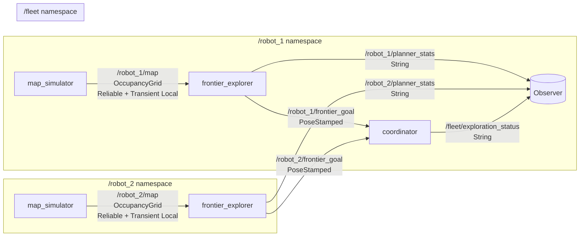
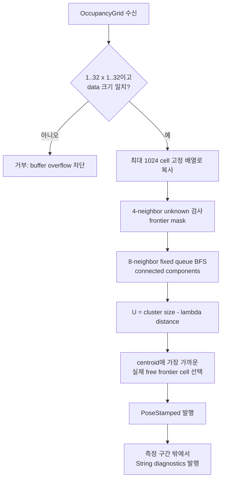

# 2026-09-10 — 다중 로봇 Namespace, Bounded Grid 처리, Frontier 탐사

## 오늘의 핵심 요약

오늘은 **동일한 ROS 2 실행 파일을 `/robot_1`, `/robot_2` namespace로 재사용**하고, **최대 32×32 고정 배열과 반복 상한이 있는 frontier 분석기**를 만들며, **free/unknown 경계에서 다음 자율 탐사 목표를 고르는 알고리즘**을 구현한다.

- **기초 실무:** 상대 이름·절대 이름·namespace·launch remapping, `OccupancyGrid`, `PoseStamped`, Transient Local map QoS
- **심화·RT:** 입력 크기 계약, `std::array` 사전 할당, fixed-capacity BFS queue, `steady_clock` budget 계측, 비-RT 진단 경로 분리
- **알고리즘:** frontier 검출, 8-connected component clustering, 정보량-거리 utility, 실제 free cell 대표점 선택

> 이 예제는 탐사 목표 **후보**를 만드는 학습용 코드다. 실제 로봇에서는 Nav2 costmap/inflation, reachable-path 검증, 로봇 간 task lease, 충돌 회피, localization confidence, 통신 단절 정책이 추가되어야 한다.

## 학습 순서 (Reading Order)

1. 아래 ROS graph에서 상대 topic이 namespace와 remapping을 거쳐 어떤 FQN이 되는지 확인한다.
2. [`launch/daily_demo.launch.py`](launch/daily_demo.launch.py)의 `PushRosNamespace`와 `remappings`를 읽는다.
3. [`src/map_simulator.cpp`](src/map_simulator.cpp)에서 `OccupancyGrid`의 `-1/0/100` 의미와 Transient Local QoS를 확인한다.
4. [`src/bounded_frontier_explorer.cpp`](src/bounded_frontier_explorer.cpp)의 `is_frontier_cell → BFS cluster → utility → representative cell` 순서를 따라간다.
5. [`src/fleet_coordinator.cpp`](src/fleet_coordinator.cpp)에서 `/robot_1/...` 절대 이름과 `/fleet` 아래 상대 publisher의 차이를 찾는다.
6. 빌드·실행 후 `ros2 node list`, `ros2 topic list`, `/fleet/exploration_status`로 graph 계약을 검증한다.
7. [`paper_review.md`](paper_review.md)와 누적 문서 [`../../knowledge/ros2/multi_robot_namespaces.md`](../../knowledge/ros2/multi_robot_namespaces.md), [`../../knowledge/planning/frontier_exploration.md`](../../knowledge/planning/frontier_exploration.md), [`../../knowledge/realtime/bounded_grid_processing.md`](../../knowledge/realtime/bounded_grid_processing.md)를 읽는다.

## ROS 통신 구조 (`rqt_graph` 관점)



소스의 generic 이름과 최종 graph 이름은 다음처럼 변한다.

| 소스 이름 | launch 규칙 | 최종 FQN 예시 | 이유 |
|---|---|---|---|
| `local_map` | `local_map:=map`, namespace `/robot_1` | `/robot_1/map` | simulator 내부 이름을 배포 계약에 맞춤 |
| `map_input` | `map_input:=map`, namespace `/robot_1` | `/robot_1/map` | 같은 namespace 안에서 publisher와 연결 |
| `goal_output` | `goal_output:=frontier_goal` | `/robot_1/frontier_goal` | 실행 파일을 수정하지 않고 외부 API 이름 결정 |
| `/robot_1/frontier_goal` | 절대 이름이라 namespace 미적용 | `/robot_1/frontier_goal` | fleet 계층이 특정 로봇을 명시적으로 관찰 |
| `exploration_status` | coordinator namespace `/fleet` | `/fleet/exploration_status` | fleet 소유의 상대 interface |

## 한 번의 map callback과 계산량 상한



활성 cell 수를 `N`, frontier cell 수를 `F`라 하면 `N ≤ 1024`, `F ≤ N`이다.

- frontier 판정: cell마다 최대 4-neighbor → `≤ 4N`
- connected component BFS: frontier마다 최대 8-neighbor → `≤ 8F`
- 각 cluster의 대표 frontier cell 선택: 전체 합 `≤ F`
- 핵심 이웃/대표점 반복의 총상한: `4N + 9F ≤ 13N ≤ 13,312`

이는 전체 ROS callback이 hard real-time이라는 뜻은 아니다. `OccupancyGrid::data`, DDS 수신, `PoseStamped.frame_id`, 로그와 진단 문자열에는 동적 할당/OS scheduling 영향이 남는다. 이 예제의 정확한 주장은 **frontier 분석 함수의 메모리 용량과 반복 횟수에 상한이 있다**는 것이다.

## Frontier 수학과 코드 연결

점유 격자 cell `i`의 상태를 `m_i ∈ {unknown, free, occupied}`라 한다. 4-neighbor 집합을 `N₄(i)`라 하면 frontier는 다음과 같다.

\[
\mathcal{F}=\{i\mid m_i=free\;\land\;\exists j\in\mathcal{N}_4(i):m_j=unknown\}
\]

코드의 `is_frontier_cell()`이 이 식을 그대로 검사한다. frontier cell을 8-connectivity로 묶은 cluster `C`에는 다음 utility를 준다.

\[
U(C)=|C|-\lambda\lVert c_C-p_{robot}\rVert_2
\]

`|C|`는 관측할 수 있을 것으로 기대하는 경계의 크기를 거칠게 나타내고, 두 번째 항은 이동 비용이다. 여기서는 `λ=2.0`이다. 산술 centroid `c_C`가 U자 cluster 내부의 unknown/occupied cell에 놓일 수 있으므로, 실제 목표는 centroid에 가장 가까운 **cluster 소속 free cell**로 제한한다.

## Topic과 QoS 판단

| Topic | 의미 | QoS | 판단 |
|---|---|---|---|
| `/robot_N/map` | 로봇별 local occupancy grid | Reliable, Transient Local, depth 1 | 손실 없이 최신 지도 하나를 보존하고 late joiner 지원 |
| `/robot_N/frontier_goal` | 다음 탐사 후보 | Reliable, depth 1 | 저주기 decision이며 최신 목표 하나만 필요 |
| `/robot_N/planner_stats` | frontier/시간 통계 | Reliable, depth 1 | 사람이 보는 저용량 진단, hot path 밖 |
| `/fleet/exploration_status` | 목표 간 분리 상태 | Reliable, depth 1 | fleet monitor의 최신 요약만 보존 |

Publisher가 Transient Local이어도 Subscription이 Volatile이면 과거 map을 요청하지 않는다. 이 예제는 양쪽 모두 같은 durability를 명시한다.

## 빌드

ROS 2 Jazzy 환경에서 저장소 루트 기준으로 실행한다.

```bash
colcon --log-base log/2026-09-10 build \
  --base-paths daily_robotics/2026-09-10 \
  --build-base build/2026-09-10 \
  --install-base install/2026-09-10 \
  --event-handlers console_direct+
source install/2026-09-10/setup.bash
```

산출물 `build/`, `install/`, `log/`는 저장소 `.gitignore` 대상이며 커밋하지 않는다.

## 실행과 관찰

```bash
ros2 launch daily_robotics_2026_09_10 daily_demo.launch.py
```

다른 터미널에서:

```bash
source install/2026-09-10/setup.bash
ros2 node list
ros2 topic list
ros2 topic echo /robot_1/frontier_goal --once
ros2 topic echo /robot_2/planner_stats --once
ros2 topic echo /fleet/exploration_status --once
```

정상이라면 같은 세 실행 파일만으로 `/robot_1/*`, `/robot_2/*`, `/fleet/*` graph가 분리되고, 두 explorer가 각 지도에서 실제 free frontier cell을 목표로 발행한다. `planner_stats`의 `cells`는 480, `budget_misses`는 보통 0이어야 한다. 단, 시간 수치는 CPU·부하·RMW에 따라 달라지므로 대상 하드웨어에서 다시 측정한다.

## 자체 검증 기록

공식 `ros:jazzy-ros-base` 컨테이너(GCC 13.3, Fast DDS)에서 검증했다.

- `colcon build` 성공, `-Wall -Wextra -Wpedantic` compiler warning 없음
- launch에서 `/robot_1/map_simulator`, `/robot_1/frontier_explorer`, `/robot_2/map_simulator`, `/robot_2/frontier_explorer`, `/fleet/coordinator` 실행 확인
- 최종 graph에서 robot별 `map`, `frontier_goal`, `planner_stats`와 `/fleet/exploration_status` type 확인
- `/robot_1/frontier_goal`: `frame_id=map`, 실제 free frontier 대표점 `(0.875, -0.625)` 수신
- `/robot_2/planner_stats`: `cells=480`, `frontier_cells=25`, `clusters=3`, `best_cluster=11`, `budget_misses=0` 수신
- 통합 실행 중 frontier 분석시간 8–34 us, 설정한 1,500 us budget miss 0회 관찰
- coordinator에서 `GOALS_SEPARATED`, 목표 간 거리 `1.45774 m` 상태 수신

시간과 선택 목표는 현재 컨테이너의 deterministic simulator에서 얻은 smoke-test 값이다. CPU/RMW/부하가 바뀌면 시간은 다시 측정해야 하며, 실제 SLAM map에서는 frontier 결과도 달라진다.

## 실패 모드와 제품화 경계

- **도달 불가:** 목표 cell이 free여도 inflated costmap이나 동역학 제약 때문에 경로가 없을 수 있다. Nav2 planner 결과로 재검증해야 한다.
- **중복 할당:** 두 local map이 같은 물리 공간을 다르게 표현하면 단순 좌표 거리만으로 frontier 동일성을 판단하기 어렵다. 공통 frame과 map merge가 필요하다.
- **stale goal:** 이 coordinator는 goal lease/TTL을 구현하지 않았다. timestamp 기반 만료와 재할당이 필요하다.
- **bounded ≠ hard RT:** 알고리즘 반복 상한만 확보했다. page fault, DDS allocation, logging, executor scheduling까지 측정·통제해야 hard RT 주장을 할 수 있다.
- **회전된 map origin:** 예제는 origin quaternion이 단위 quaternion이라고 가정한다. 회전된 grid에는 SE(2) 변환을 적용해야 한다.

## 실습 과제

1. launch에서 `robot_3`를 추가하되 C++ 소스를 한 줄도 수정하지 않고 topic graph를 확장한다.
2. `distance_weight`를 0, 2, 10으로 바꾸고 선택되는 cluster의 크기와 거리를 비교한다.
3. 33×32 map을 발행해 입력 계약 거부 로그와 buffer 안전성을 확인한다.
4. frontier centroid를 그대로 목표로 발행하도록 바꿨을 때 occupied/unknown 목표가 생기는 반례를 만든다.
5. fleet coordinator에 goal timestamp TTL과 task lease를 추가하고, 로봇 하나가 죽었을 때 재할당 상태 머신을 그린다.

## 참고 자료

- [ROS 2 Jazzy — Passing ROS arguments and remapping names](https://docs.ros.org/en/jazzy/How-To-Guides/Node-arguments.html)
- [ROS 2 design — Static remapping](https://design.ros2.org/articles/static_remapping.html)
- [ROS 2 Jazzy — Quality of Service settings](https://docs.ros.org/en/jazzy/Concepts/Intermediate/About-Quality-of-Service-Settings.html)
- [nav_msgs/OccupancyGrid message](https://docs.ros.org/en/jazzy/p/nav_msgs/msg/OccupancyGrid.html)
- [geometry_msgs/PoseStamped message](https://docs.ros.org/en/jazzy/p/geometry_msgs/msg/PoseStamped.html)
- [Yamauchi, “A Frontier-Based Approach for Autonomous Exploration,” CIRA 1997](https://doi.org/10.1109/CIRA.1997.613851)
- [Open PDF copy of the Yamauchi paper](https://faculty.iiit.ac.in/~mkrishna/YamauchiFrontier.pdf)
