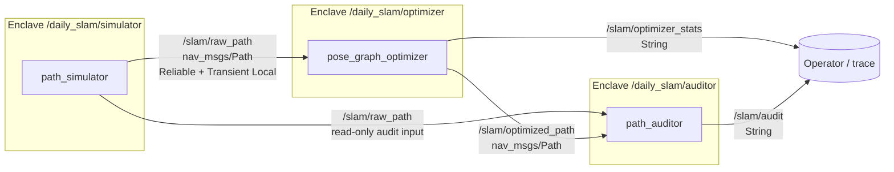
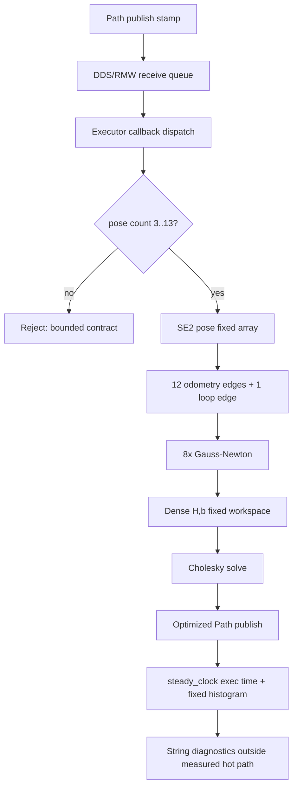

# 2026-09-11 — SROS2 Enclave, Callback Trace, Pose-Graph SLAM

## 오늘의 핵심 요약

오늘은 **ROS 2 graph의 process를 SROS2 enclave로 나누는 최소 권한 사고방식**, **callback queue/실행 지연을 서로 다른 clock과 고정 histogram으로 관찰하는 방법**, **SE(2) pose graph의 loop closure를 Gauss–Newton으로 최적화하는 back-end**를 하나의 실행 가능한 패키지로 연결한다.

- **기초 실무:** `nav_msgs/Path`, Header stamp/frame, Reliable + Transient Local QoS, node/topic graph, launch의 `--enclave`
- **심화·RT:** 최대 13 pose·13 edge·8 iteration 계약, `std::array` dense workspace, callback queue/실행시간 분리, 고정 6-bin histogram
- **알고리즘:** `T_i⁻¹T_j` SE(2) residual, 정보행렬, analytic Jacobian, gauge anchor, Gauss–Newton 정상방정식, Cholesky solve

> 이 예제는 작은 graph의 수학과 시스템 경계를 투명하게 보여주는 학습용 back-end다. 실제 SLAM에는 scan/visual front-end, loop geometric verification, robust kernel, sparse/incremental solver, map 관리와 안전 감독이 더 필요하다.

## 학습 순서 (Reading Order)

1. 아래 graph와 enclave 표에서 node 이름, topic 권한, process identity가 왜 별개인지 확인한다.
2. [`launch/daily_demo.launch.py`](launch/daily_demo.launch.py)에서 세 process에 전달되는 `--enclave`를 읽는다.
3. [`src/path_simulator.cpp`](src/path_simulator.cpp)에서 Header/QoS와 결정론적 odometry drift가 만들어지는 식을 확인한다.
4. [`src/bounded_pose_graph_optimizer.cpp`](src/bounded_pose_graph_optimizer.cpp)의 `relative_pose → accumulate_edge → solve_cholesky → optimize` 순서로 수식과 코드를 연결한다.
5. 같은 파일의 callback 시작부와 끝에서 queue delay, execution time, histogram이 어떻게 분리되는지 본다.
6. [`src/path_auditor.cpp`](src/path_auditor.cpp)가 optimizer와 독립적으로 closure gap 감소를 판정하는 이유를 생각한다.
7. 빌드·실행 후 `/slam/optimizer_stats`, `/slam/audit`를 관찰하고 [`paper_review.md`](paper_review.md)를 읽는다.
8. 누적 문서 [`../../knowledge/security/sros2_enclaves.md`](../../knowledge/security/sros2_enclaves.md), [`../../knowledge/realtime/executor_trace_latency.md`](../../knowledge/realtime/executor_trace_latency.md), [`../../knowledge/slam/pose_graph_optimization.md`](../../knowledge/slam/pose_graph_optimization.md)를 복습한다.

## ROS 통신 구조와 보안 경계



| Enclave | 필요한 ROS graph 권한 | 주면 안 되는 대표 권한 |
|---|---|---|
| `/daily_slam/simulator` | raw path publish | optimized path/audit publish |
| `/daily_slam/optimizer` | raw subscribe, optimized/stats publish | raw path publish |
| `/daily_slam/auditor` | raw/optimized subscribe, audit publish | raw/optimized publish |

Launch의 enclave 이름만으로 보안이 활성화되지는 않는다. DDS Security를 지원하는 RMW, 올바른 keystore, 서명된 governance/permissions, `ROS_SECURITY_ENABLE=true`, `ROS_SECURITY_STRATEGY=Enforce`가 함께 필요하다. 상세 계약은 [`security/enclave_contract.md`](security/enclave_contract.md)에 있다.

## 한 callback의 실행 흐름



`queue_us`는 publisher의 ROS timestamp부터 callback 시작까지의 전송·대기·dispatch 합성 근사치다. `exec_us`는 callback 시작부터 optimized path를 publish한 직후까지 `steady_clock`으로 잰다. 전자는 clock synchronization/sim-time jump에 영향을 받을 수 있고, 후자는 executor 내부 대기 원인을 설명하지 못한다. 실제 원인 분석은 Linux `ros2 trace`의 rclcpp/rcl tracepoint와 함께 해야 한다.

## Pose graph 수학과 코드 연결

Pose `x_i=[x_i,y_i,θ_i]`에서 `x_j`를 본 예측 상대변환은

\[
h(x_i,x_j)=T_i^{-1}T_j=
\begin{bmatrix}
\cos\theta_i\Delta x+\sin\theta_i\Delta y\\
-\sin\theta_i\Delta x+\cos\theta_i\Delta y\\
\mathrm{wrap}(\theta_j-\theta_i)
\end{bmatrix}
\]

이다. 측정 `z_ij`와의 residual `e_ij=h(x_i,x_j)⊖z_ij`를 정보행렬 `Ω_ij`로 가중해

\[
F(x)=\sum e_{ij}^{T}\Omega_{ij}e_{ij}
\]

를 최소화한다. 코드의 `relative_pose()`가 `T_i⁻¹T_j`, `accumulate_edge()`가 `JᵀΩJ`와 `JᵀΩe`, `solve_cholesky()`가

\[
H\Delta x=-b
\]

를 푸는 부분이다. 상대변환만으로는 모든 pose를 함께 옮기거나 돌린 해를 구분할 수 없으므로 pose 0을 변수에서 제외해 gauge freedom을 제거한다.

Simulator는 12구간 원형 주행의 마지막 keyframe을 시작 장소와 같게 만들되, odometry에는 아래 식처럼 결정론적인 위치·방향 drift를 넣는다.

\[
p_{odom}(k)=p_{true}(k)+[0.30,-0.18]^T\frac{k}{12},\qquad
\theta_{odom}(k)=\theta_{true}(k)+0.072\frac{k}{12}
\]

마지막→처음 loop edge의 측정은 `[0,0,0]`이다. Optimizer는 인접 odometry edge를 완전히 버리지 않고 loop 오차를 경로 전체에 분산한다.

## 계산량과 메모리 상한

- Pose `N≤13`, edge `M=N≤13`, 고정 iteration `K=8`
- 첫 pose 고정 후 변수 차원 `D=3(N-1)≤36`
- Hessian workspace `36×36` double, gradient/delta 각 36 double
- Dense 조립은 대략 `O(KM)`, Cholesky는 `O(KD³)`; 최대 크기가 작아 실행 상한은 유한하지만 큰 graph에는 부적합
- `nav_msgs/Path::poses`, 출력 Path와 String에는 동적 할당이 있으므로 **전체 callback hard RT**를 주장하지 않음
- Histogram은 `≤100, ≤250, ≤500, ≤1000, ≤2000, >2000 μs` 여섯 고정 bin

실제 graph가 수천 pose라면 block-sparse Hessian, fill-reducing ordering, robust cost와 incremental solver가 필요하다.

## 빌드

ROS 2 Jazzy 환경에서 저장소 루트 기준으로 실행한다.

```bash
colcon --log-base log/2026-09-11 build \
  --base-paths daily_robotics/2026-09-11 \
  --build-base build/2026-09-11 \
  --install-base install/2026-09-11 \
  --event-handlers console_direct+
source install/2026-09-11/setup.bash
```

`build/`, `install/`, `log/`는 저장소 `.gitignore` 대상이며 커밋하지 않는다.

## 일반 실행과 관찰

```bash
ros2 launch daily_robotics_2026_09_11 daily_demo.launch.py
```

다른 터미널에서:

```bash
source install/2026-09-11/setup.bash
ros2 node list
ros2 topic list -t
ros2 topic echo /slam/optimizer_stats --once
ros2 topic echo /slam/audit --once
```

정상이면 `raw_gap_m≈0.3499 m`가 크게 줄고 auditor가 `PASS`를 발행한다. `queue_us`, `exec_us`는 CPU/RMW/부하마다 달라지므로 숫자 자체보다 반복 실행의 tail과 변화 원인을 본다.

## SROS2 실습 절차

SROS2는 별도 설치가 필요할 수 있다(`ros-jazzy-sros2`). 개인키가 생기는 keystore는 저장소 밖 임시/보안 경로에서 만든다.

1. 보안을 끈 상태로 완전한 launch를 실행한다.
2. 다른 터미널에서 실행 중 graph를 관찰해 policy를 만든다.

```bash
ros2 security generate_policy /tmp/daily_slam_policy.xml --no-daemon
```

3. Launch를 종료하고 keystore와 서명 artifact를 만든다.

```bash
ros2 security create_keystore /tmp/daily_slam_keystore
ros2 security generate_artifacts \
  -k /tmp/daily_slam_keystore \
  -p /tmp/daily_slam_policy.xml
```

4. 보안을 fail-closed로 켜고 같은 launch를 실행한다.

```bash
export ROS_SECURITY_KEYSTORE=/tmp/daily_slam_keystore
export ROS_SECURITY_ENABLE=true
export ROS_SECURITY_STRATEGY=Enforce
ros2 launch daily_robotics_2026_09_11 daily_demo.launch.py
```

자동 생성 policy는 시작점이다. Parameter/service와 graph 보조 interface까지 포함됐는지 확인한 뒤 [`security/enclave_contract.md`](security/enclave_contract.md)의 의도와 비교해 줄인다. 사용 중인 RMW가 DDS Security artifact 방식을 지원하는지도 확인한다.

## 자체 검증 기록

공식 `ros:jazzy-ros-base` 컨테이너(GCC 13.3, Fast DDS)에서 일반 경로와 SROS2 Enforce 경로를 검증했다. SROS2 keystore는 컨테이너 `/tmp`에서만 생성하고 저장소에는 포함하지 않았다.

- `colcon build` 성공, `-Wall -Wextra -Wpedantic` compiler warning 없음
- Launch log에서 `path_simulator`, `pose_graph_optimizer`, `path_auditor` 세 process 시작 확인
- `/slam/raw_path`, `/slam/optimized_path`는 `nav_msgs/msg/Path`, `/slam/optimizer_stats`, `/slam/audit`는 `std_msgs/msg/String`으로 확인
- `poses=13`, `edges=13`, 고정 8회 최적화 후 `raw_gap_m=0.3499 → optimized_gap_m=0.0021`, `final_cost=0.7812`
- 독립 auditor: `PASS`, closure gap `99.4077%` 감소
- 격리된 smoke test 10회에서 `max_queue_us=648`, `max_exec_us=528`, 실행 histogram `0/0/9/1/0/0` 관찰
- 실행 중 graph에서 생성한 policy에 세 enclave/profile이 모두 포함됨을 확인
- 생성 policy로 keystore/artifact를 만든 뒤 `ROS_SECURITY_STRATEGY=Enforce`에서 세 enclave artifact 로드 및 auditor `PASS` 확인

시간 값은 Docker Desktop의 `--network host --ipc host`, `ROS_DOMAIN_ID=94` 격리 조건에서 얻었다. Target CPU, kernel, RMW, network 조건이 바뀌면 반드시 다시 측정한다.

## 실패 모드와 제품화 경계

- **False loop closure:** 잘못된 장소를 잇는 edge 하나가 graph를 심하게 접는다. Descriptor match 뒤 geometric verification와 robust kernel이 필요하다.
- **Gauge/singularity:** Anchor/prior가 없거나 graph가 끊기면 Hessian이 singular해질 수 있다.
- **초기 추정 불량:** 큰 회전·병진 오차에서는 Gauss–Newton 선형화가 local minimum으로 갈 수 있다.
- **Dense scaling:** 최대 36변수 계약을 넘기는 입력은 거부한다. 큰 graph를 배열 크기만 늘려 해결하지 않는다.
- **Trace 왜곡:** Logging, CPU frequency scaling, container scheduling, DDS transport가 지연분포를 바꾼다. Target hardware에서 workload와 trace 조건을 고정한다.
- **보안 ≠ 안전:** 인증된 publisher도 의미상 위험한 data를 보낼 수 있다. Range/plausibility 검사와 안전 상태 머신은 별도다.
- **CA 탈취:** CA private key가 유출되면 공격자가 유효 identity/permissions를 만들 수 있다. Offline CA와 rotation/revocation 절차가 필요하다.

## 실습 과제

1. Loop edge 정보행렬을 `800→20`으로 낮추고 raw/optimized gap과 odometry 변형량을 비교한다.
2. Loop measurement에 1 m 오검출을 넣고 graph가 접히는 모습을 확인한 뒤 Huber robust weight를 추가한다.
3. `kMaxPoses+1` Path를 발행해 bounded contract가 안전하게 거부하는지 확인한다.
4. Analytic Jacobian을 finite-difference Jacobian과 비교하는 단위 시험을 작성한다.
5. `ros2 trace`로 callback start/end를 캡처해 application의 `queue_us/exec_us`와 시간축을 맞춘다.
6. Auditor enclave에 `/slam/raw_path` publish 권한이 없음을 Enforce 모드의 음성 시험으로 증명한다.

## 참고 자료

- [ROS 2 Jazzy — Understanding the security keystore](https://docs.ros.org/en/jazzy/Tutorials/Advanced/Security/The-Keystore.html)
- [ROS 2 Jazzy — RMW security options](https://docs.ros.org/en/jazzy/Tutorials/Advanced/Creating-An-RMW-Implementation.html#security)
- [ROS 2 Jazzy — tracetools C++ API](https://docs.ros.org/en/jazzy/p/tracetools/generated/index.html)
- [ROS 2 Jazzy — CLI tools and `trace`](https://docs.ros.org/en/jazzy/Concepts/Basic/About-Command-Line-Tools.html)
- [nav_msgs/Path message](https://docs.ros.org/en/jazzy/p/nav_msgs/msg/Path.html)
- [ROS 2 Jazzy — QoS settings](https://docs.ros.org/en/jazzy/Concepts/Intermediate/About-Quality-of-Service-Settings.html)
- [Grisetti et al., “A Tutorial on Graph-Based SLAM,” 2010](https://doi.org/10.1109/MITS.2010.939925)
- [Institutional bibliographic record](https://iris.uniroma1.it/handle/11573/137105)
