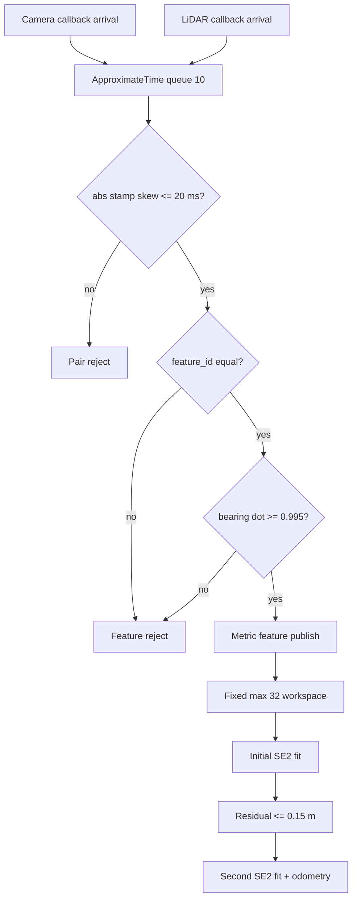

# 2026-09-12 — Camera–LiDAR Sync, Bounded Hot Path, Visual Odometry

## 오늘의 핵심 요약

오늘은 **센서의 도착 시각이 아니라 `Header.stamp`로 camera/LiDAR를 동기화하는 방법**, **최대 32개 대응점과 고정 2-pass로 계산량을 제한하는 방법**, **연속 metric feature frame을 SE(2)로 정합해 Visual Odometry를 누적하는 방법**을 하나의 실행 가능한 ROS 2 패키지로 연결한다.

- **기초 실무:** `sensor_msgs/PointCloud`, `nav_msgs/Odometry`, `SensorDataQoS`, `message_filters::ApproximateTime`, Header frame/stamp
- **심화·RT:** 20 ms timestamp 계약, 최대 32개 correspondence, `std::array` hot path, 고정 2-pass outlier trimming, `ros2_tracing`/LTTng 관찰 절차
- **알고리즘:** feature ID matching, 2D Kabsch/Procrustes closed form, residual gate, body-frame 증분의 world-frame 누적

> 이 예제는 feature detection/descriptor matching을 이미 끝낸 **metric feature front-end의 학습용 축소판**이다. ROS 메시지 sequence, DDS, 문자열 진단에는 동적 할당이 남아 있으므로 전체 노드를 hard real-time이라고 주장하지 않는다.

## 학습 순서 (Reading Order)

1. 아래 구조도에서 raw sensor stream, 동기화 경계, bounded math 경계, 독립 auditor의 책임을 나눈다.
2. [`src/sensor_simulator.cpp`](src/sensor_simulator.cpp)에서 `p_sensor=Rᵀ(L-t)`, camera bearing, 6–18 ms stamp skew를 확인한다.
3. [`src/approximate_time_sync.cpp`](src/approximate_time_sync.cpp)에서 `ApproximateTime`, QoS 호환성, 20 ms 재검사, bearing gate를 읽는다.
4. [`src/bounded_vo_estimator.cpp`](src/bounded_vo_estimator.cpp)의 `copy_bounded → ID matching → fit_se2 → residual trim → pose 누적` 순서로 수식과 코드를 연결한다.
5. [`src/vo_auditor.cpp`](src/vo_auditor.cpp)가 같은 stamp만 비교하고 누적 최대 오차로 PASS를 판정하는 이유를 생각한다.
6. 빌드·실행 후 `/sync/diagnostics`, `/vo/diagnostics`, `/vo/audit`를 관찰한다.
7. `ros2 trace`를 launch보다 먼저 시작하고 callback/publish/take의 시간축을 확인한다.
8. [`paper_review.md`](paper_review.md)와 누적 문서 [`../../knowledge/sensors/time_synchronization.md`](../../knowledge/sensors/time_synchronization.md), [`../../knowledge/realtime/ros2_tracing_lttng.md`](../../knowledge/realtime/ros2_tracing_lttng.md), [`../../knowledge/slam/visual_odometry.md`](../../knowledge/slam/visual_odometry.md)를 읽는다.

## ROS 통신 구조

```mermaid
graph LR
    SIM[sensor_simulator]
    CAM[/camera/features<br/>unit bearing PointCloud]
    LID[/lidar/features<br/>metric XY PointCloud]
    SYNC[approximate_time_sync<br/>ApproximateTime + 20 ms gate]
    METRIC[/sync/metric_features<br/>ID + metric point]
    VO[bounded_vo_estimator<br/>SE2 2-pass fit]
    ODOM[/vo/odometry]
    GT[/sim/ground_truth]
    AUDIT[vo_auditor]
    OUT[/vo/audit]

    SIM -->|33 Hz camera stamp| CAM
    SIM -->|camera + 6..18 ms| LID
    CAM --> SYNC
    LID --> SYNC
    SYNC -->|skew <= 20 ms; max 32| METRIC
    METRIC --> VO
    VO --> ODOM
    SIM -. validation only .-> GT
    ODOM --> AUDIT
    GT --> AUDIT
    AUDIT --> OUT
```

더 큰 화면에서 관계를 탐색하려면 검증된 [`architecture.html`](architecture.html)을 연다. 작성 내용은 한국어지만 Archify viewer의 고정 UI와 `<html lang>`은 현재 영어로 표시된다.

## 타임스탬프 동기화 계약



`ApproximateTime`의 queue와 age penalty는 “가장 가까워 보이는 pair 선택” 정책이다. 그것이 시스템의 안전 계약은 아니다. 그래서 callback이 실제 stamp 차이를 다시 계산하고 20 ms를 넘으면 버린다. 실제 hardware에서는 다음도 확인해야 한다.

- camera와 LiDAR stamp가 같은 clock domain인지(PTP, hardware trigger, driver offset 보정)
- `frame_id`가 실제 optical/LiDAR frame인지, extrinsic calibration이 유효한지
- queue가 overflow할 때 오래된 frame을 버릴지, pipeline 전체를 fault 처리할지
- `/use_sim_time` 전환이나 clock jump가 있었는지

## Visual Odometry 수학과 코드 연결

이전 frame의 점을 `pᵖ`, 현재 frame의 같은 landmark 점을 `pᶜ`라고 하자. 현재 점을 이전 좌표계로 옮기는 rigid transform은

\[
p^p \approx R(\Delta\theta)p^c+t
\]

이며 다음 최소제곱을 푼다.

\[
\min_{R,t}\sum_i \left\|p_i^p-(Rp_i^c+t)\right\|^2
\]

두 집합의 중심을 뺀 `x_i=p_i^c-c_c`, `y_i=p_i^p-c_p`에 대해 평면 최적 회전은

\[
\Delta\theta=\operatorname{atan2}
\left(\sum_i(x_{ix}y_{iy}-x_{iy}y_{ix}),
      \sum_i(x_{ix}y_{ix}+x_{iy}y_{iy})\right)
\]

이고 병진은 `t=c_p-Rc_c`다. 코드의 `fit_se2()`가 이 식을 그대로 구현한다. 1차 fit 뒤 residual이 0.15 m를 넘는 점을 끄고 같은 식을 한 번 더 푼다. RANSAC보다 약하지만 반복 횟수가 고정되어 학습용 timing contract가 명확하다.

`t`는 이전 robot frame 좌표이므로 global pose에는

\[
\begin{bmatrix}x\\y\end{bmatrix}_{k+1}=
\begin{bmatrix}x\\y\end{bmatrix}_{k}+
R(\theta_k)t,\qquad
\theta_{k+1}=\operatorname{wrap}(\theta_k+\Delta\theta)
\]

로 누적한다. Simulator의 camera bearing은 깊이가 없지만 LiDAR metric point가 대응점의 scale을 제공하므로 이 예제에는 monocular scale 모호성이 없다.

## 계산량과 메모리 경계

- 입력 feature `N≤32`; 범위를 벗어난 frame은 즉시 거부
- ID matching은 최대 `32×32=1,024`회 비교
- SE(2) fit 두 번, 각 pass는 `O(N)`
- 고정 배열: 현재/이전/matched point와 ID, inlier mask
- 동적 할당이 남는 곳: 수신/발행 ROS 메시지 sequence, DDS 내부, `ostringstream`, logger
- `steady_clock`의 `solve_us`는 callback 전체 application 구간이며 executor queue 대기를 포함하지 않음

이 경계는 WCET 분석의 출발점이지 증명 자체가 아니다. Target CPU에서 page fault, CPU frequency, IRQ affinity, RMW, trace overhead까지 고정하고 tail latency를 측정해야 한다.

## 빌드

ROS 2 Jazzy 환경에서 저장소 루트 기준으로 실행한다.

```bash
colcon --log-base log/2026-09-12 build \
  --base-paths daily_robotics/2026-09-12 \
  --build-base build/2026-09-12 \
  --install-base install/2026-09-12 \
  --event-handlers console_direct+
source install/2026-09-12/setup.bash
```

`build/`, `install/`, `log/`는 저장소 `.gitignore` 대상이며 커밋하지 않는다.

## 실행과 관찰

```bash
ros2 launch daily_robotics_2026_09_12 daily_demo.launch.py
```

다른 터미널에서:

```bash
source install/2026-09-12/setup.bash
ros2 node list
ros2 topic list -t
ros2 topic echo /sync/diagnostics --once
ros2 topic echo /vo/diagnostics --once
ros2 topic echo /vo/audit --once
```

공식 Jazzy container처럼 저장소 루트와 build/install 경로가 같은 환경에서는 [`scripts/smoke_test.sh`](scripts/smoke_test.sh)로 위 관찰을 한 번에 재현할 수 있다.

정상이면 stamp skew가 `6000/10000/14000/18000 us` 범위에서 반복되고, camera-only 오검출 때 `bearing_rejected=1`, 일관되게 오염된 correspondence가 들어온 frame에서는 VO `inliers < matched`가 관찰된다. Auditor는 20개 이상의 같은-stamp 비교 뒤 누적 position/yaw 오차 계약을 만족하면 `PASS`를 발행한다.

## ros2_tracing / LTTng 실습

`ros2_tracing`은 현재 Linux의 LTTng를 사용한다. trace는 node를 시작하기 **전에** 켜야 초기화 metadata까지 보존된다.

최소 `ros:jazzy-ros-base` image는 core tracepoint가 활성화되어 있어도 `ros2 trace` CLI가 빠져 있을 수 있다. `ros2 run tracetools status`가 `Tracing enabled`인지 확인하고, CLI가 없으면 `ros2trace` 배포 패키지(Ubuntu binary 배포에서는 보통 `ros-jazzy-ros2trace`)를 추가한다.

```bash
ros2 run tracetools status
ros2 trace start daily_vo_trace
ros2 launch daily_robotics_2026_09_12 daily_demo.launch.py
# 충분한 표본을 얻은 뒤 별도 터미널에서
ros2 trace stop daily_vo_trace
```

기본 trace session은 ROS 2 core tracepoint를 수집한다. callback start/end, publish, `rcl_take`의 관계로 다음을 분리한다.

1. DDS가 메시지를 가져온 시각부터 callback 시작까지의 dispatch/queue 지연
2. callback 시작부터 끝까지의 application 실행시간
3. sync node publish부터 VO callback까지의 downstream 전달 지연

Tracepoint가 low-overhead라고 해서 무비용은 아니다. 같은 workload에서 tracing on/off 두 조건을 반복하고 `solve_us`와 trace 분포가 얼마나 달라졌는지 함께 기록한다.

## 자체 검증 기록

공식 `ros:jazzy-ros-base` 컨테이너(GCC 13.3, Fast DDS)에서 검증했다. 숫자는 Docker Desktop 환경의 관찰값이지 target hardware 보장이 아니다.

- `colcon build` 성공, `-Wall -Wextra -Wpedantic` compiler warning 없음
- Launch log에서 4개 process 시작, camera/LiDAR/sync/odometry/audit 핵심 topic 5개와 type 확인
- 관찰 pair: `skew_us=6000`, `accepted_features=23`, `bearing_rejected=1`, `pair_rejected=0`
- VO 관찰: `matched=23`, `inliers=22`, `rmse_m=0.0000`; callback 최대 `1016 us` 관찰
- ExactTime auditor 420쌍: `PASS`, 현재 position error `0.00892 m`, yaw error `0.00324 rad`
- 누적 최대 오차: position `0.01008 m`, yaw `0.00324 rad`로 5 cm/0.03 rad 계약 만족
- `ros2 run tracetools status`는 `Tracing enabled`; 최소 image에는 `ros2 trace` CLI가 없어 trace 수집은 optional 패키지 설치 뒤 수행
- Archify showcase 9/9 검사 통과(오류/경고 0), HTML SHA-256 `0aae712563b802d23c7dda2cca30074c84d6d86fd2613978b8db07d134789291`
- 1440×900, 1600×1000, 1920×1080, 2048×1320 browser containment/readability 통과; 1440 light와 2048 dark capture를 육안 점검해 label·route·card 가독성 확인

## 실패 모드와 제품화 경계

- **Clock domain 불일치:** stamp 차이가 작아도 두 장치 clock offset이 틀리면 잘못된 pair다. PTP/trigger 검증이 먼저다.
- **잘못된 feature ID:** 순서가 같다는 가정은 실제 matcher에서 성립하지 않는다. Descriptor match, mutual check, geometric verification가 필요하다.
- **평면 모델 한계:** roll/pitch/높이 변화가 큰 로봇은 SE(3), PnP/essential matrix, calibrated extrinsic이 필요하다.
- **Degenerate geometry:** 점이 거의 한 직선이거나 같은 위치에 모이면 회전 추정이 약해진다.
- **고정 residual gate:** 속도·거리·센서 노이즈에 따라 0.15 m가 너무 크거나 작다. covariance/robust scale 추정이 필요하다.
- **Odometry drift:** frame-to-frame VO에는 loop closure와 global optimization이 없어 작은 오차가 누적된다.
- **Dynamic scene:** 움직이는 물체가 feature 다수를 차지하면 2-pass gate도 오염된 motion을 선택할 수 있다.
- **Hard RT 아님:** bounded math 바깥의 allocator, DDS, executor, OS scheduling은 별도 설계/검증 대상이다.

## 실습 과제

1. 동기화 상한을 10 ms로 줄이고 14/18 ms frame이 어떻게 사라지는지 topic rate와 함께 측정한다.
2. `kOutlierThresholdM`을 0.02/0.50 m로 바꾸고 inlier 수와 auditor 오차를 비교한다.
3. landmark 세 개를 거의 일직선으로 놓아 회전 추정의 condition이 나빠지는 현상을 재현한다.
4. 고정 2-pass를 bounded RANSAC 16 hypothesis로 바꾸고 outlier 비율 40%에서 비교한다.
5. `ros2 trace`로 sync와 VO callback의 queue/execute 구간을 나누고 application `solve_us`와 대조한다.
6. PointCloud 대신 loan 가능한 고정 크기 custom message를 설계하고 RMW별 loan 지원 여부를 확인한다.

## 참고 자료

- [ROS 2 Jazzy message_filters — Approximate Time Synchronizer (C++)](https://docs.ros.org/en/ros2_packages/jazzy/api/message_filters/doc/Tutorials/Approximate-Synchronizer-Cpp.html)
- [ROS 2 ros2_tracing 공식 저장소와 사용법](https://github.com/ros2/ros2_tracing)
- [ROS 2 Jazzy tracetools_trace API](https://docs.ros.org/en/jazzy/p/tracetools_trace/tracetools_trace.trace.html)
- [ROS Index — ros2trace CLI package](https://index.ros.org/p/ros2trace/)
- [ORB-SLAM 논문 — IEEE Transactions on Robotics](https://doi.org/10.1109/TRO.2015.2463671)
- [ORB-SLAM 논문 — arXiv:1502.00956](https://arxiv.org/abs/1502.00956)
- [ORB-SLAM 저자 공개 구현](https://github.com/raulmur/ORB_SLAM)
