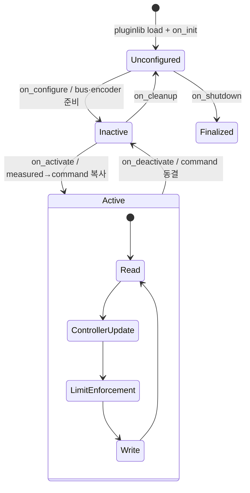

# 2026-09-13 — ros2_control Lifecycle, RT Publisher, Singularity-Robust IK

## 오늘의 핵심 요약

오늘은 **URDF의 `<ros2_control>` 계약으로 2축 하드웨어 plugin을 로드하고 configure→activate하는 과정**, **250 Hz controller `update()`에서 ROS 발행을 분리하는 방법**, **Damped Least Squares(DLS)로 특이점 근처 joint velocity 폭주를 억제하는 방법**을 하나의 실행 가능한 ROS 2 Jazzy 패키지로 연결한다.

- **기초 실무:** `controller_manager`, `ResourceManager`, `SystemInterface`, pluginlib, state/command interface, hardware/controller lifecycle
- **심화·RT:** framework-managed non-blocking handle, `RealtimeBuffer`, preallocated `RealtimePublisher`, read→update→limit→write hot path
- **알고리즘:** 2R 순기구학/Jacobian, manipulability, adaptive damping, differential IK, joint/Cartesian velocity limit

> 이 예제의 수학과 controller hot path는 동적 할당을 피하지만 Docker의 일반 Linux scheduler와 DDS까지 hard real-time이 되는 것은 아니다. 실제 장비에서는 bus timeout, drive fault, PREEMPT_RT, CPU/IRQ 격리와 WCET를 별도로 검증해야 한다.

## 학습 순서 (Reading Order)

1. 아래 구조도에서 ROS topic 영역과 Controller Manager 내부 RT loop의 경계를 구분한다.
2. [`description/study_arm.urdf`](description/study_arm.urdf)의 `<ros2_control>` plugin/interface 계약을 읽는다.
3. [`src/mock_arm_system.cpp`](src/mock_arm_system.cpp)의 `on_init → on_configure → on_activate`와 `read/write`를 연결한다.
4. [`src/dls_ik_controller.cpp`](src/dls_ik_controller.cpp)에서 `RealtimeBuffer → FK/Jacobian → DLS → command interface` 흐름을 수식과 대조한다.
5. `RealtimePublisher::trylock()` 실패 시 진단을 버리고 control deadline을 우선하는 이유를 이해한다.
6. [`launch/daily_demo.launch.py`](launch/daily_demo.launch.py)의 `OnProcessExit`가 hardware→broadcaster→controller 순서를 보장하는 방식을 확인한다.
7. 실행 후 hardware/controller state, claimed interface, `/arm/audit`의 독립 FK 결과를 관찰한다.
8. [`paper_review.md`](paper_review.md)와 누적 문서 [`../../knowledge/ros2/ros2_control_hardware_lifecycle.md`](../../knowledge/ros2/ros2_control_hardware_lifecycle.md), [`../../knowledge/realtime/realtime_publisher_handoff.md`](../../knowledge/realtime/realtime_publisher_handoff.md), [`../../knowledge/kinematics/damped_least_squares_ik.md`](../../knowledge/kinematics/damped_least_squares_ik.md)를 읽는다.

## ROS 통신 및 제어 구조

```mermaid
graph LR
    RSP[robot_state_publisher]
    DESC[/robot_description<br/>Transient Local]
    AUD[target_auditor]
    TARGET[/arm/target_xy]
    STATUS[/ik_controller/status]
    JS[/joint_states]

    subgraph CM[controller_manager — 250 Hz]
      direction LR
      RM[ResourceManager]
      HW[MockArmSystem<br/>SystemInterface]
      IK[DlsIkController]
      JSB[JointStateBroadcaster]
      RM -->|read state| HW
      HW -->|position state| IK
      IK -->|position command| HW
      HW -->|position state| JSB
    end

    RSP --> DESC --> RM
    AUD -->|reliable depth 1| TARGET --> IK
    IK -->|RealtimePublisher<br/>25 Hz| STATUS --> AUD
    JSB --> JS --> AUD
    AUD -->|PASS / WAIT| RESULT[/arm/audit]
```

`controller_manager`의 주기 순서는 개념적으로 `hardware.read() → active controller.update() → command limit → hardware.write()`다. `/arm/target_xy` callback은 non-RT executor에서 실행되고, 실제 `update()`는 `RealtimeBuffer` snapshot만 읽는다. `/ik_controller/status`의 DDS 발행도 `RealtimePublisher` 전용 non-RT thread가 맡는다.

## Lifecycle과 활성화 순서



이 launch는 `hardware_spawner --activate`가 끝난 **사건** 뒤에 `joint_state_broadcaster`, 그 spawner가 끝난 뒤 `ik_controller`, 마지막에 auditor를 시작한다. 고정 `sleep`만 사용하면 느린 machine이나 DDS discovery에서 controller가 inactive hardware를 claim하려다 실패할 수 있다.

## DLS 역기구학과 코드 연결

2R 평면 팔의 말단 위치는 다음과 같다.

\[
p(q)=\begin{bmatrix}
l_1\cos q_1+l_2\cos(q_1+q_2)\\
l_1\sin q_1+l_2\sin(q_1+q_2)
\end{bmatrix}
\]

Jacobian `J=∂p/∂q`로 `p_dot=J q_dot`이며, 코드의 DLS 해는

\[
\dot{q}=J^T(JJ^T+\lambda^2I)^{-1}K(p_d-p)
\]

다. 이것은 Cartesian velocity error와 joint speed penalty를 동시에 최소화한다.

\[
\arg\min_{\dot q}
\left(\|J\dot q-Ke\|^2+\lambda^2\|\dot q\|^2\right)
\]

2R에서는 `|det(J)|=|l1*l2*sin(q2)|`가 manipulability 지표다. 이 값이 0.12 아래로 내려가면 코드는 `lambda`를 0.005에서 최대 0.155까지 연속적으로 키운다. 이후 Cartesian 속도 ±0.8 m/s, joint 속도 ±1.5 rad/s, 위치 한계를 차례로 적용한다. DLS는 특이점을 없애는 것이 아니라, 만들기 어려운 방향의 명령 정확도를 양보해 joint velocity를 제한한다.

## RT 경계와 메모리 규칙

| 구간 | 허용한 작업 | 피한 작업 |
|---|---|---|
| lifecycle/configure | parameter, subscription/publisher 생성, vector resize, logging | 없음—비실시간 준비 구간 |
| target callback | 유효성 검사, fixed-size `Target2D` 쓰기 | controller state 직접 수정 |
| controller `update()` | fixed scalar math, non-blocking handle, `readFromRT`, `trylock` | `new`, resize, string/log, blocking lock |
| hardware `read/write()` | cached handle, fixed `std::array`, clamp | bus wait, logger, dynamic allocation |
| publisher thread | 실제 rclcpp/DDS publish | control 계산 |

`trylock()` 실패는 진단 sample 유실로 기록한다. 상태 발행이 늦다고 250 Hz control을 기다리게 만들지 않는다. 단, hardware `read/write()`에서 실제 장치 I/O가 들어오면 bounded polling, timeout과 error transition을 설계해야 한다.

## 빌드

Ubuntu 24.04 / ROS 2 Jazzy 기준 의존성:

```bash
sudo apt update
sudo apt install ros-jazzy-ros2-control \
  ros-jazzy-joint-state-broadcaster \
  ros-jazzy-robot-state-publisher
```

저장소 루트에서:

```bash
colcon --log-base log/2026-09-13 build \
  --base-paths daily_robotics/2026-09-13 \
  --build-base build/2026-09-13 \
  --install-base install/2026-09-13 \
  --event-handlers console_direct+ \
  --cmake-args -DCMAKE_BUILD_TYPE=RelWithDebInfo
source install/2026-09-13/setup.bash
```

`build/`, `install/`, `log/`는 저장소 `.gitignore` 대상이며 커밋하지 않는다.

## 실행과 관찰

```bash
ros2 launch daily_robotics_2026_09_13 daily_demo.launch.py
```

다른 터미널에서:

```bash
source install/2026-09-13/setup.bash
ros2 control list_hardware_components
ros2 control list_controllers
ros2 control list_hardware_interfaces
ros2 topic echo /arm/audit std_msgs/msg/String --once --full-length
ros2 topic echo /ik_controller/status std_msgs/msg/Float64MultiArray --once
```

`/ik_controller/status.data`의 순서는 `[x, y, error_m, lambda, q1, q2, publish_misses, interface_misses]`다. custom target도 보낼 수 있다.

```bash
ros2 topic pub --once /arm/target_xy geometry_msgs/msg/Point \
  "{x: 1.0, y: 0.5, z: 0.0}"
```

공식 Jazzy container처럼 build/install 경로가 같다면 [`scripts/smoke_test.sh`](scripts/smoke_test.sh)이 별도 `ROS_DOMAIN_ID=93`에서 lifecycle·controller·네 목표 수렴과 adaptive damping 증가를 자동 검증한다.

## 자체 검증 기록

공식 `ros:jazzy-ros-base` 컨테이너에 Jazzy ros2_control 의존성을 설치해 검증했다. 관찰 버전은 `hardware_interface/controller_interface 4.48.0`, compiler는 GCC 13.3이다.

- `colcon build -DCMAKE_BUILD_TYPE=RelWithDebInfo` 성공, `-Wall -Wextra -Wpedantic` compiler warning 없음
- `StudyArm`: `system`, lifecycle `active`, read/write 250 Hz
- `shoulder_joint/position`, `elbow_joint/position`: available + claimed
- `joint_state_broadcaster`, `ik_controller`: 모두 `active`
- 목표 `(1.20, 0.20)`: 독립 FK 오차 `0.00000460 m`, controller 오차 `0.00000477 m` 관찰
- 목표 `(0.80, 0.85)`: 독립 FK 오차 `0.000144 m`, controller 오차 `0.000149 m` 관찰
- 목표 `(1.30, -0.35)`: 독립 FK 오차 `0.0000521 m`, controller 오차 `0.0000567 m` 관찰
- 특이점 근방 목표 `(1.797, 0.0)`: 오차 `0.0000257 m`, adaptive `lambda=0.0386`으로 기본 `0.005`보다 증가
- 4,700회 이상 joint sample 동안 `rt_publish_misses=0`, `interface_misses=0`; `SMOKE_TEST_PASS`
- 일반 Docker 권한에서는 Controller Manager의 `SCHED_FIFO 50` 설정이 `Operation not permitted`로 fallback함을 확인했으며 hard RT 성능을 주장하지 않음

## 실패 모드와 제품화 경계

- **Lifecycle 순서:** inactive hardware에 controller를 먼저 활성화하면 interface switch가 거부된다.
- **통신 fault:** 이 mock은 CRC, bus timeout, encoder jump가 없다. 실제 plugin은 `read/write ERROR`와 안전 정지 정책이 필요하다.
- **특이점 trade-off:** damping이 커질수록 joint speed는 안정되지만 Cartesian tracking bias가 커진다.
- **도달 불가능 목표:** callback이 여유 작업공간 밖 목표를 거부하지만, 제품에서는 거부 상태/가장 가까운 feasible 목표를 명시해야 한다.
- **국소 알고리즘:** 큰 목표를 작은 velocity step으로 반복할 뿐 global branch, collision, joint-limit 최적화를 하지 않는다.
- **모델 불일치:** link 길이, backlash, flex, payload가 틀리면 FK 오차가 남는다.
- **진단 유실:** RealtimePublisher는 RT thread 보호를 위해 sample을 버릴 수 있다. miss counter와 별도 safety channel이 필요하다.
- **Scheduler:** 컨테이너 평균 동작은 PREEMPT_RT target의 deadline 보장이 아니다.

## 실습 과제

1. `(1.79, 0.0)` 근방 목표를 허용하고 `lambda`, 최대 joint speed, 수렴 오차가 어떻게 바뀌는지 기록한다.
2. adaptive damping을 `lambda=0` 및 고정 `0.1`과 비교해 tracking error/peak velocity 표를 만든다.
3. `read()`가 5회 연속 timeout이면 `ERROR`를 반환하고 controller가 정지하는 fault injection을 추가한다.
4. hardware를 `inactive`로 내렸다 다시 올릴 때 bumpless activation이 유지되는지 확인한다.
5. DLS를 constrained QP로 바꾸고 joint-limit avoidance와 Cartesian objective를 함께 푼다.
6. target CPU에서 `SCHED_FIFO`, CPU affinity, IRQ isolation을 적용하고 250 Hz loop overrun 분포를 비교한다.

## 참고 자료

- [ros2_control Jazzy — Getting Started / Architecture](https://control.ros.org/jazzy/doc/getting_started/getting_started.html)
- [ros2_control Jazzy — Writing a Hardware Component](https://control.ros.org/jazzy/doc/ros2_control/hardware_interface/doc/writing_new_hardware_component.html)
- [ros2_control Jazzy — Controller Manager](https://control.ros.org/jazzy/doc/ros2_control/controller_manager/doc/userdoc.html)
- [ros2_control Jazzy — RealtimePublisher API](https://control.ros.org/jazzy/doc/api/classrealtime__tools_1_1RealtimePublisher.html)
- [ROS 2 Managed Nodes lifecycle design](https://design.ros2.org/articles/node_lifecycle.html)
- [Nakamura & Hanafusa (1986), DOI 10.1115/1.3143764](https://doi.org/10.1115/1.3143764)
