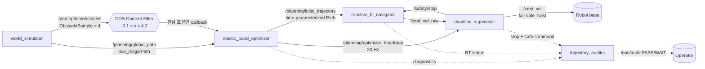

# 2026-09-14 — 반응형 Nav2 BT · DDS 필터 · Elastic Band

> **오늘의 핵심:** 전역 계획을 계속 재평가하는 Behavior Tree의 제어 흐름, 필요한 장애물만 callback 전에 거르는 DDS ContentFilteredTopic, heartbeat 누락 시 독립적으로 정지시키는 deadline supervisor, 그리고 고정 크기 배열에서 경로를 부드럽고 안전하게 변형하는 elastic-band 최적화를 하나의 실행 가능한 ROS 2 파이프라인으로 연결한다.

## 학습 순서 (Reading Order)

1. 이 README의 구조도와 **세 영역 핵심**을 먼저 읽는다.
2. [`behavior_trees/navigate_reactive.xml`](behavior_trees/navigate_reactive.xml)에서 `PipelineSequence → RecoveryNode` 흐름을 눈으로 따라간다.
3. [`src/elastic_band_optimizer.cpp`](src/elastic_band_optimizer.cpp)의 DDS 필터 설정과 두 힘의 수식을 코드와 대조한다.
4. [`src/deadline_supervisor.cpp`](src/deadline_supervisor.cpp)에서 callback group을 두 executor에 격리하는 이유를 확인한다.
5. [`src/trajectory_auditor.cpp`](src/trajectory_auditor.cpp)로 구현과 독립된 합격 조건을 확인하고 smoke test를 실행한다.
6. [`paper_review.md`](paper_review.md)에서 원 논문의 문제·직관·실무 한계를 정리한다.

## 세 영역 핵심

### 1) 기초 실무 — Nav2 Behavior Tree를 왜 쓰는가

Nav2의 BT Navigator는 `NavigateToPose` 같은 장기 작업을 행동 트리로 조립한다. 일반 `Sequence`가 앞 노드 성공 후 다음 노드만 실행하는 데 비해, `PipelineSequence`는 `FollowPath`가 실행 중이어도 상위의 `ComputePathToPose` 분기를 다시 tick할 수 있어 환경 변화에 반응하는 재계획 파이프라인을 표현한다. `RecoveryNode`는 주 동작 실패 시 costmap 정리나 대기 같은 복구 동작을 제한 횟수만큼 실행한다.

오늘의 `reactive_bt_navigator`는 BehaviorTree.CPP/Nav2 플러그인 자체가 아니다. Nav2가 없는 `ros:jazzy-ros-base`에서도 핵심 tick 의미를 관찰하도록 만든 축소 상태기다. 실제 제품에서는 XML 계약을 `nav2_bt_navigator`에 연결하고, C++ 축소 노드는 제거한다.

### 2) 심화/RT — ContentFilteredTopic + deadline supervisor

`elastic_band_optimizer`의 구독 옵션은 다음 필터를 DDS DataReader에 전달한다.

```cpp
options.content_filter_options.filter_expression = "x >= %0 AND x <= %1";
options.content_filter_options.expression_parameters = {"-0.1", "4.2"};
```

지원 RMW에서는 관심 구간 밖 장애물이 ROS callback에 도달하지 않아 역직렬화·callback 부하를 줄일 수 있다. 그러나 지원 여부는 RMW마다 다르므로 `is_cft_enabled()`를 확인하고, 미지원이면 같은 조건을 callback에서 다시 적용한다. 이 최적화는 안전 판정 자체를 대체하지 않는다.

`deadline_supervisor`는 planner가 보내는 heartbeat의 `steady_clock` age를 20 ms마다 확인한다. 150 ms를 넘으면 `/safety/stop=true`와 0 속도를 내보낸다. 안전 callback과 500 ms 문자열 telemetry는 서로 다른 `SingleThreadedExecutor`에 배치해 진단 문자열 조립이 안전 감시 큐를 막지 않게 한다. 이 구조는 실행 경로 격리일 뿐, PREEMPT_RT나 WCET 증명을 자동으로 제공하지 않는다.

### 3) 알고리즘 — bounded elastic band

각 내부 knot `p_i`에는 두 힘을 적용한다.

```text
F_internal = k_c (p_(i-1) - 2 p_i + p_(i+1))
F_external = k_r (d0 - d) / d · (p_i - o) / d,  d < d0
p_i <- clamp(p_i + F_internal + F_external)
```

첫 항은 경로의 이산 2차 미분을 줄여 꺾임을 펴고, 둘째 항은 영향 반경 안에서 장애물로부터 밀어낸다. 오늘 코드는 최대 21 knot, 장애물 8개, 반복 8회로 계산량을 `O(21 × 8 × 8)`에 제한한다. 마지막에는 각 구간 길이를 `v_max=0.6 m/s`로 나누어 pose stamp를 단조 증가시키므로 공간 경로를 최소한의 시간 매개 궤적으로 바꾼다.

이는 원 논문의 핵심 직관을 학습하기 위한 뼈대다. 실제 TEB/Nav2 controller 수준의 비홀로노믹 제약, 가속도, footprint 연속 충돌, 동적 장애물 예측, sparse graph solver는 포함하지 않는다.

## ROS 통신 구조 (`rqt_graph` 관점)



## 실시간 실행 구조

```mermaid
graph TD
    HB[Heartbeat subscription] --> CE[Critical SingleThreadedExecutor]
    RAW[Raw command subscription] --> CE
    T20[20 ms deadline timer] --> CE
    CE --> GATE{heartbeat age ≤ 150 ms?}
    GATE -->|yes| PASS[latest /cmd_vel_raw 통과]
    GATE -->|no| ZERO[0 Twist + /safety/stop]
    T500[500 ms telemetry timer] --> TE[Telemetry SingleThreadedExecutor]
    TE --> DIAG[/safety/deadline_status]
```

같은 관계를 검색·포커스·테마 전환으로 탐색하려면 [`architecture.html`](architecture.html)을 연다. 작성 내용은 한국어이며, Archify 뷰어가 한국어 UI locale을 제공하지 않아 고정 조작 UI와 HTML 언어 표시는 영어 fallback을 사용한다.

## 파일 지도

| 파일 | 역할 |
|---|---|
| `msg/ObstacleSample.msg` | DDS 필터가 직접 참조하는 top-level `x` 필드의 장애물 계약 |
| `src/world_simulator.cpp` | 17-knot 전역 경로와 관심 안/밖 장애물 4개 생성 |
| `src/elastic_band_optimizer.cpp` | CFT, 고정 배열 8회 최적화, 시간 매개화, 의도적 heartbeat gap |
| `src/reactive_bt_navigator.cpp` | `PipelineSequence`/`RecoveryNode` 의미의 20 Hz 축소 실행기 |
| `src/deadline_supervisor.cpp` | 150 ms heartbeat watchdog과 executor 격리, 안전 속도 gate |
| `src/trajectory_auditor.cpp` | endpoint·knot·timestamp·CFT·정지/복구를 topic만으로 독립 검사 |
| `scripts/smoke_test.sh` | 통합 실행 후 transient-local audit `PASS` 확인 |

## 빌드와 실행

Ubuntu 24.04 + ROS 2 Jazzy 환경에서:

```bash
cd <repository-root>
source /opt/ros/jazzy/setup.bash
colcon build \
  --base-paths daily_robotics/2026-09-14 \
  --build-base build/2026-09-14 \
  --install-base install/2026-09-14 \
  --event-handlers console_direct+
source install/2026-09-14/setup.bash
ros2 launch daily_robotics_2026_09_14 daily_demo.launch.py
```

통합 자체 검증:

```bash
bash daily_robotics/2026-09-14/scripts/smoke_test.sh
```

정상 관찰 포인트:

- optimizer 진단에 Fast DDS 기준 `cft=true`, `knots=17`, `iterations=8`이 보인다.
- 약 4초에 heartbeat가 0.5초 끊기며 supervisor의 `trips`가 1 증가한다.
- heartbeat 복귀 후 `recoveries`가 1 증가하고 BT가 `RecoveryNode`에서 `FollowPath`로 돌아간다.
- `/nav/audit`가 경로 계약, CFT, 0 속도, 복구를 모두 본 뒤 `PASS`가 된다.

## 실무 체크리스트

- 필터 필드가 메시지의 직렬화 스키마와 정확히 일치하는가?
- 시작 시 `is_cft_enabled()`를 기록하고 미지원 RMW fallback을 시험했는가?
- watchdog은 ROS time이 아니라 단조 증가 clock으로 deadline을 재는가?
- 안전 출력은 planner/controller process가 멈춰도 별도 process에서 0을 강제할 수 있는가?
- 경로 knot·반복 횟수·장애물 수에 상한이 있는가?
- knot 샘플만이 아니라 footprint sweep 전체의 충돌을 별도 검증하는가?
- BT recovery 횟수와 실패 후 안전 상태가 명시돼 있는가?

## 참고 자료

- [Nav2 Jazzy: Behavior-Tree Navigator](https://docs.nav2.org/jazzy/configuration_and_development/configuration_guide/core_servers/configuring_bt_navigator/)
- [Nav2 Jazzy: Detailed Behavior Tree Walkthrough](https://docs.nav2.org/jazzy/getting_started/nav2_behavior_trees/detailed_behavior_tree_walkthrough/detailed_behavior_tree_walkthrough/)
- [ROS 2 Jazzy rclcpp `SubscriptionOptionsBase`](https://docs.ros.org/en/jazzy/p/rclcpp/generated/structrclcpp_1_1SubscriptionOptionsBase.html)
- [ROS 2 공식 content-filtering 예제](https://github.com/ros2/examples/blob/rolling/rclcpp/topics/minimal_subscriber/content_filtering.cpp)
- [Quinlan & Khatib, “Elastic Bands: Connecting Path Planning and Control” PDF](https://khatib.stanford.edu/publications/pdfs/Quinlan_1993_ICRA.pdf)
- [DOI: 10.1109/ROBOT.1993.291936](https://doi.org/10.1109/ROBOT.1993.291936)

## 다음 확장

1. 축소 상태기를 실제 `nav2_bt_navigator` XML/플러그인과 교체한다.
2. 원형 장애물의 knot 거리 대신 costmap footprint swept-volume 충돌을 검사한다.
3. `SCHED_FIFO`, CPU affinity, tracing을 붙여 critical executor의 WCET와 jitter를 측정한다.
4. sparse graph optimizer를 사용해 비홀로노믹·속도·가속도 제약을 함께 푼다.
