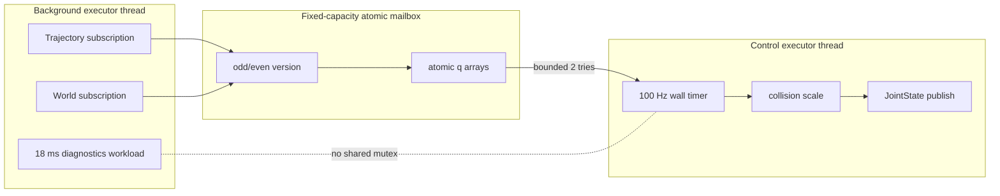
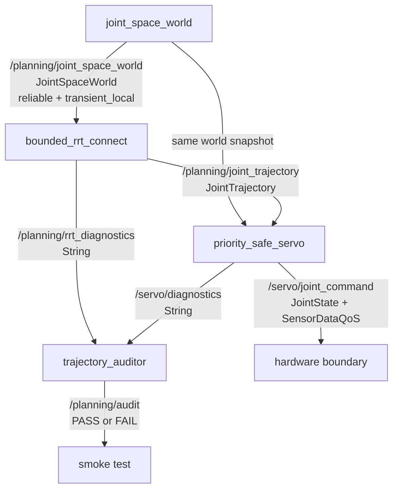

# 2026-09-15 — JointTrajectory · 우선순위 역전 회피 · Bounded RRT-Connect

> **오늘의 핵심:** 2축 로봇의 관절 공간을 Topic으로 모델링하고, 양방향 RRT-Connect로 충돌 없는 `JointTrajectory`를 만든다. 100 Hz servo는 계획/진단 callback과 별도 executor에서 돌며, 고정 용량 원자 mailbox로 궤적을 넘겨받는다. “경로를 찾기 쉬운 확률적 알고리즘”, “실행량 상한”, “운영체제 hard real-time 보장”은 서로 다른 주장임을 코드와 측정으로 구분한다.

## 학습 순서 (Reading Order)

1. 이 README의 세 영역과 구조도를 읽어 전체 데이터 흐름을 잡는다.
2. [`msg/JointSpaceWorld.msg`](msg/JointSpaceWorld.msg)와 [`src/joint_space_world.cpp`](src/joint_space_world.cpp)에서 C-space와 Transient Local QoS 계약을 확인한다.
3. [`src/bounded_rrt_connect.cpp`](src/bounded_rrt_connect.cpp)의 `EXTEND → CONNECT → SWAP` 및 고정 용량 자료구조를 따라간다.
4. [`src/priority_safe_servo.cpp`](src/priority_safe_servo.cpp)에서 callback group 격리, 원자 mailbox, 충돌 감속을 읽는다.
5. [`paper_review.md`](paper_review.md)에서 원 논문의 문제·수학적 직관·실무 한계를 정리한다.
6. 누적 노트 [`knowledge/ros2/joint_trajectory_contract.md`](../../knowledge/ros2/joint_trajectory_contract.md), [`knowledge/realtime/priority_inversion_avoidance.md`](../../knowledge/realtime/priority_inversion_avoidance.md), [`knowledge/planning/rrt_connect.md`](../../knowledge/planning/rrt_connect.md)로 복습한다.

## 세 영역 핵심

### 1) 기초 실무 — `JointTrajectory`는 “숫자 배열”이 아니라 시간 계약이다

`trajectory_msgs/msg/JointTrajectory`의 핵심 필드는 다음과 같다.

- `header.stamp`: 전체 궤적을 어느 시각 기준으로 해석할지 나타낸다.
- `joint_names`: `positions`, `velocities`, `effort` 배열의 축 순서를 정의한다. 이름과 값의 순서가 어긋나면 다른 관절이 움직인다.
- `points[i].time_from_start`: 절대 시간이 아니라 궤적 시작점부터의 누적 시간이다. 반드시 단조 증가해야 한다.
- 각 point는 위치만, 또는 위치+속도+가속도를 담을 수 있다. 실제 controller가 요구하는 필드 계약을 먼저 확인해야 한다.

오늘 planner는 `joint1`, `joint2` 순서로 51개 위치와 nominal 1.2 rad/s 기반 시간을 채운다. 실습 servo는 알고리즘을 드러내기 위해 자체 100 Hz 추종기를 사용하지만, 제품에서는 `joint_trajectory_controller`가 기대하는 interface·허용 오차·goal time을 함께 설정한다.

정적 world와 일회성 경로는 `Reliable + TransientLocal + KeepLast(1)`이다. 늦게 시작한 노드도 마지막 snapshot을 받는다. 반대로 100 Hz `/servo/joint_command`는 `SensorDataQoS`로 오래된 명령을 쌓지 않는다.

### 2) 심화/RT — priority inversion의 원인을 없애는 실행 구조

전형적인 우선순위 역전은 `Low`가 mutex를 잡은 상태에서 `High`가 그 mutex를 기다리고, 그 사이 `Medium`이 `Low`를 선점할 때 생긴다. Priority inheritance mutex는 완화책이지만, 오늘 구조는 애초에 high callback이 low callback의 mutex를 기다리지 않게 만든다.



mailbox writer는 `version`을 홀수로 만든 뒤 데이터를 쓰고 짝수로 공개한다. reader는 읽기 전후의 version이 같은 짝수일 때만 snapshot을 채택한다. writer와 겹치면 두 번까지만 재시도하고 지난 궤적을 사용하므로 무한 대기가 없다. `is_lock_free()`는 실행 플랫폼에서 실제 원자 연산이 lock-free인지 확인한다.

중요한 경계도 있다.

- 이 코드는 callback 격리와 bounded handoff를 시연하지만 일반 `rclcpp::Publisher::publish()`를 사용한다. DDS 직렬화/할당까지 포함한 allocation-free hard RT를 증명하지 않는다.
- Docker의 비특권 thread에서는 `SCHED_FIFO` 설정이 거부되었고 정상 fallback했다. PREEMPT_RT, `CAP_SYS_NICE`, CPU affinity, IRQ 격리, page fault 제거, WCET 계측은 별도 배포 단계다.
- `std::atomic<double>`의 lock-free 여부는 ABI/CPU에 따라 다를 수 있으므로 부팅 시 진단을 실패 조건으로 승격할 수 있다.

### 3) 알고리즘 — 양방향 bounded RRT-Connect

구성 `q=(q1,q2)` 한 점이 로봇의 한 자세다. 충돌 검사는 원형 금지 영역 `O_i=(c_i,r_i)`에 안전 여유 `m`을 더해 다음을 검사한다.

```text
q ∈ C_free  ⇔  ||q - c_i||₂ > r_i + m,  모든 obstacle i에 대해
```

`EXTEND`는 표본 `q_rand`에 가장 가까운 tree node에서 최대 `δ=0.14 rad` 전진한다.

```text
q_new = q_near + min(δ, ||q_rand-q_near||) · (q_rand-q_near)/||q_rand-q_near||
```

`CONNECT`는 다른 tree가 `q_new`에 닿거나 막힐 때까지 같은 `EXTEND`를 탐욕적으로 반복한다. 시작/목표 tree를 매 iteration 교대하면 양쪽에서 통로를 찾는다.

| 상한 | 오늘 값 | 실패 의미 |
|---|---:|---|
| tree당 node | 512 | 용량을 다 쓰면 더 할당하지 않음 |
| planning iteration | 600 | 시간/노드 budget 안에서 못 찾음 |
| obstacle | 8 | 입력이 많으면 앞 8개만 사용 |
| edge collision sample | 64 | local edge 검사량 제한 |
| mailbox read attempt | 2 | writer와 겹치면 이전 snapshot 유지 |

상한을 둔다고 성공이 보장되지는 않는다. 원래의 probabilistic completeness는 시간이 무한히 주어질 때 성공 확률이 1로 간다는 성질이고, 오늘 구현은 운영 deadline을 위해 600회에서 멈춘다.

## ROS 통신 구조 (`rqt_graph` 관점)



## 실습 결과

공식 `ros:jazzy-ros-base` 컨테이너(GCC 13.3, Fast DDS)에서 확인한 한 번의 재현 가능한 실행 결과다.

| 항목 | 관측값 |
|---|---:|
| `colcon build` | 성공, compiler warning 0 |
| RRT iterations | 74 |
| start/goal tree nodes | 50 / 43 |
| 출력 경로 | 51 points, 6.89958 rad |
| waypoint 최소 여유 | 0.166709 rad |
| planning callback | 44 µs |
| auditor 판정 시 control samples | 876 |
| mailbox snapshot miss | 0 |
| 실제 최소 추종 여유 | 0.178415 rad |
| container 최대 period jitter | 2957 µs |
| 통합 판정 | PASS |

이 수치는 학습용 container 한 번의 관측이지 WCET나 안전 인증 수치가 아니다. 특히 최대 jitter는 host 부하, timer source, DDS 설정에 따라 다시 측정해야 한다.

## 파일 지도

- `msg/JointSpaceWorld.msg`: start/goal과 원형 C-space obstacle 계약
- `src/joint_space_world.cpp`: Transient Local 정적 world publisher
- `src/bounded_rrt_connect.cpp`: 고정 용량 양방향 planner와 `JointTrajectory` 시간화
- `src/priority_safe_servo.cpp`: dual executor, atomic mailbox, 100 Hz collision scaling
- `src/trajectory_auditor.cpp`: planner/servo 상태를 묶는 독립 PASS/FAIL 판정
- `launch/daily_demo.launch.py`: 네 process 통합 실행
- `scripts/smoke_test.sh`: 격리된 ROS domain에서 통신·계획·추종 확인
- `paper_review.md`: Kuffner–LaValle RRT-Connect 원 논문 리뷰

## 빌드와 실행

```bash
source /opt/ros/jazzy/setup.bash
colcon build \
  --base-paths daily_robotics/2026-09-15 \
  --build-base build/2026-09-15 \
  --install-base install/2026-09-15
source install/2026-09-15/setup.bash
ros2 launch daily_robotics_2026_09_15 daily_demo.launch.py
```

별도 terminal에서:

```bash
source /opt/ros/jazzy/setup.bash
source install/2026-09-15/setup.bash
ros2 topic echo /planning/rrt_diagnostics --once
ros2 topic echo /servo/diagnostics --once
ros2 topic echo /planning/audit --once
```

## 실무 체크리스트

- 입력 trajectory의 joint 이름/순서/단위/시간 단조성을 controller 입구에서 검증하는가?
- planning scene과 servo collision monitor가 같은 timestamp/version의 geometry를 보는가?
- 고주기 callback이 logging, parameter update, collision scene write lock을 기다리지 않는가?
- `SCHED_FIFO` 성공 로그만 보지 않고 page fault, affinity, IRQ, thermal throttling까지 계측하는가?
- planning budget 초과는 안전 정지나 직전 유효 경로 유지로 연결되는가?
- RRT 경로를 그대로 실행하지 않고 shortcut/smoothing 후 연속 충돌·속도·가속도·jerk를 다시 검사하는가?

## 참고 자료

- ROS 2 Jazzy [`JointTrajectory` 메시지 정의](https://docs.ros.org/en/jazzy/p/trajectory_msgs/msg/JointTrajectory.html)
- ROS 2 Jazzy [Callback Groups 사용 가이드](https://docs.ros.org/en/jazzy/How-To-Guides/Using-callback-groups.html)
- ROS 2 Jazzy [callback-group-level executor 예제](https://docs.ros.org/en/jazzy/p/examples_rclcpp_cbg_executor/)
- MoveIt Servo [collision velocity scaling이 적용되는 구현](https://moveit.picknik.ai/main/api/html/servo_8cpp_source.html)
- Kuffner & LaValle, [RRT-Connect 원 논문 PDF](https://www.clear.rice.edu/comp450/papers/kuffner_lavalle_00.pdf), ICRA 2000, DOI: [10.1109/ROBOT.2000.844730](https://doi.org/10.1109/ROBOT.2000.844730)

## 다음 확장

1. 원형 proxy 대신 MoveIt `PlanningSceneMonitor`의 연속 충돌 검사로 교체한다.
2. nearest-neighbor를 k-d tree/GNAT로 바꾸고 동일 budget에서 성공률을 비교한다.
3. shortcutting과 jerk-limited time parameterization을 넣은 뒤 원경로와 실행 시간을 비교한다.
4. PREEMPT_RT host에서 page fault를 잠그고 cyclictest/ros2_tracing과 함께 p99.9/WCET 후보를 측정한다.
