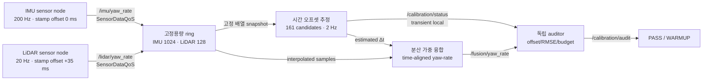
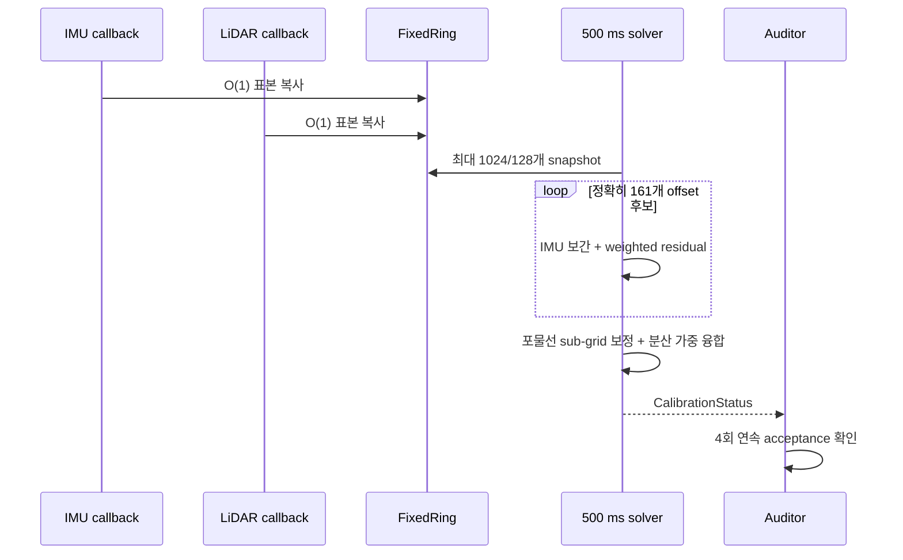

# 2026-09-16 — 측정 시각, 온라인 시간 오프셋 보정, 분산 가중 센서 융합

## 오늘의 핵심

오늘은 **메시지가 도착한 시각과 실제 측정 시각을 구분**하고, IMU 200 Hz와 LiDAR 20 Hz 사이의 알려지지 않은 `+35 ms` stamp 오프셋을 온라인으로 추정한다. 센서 callback은 고정용량 ring에 O(1)로 복사하고, 2 Hz worker가 `[-80, +80] ms`를 1 ms 간격의 161개 후보로 탐색한다. 마지막에는 보정된 같은 시각의 두 yaw-rate를 분산의 역수로 가중 융합한다.

오늘의 세 축은 다음과 같다.

1. **기초 실무:** `Header.stamp`, `frame_id`, Topic, `SensorDataQoS`, covariance 계약
2. **심화/RT:** 고정용량 ring, callback/solver 분리, 고정 후보·표본 수로 계산량 제한
3. **알고리즘:** 시간 오프셋 최소제곱 추정, 선형 시간 보간, 분산 가중 센서 융합

> 이 실습의 bounded computation은 평균 실행 시간이 아니라 **최악 입력 크기**를 제한한다. 그러나 일반 Linux, DDS publish, executor wake-up까지 hard real-time임을 증명하지는 않는다.

## 학습 순서 (Reading Order)

1. 이 README의 `시간 계약`과 두 구조도를 읽는다.
2. [`src/yaw_rate_sensor.cpp`](src/yaw_rate_sensor.cpp)에서 측정값과 잘못된 stamp가 어떻게 분리되는지 본다.
3. [`src/time_offset_fusion.cpp`](src/time_offset_fusion.cpp)에서 ring → 보간 → 탐색 → 융합 수식을 코드와 연결한다.
4. [`src/calibration_auditor.cpp`](src/calibration_auditor.cpp)의 독립 acceptance rule을 확인한다.
5. [`paper_review.md`](paper_review.md)에서 연속시간 최대우도 보정과 오늘의 축소 구현을 비교한다.
6. 빌드·실행 후 `/calibration/status`와 `/calibration/audit`를 관찰한다.

## 시스템 아키텍처



실행 경로의 핵심은 callback과 계산 worker를 논리적으로 분리하는 것이다.



더 큰 화면에서 탐색 가능한 별도 구조도는 [`architecture.html`](architecture.html)에 생성된다. 원본 사양은 [`architecture.json`](architecture.json)이다.

## 1. 기초 실무 — stamp, frame, covariance, QoS

### 도착 시각과 측정 시각은 다르다

`Header.stamp`는 보통 센서가 물리량을 관측한 시각을 뜻한다. DDS가 subscriber에 전달한 시각은 network queue, driver batching, executor scheduling의 영향을 받는다. 따라서 두 callback이 비슷한 시각에 호출되었다는 사실만으로 두 값이 같은 물리 시각을 나타낸다고 가정하면 안 된다.

이 실습의 LiDAR는 물리 시각 `t`의 값을 만들면서 `Header.stamp=t+35 ms`를 넣는다. 추정할 값은 다음 부호 규약의 `Δt`다.

\[
t_{physical}=t_{lidar\_stamp}-\Delta t
\]

따라서 결과가 `+35 ms`이면 LiDAR stamp에서 35 ms를 빼야 IMU 시간축과 정렬된다는 의미다.

### QoS 선택

- 입력은 `rclcpp::SensorDataQoS().keep_last(5)`다. 최신 표본을 빠르게 받는 것이 오래된 표본의 재전송보다 중요하다는 선택이다.
- `/calibration/status`와 `/calibration/audit`는 `reliable + transient_local + depth 1`이다. 늦게 들어온 도구도 마지막 보정 결과를 즉시 볼 수 있다.
- publisher와 subscription QoS가 호환되지 않으면 Topic 이름과 타입이 같아도 통신하지 않는다.

## 2. 심화/RT — bounded computation

| 경계 | 오늘의 상한 | 의미 |
|---|---:|---|
| IMU ring | 1024 samples | 약 5.1 s @ 200 Hz |
| LiDAR ring | 128 samples | 약 6.4 s @ 20 Hz |
| offset range | `[-80,+80] ms` | 예상 clock error 범위 |
| coarse candidates | 161 | 1 ms grid, 매 solve마다 고정 |
| solver period | 500 ms | callback에서 계산을 분리 |
| acceptance budget | 50 ms | 학습용 느슨한 CI 상한 |

`std::array` ring은 가득 차면 가장 오래된 표본을 덮어쓴다. callback에서는 메시지의 stamp, yaw-rate, variance만 복사한다. 반면 solver는 snapshot 이후 제한된 크기의 탐색을 수행한다. 메모리와 iteration 상한은 명확하지만 다음은 여전히 측정해야 한다.

- DDS serialization/publish의 내부 할당
- executor wake-up jitter와 OS scheduling latency
- cache miss, page fault, logging I/O
- 실제 센서 driver와 clock source의 drift

## 3. 알고리즘 — 시간 오프셋과 센서 융합

LiDAR 표본 `j`의 stamp를 `s_j`, 값과 분산을 각각 `z^L_j`, `σ²_L`라 하자. 후보 `Δt`마다 IMU ring에서 `s_j-Δt`를 감싸는 두 표본을 찾아 선형 보간한 값을 `z^I(s_j-Δt)`로 만든다.

\[
J(\Delta t)=
\frac{\sum_j w_j\left[z^L_j-z^I(s_j-\Delta t)\right]^2}
     {\sum_j w_j},\qquad
w_j=\frac{1}{\sigma^2_L+\sigma^2_I}
\]

161개 후보 중 `J`가 가장 작은 격자를 찾고, 그 점과 좌우 이웃의 비용에 포물선을 맞춰 sub-millisecond 보정을 얻는다. 정렬 후 독립 Gaussian noise를 가정하면 scalar 최소분산 융합은 다음과 같다.

\[
\hat\omega=
\frac{\omega_I/\sigma_I^2+\omega_L/\sigma_L^2}
     {1/\sigma_I^2+1/\sigma_L^2},\qquad
\mathrm{Var}(\hat\omega)=\frac{1}{1/\sigma_I^2+1/\sigma_L^2}
\]

분산이 작은 IMU에 더 큰 가중치가 생긴다. 두 센서 오차가 상관되어 있거나 variance가 실제 noise를 반영하지 않으면 이 결과는 과신될 수 있다.

## 빌드와 실행

ROS 2 Jazzy 환경에서 저장소 루트를 workspace로 사용한다.

```bash
source /opt/ros/jazzy/setup.bash
colcon --log-base log/2026-09-16 build \
  --base-paths daily_robotics/2026-09-16 \
  --build-base build/2026-09-16 \
  --install-base install/2026-09-16 \
  --event-handlers console_direct+
source install/2026-09-16/setup.bash
ros2 launch daily_robotics_2026_09_16 daily_demo.launch.py
```

자동 smoke test:

```bash
bash daily_robotics/2026-09-16/scripts/smoke_test.sh
```

관찰 명령:

```bash
ros2 topic echo /calibration/status daily_robotics_2026_09_16/msg/CalibrationStatus --once \
  --qos-reliability reliable --qos-durability transient_local
ros2 topic echo /calibration/audit std_msgs/msg/String --once \
  --qos-reliability reliable --qos-durability transient_local
```

정상 실행에서는 추정 offset이 `35 ms` 부근으로 수렴하고, auditor가 `offset error ≤ 3 ms`, `RMSE ≤ 0.06 rad/s`, `matched pairs ≥ 50`, `solve ≤ 50 ms`를 네 번 연속 확인한 뒤 `PASS`를 발행한다.

## 자체 검증 결과

- 공식 `ros:jazzy-ros-base` 컨테이너, GCC 13.3에서 `colcon build` 성공
- 세 실행 파일과 `CalibrationStatus` type support를 compiler warning 없이 생성
- 네 노드와 다섯 Topic discovery 확인
- 대표 관측값: `estimated_offset=33.963 ms`, `RMSE=0.01562 rad/s`, `matched_pairs=103`
- 같은 실행의 auditor: `PASS`, offset error 약 `1.0 ms`, 최대 관측 solve time `1.658 ms`
- Archify 구조도: showcase 9/9, 오류/경고 0; 1440×900부터 2048×1320까지 light/dark containment와 가독성 확인

이 숫자는 일반 Windows host 위 Docker에서 수행한 기능 검증이며 실제 robot CPU의 WCET 또는 hard-RT 보장은 아니다.

## 실무 확장 질문

1. 회전하지 않고 정지한 구간에서 offset이 관측 가능한가?
2. constant offset이 아니라 clock skew까지 있으면 상태를 어떻게 늘릴 것인가?
3. LiDAR 한 scan 안의 각 beam 시각이 다르면 대표 stamp 하나로 충분한가?
4. 센서 noise가 상관되어 있으면 scalar inverse-variance 식을 어떻게 바꿔야 하는가?
5. 실제 RT 요구가 있다면 solver를 어느 thread/CPU에 배치하고 어떤 trace를 남길 것인가?

## 참고 자료

- [ROS 2 Jazzy: Topics, Services, Actions](https://docs.ros.org/en/jazzy/How-To-Guides/Topics-Services-Actions.html)
- [ROS 2 QoS settings](https://docs.ros.org/en/humble/Concepts/Intermediate/About-Quality-of-Service-Settings.html)
- [geometry_msgs/TwistWithCovarianceStamped](https://docs.ros.org/en/jazzy/p/geometry_msgs/msg/TwistWithCovarianceStamped.html)
- [Furgale, Rehder, Siegwart, “Unified Temporal and Spatial Calibration for Multi-Sensor Systems,” IROS 2013](https://doi.org/10.1109/IROS.2013.6696514)
- [ETH Research Collection metadata](https://www.research-collection.ethz.ch/items/487b06bb-dcbe-411d-ab46-8580147273ac)
