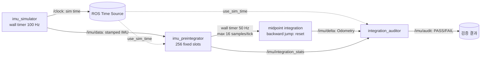

# 2026-09-17 — ROS 시각, 재생 결정성, 평면 IMU 사전적분

오늘의 핵심: ROS 2의 **측정 시각(`Header.stamp`)**과 콜백 도착 시각, **시뮬레이션 시각(`/clock`)**과 처리 주기를 분리한다. 100 Hz IMU를 고정 용량 큐에 받고, 한 번에 최대 16개만 적분해 상대 자세·속도·위치를 추정한다. 4초마다 시계를 역행시켜 재생 경계에서 상태가 섞이지 않는지도 확인한다. 이는 알고리즘/버퍼링 실습이지 hard real-time 보증이나 완전한 3D VIO가 아니다.

## 학습 순서 (Reading Order)

1. [ROS 시각과 메시지 계약](../../knowledge/ros2/clock_and_replay.md): `use_sim_time`, `/clock`, `Header.stamp`, 벽시계 타이머의 차이.
2. [결정적 버퍼링](../../knowledge/realtime/bounded_replay_pipeline.md): 고정 배열, 배치 예산, 포화/시각 점프 정책.
3. [평면 IMU 사전적분](../../knowledge/sensor_fusion/planar_imu_preintegration.md): 중점 적분 수식과 가정.
4. `src/imu_simulator.cpp` → `src/imu_preintegrator.cpp` → `src/integration_auditor.cpp`를 따라가며 실습한다.
5. [논문 리뷰](paper_review.md)를 읽고 연구용 완전 모델과 오늘의 교육용 구현을 비교한다.

## 오늘의 시스템 구조



[대화형 구조도](architecture.html)는 같은 흐름을 별도 HTML로 보여준다. 작성 콘텐츠는 한국어이나 뷰어의 고정 UI는 영어로 표시된다.

### 세 학습 축을 연결하기

- **기초:** 발행자 하나가 `/clock`을 내보내고 소비자에는 `use_sim_time=true`를 설정한다. IMU는 `sensor_msgs/Imu`의 `header.stamp`와 `frame_id=imu_link`를 가진다. `orientation_covariance[0]=-1`은 방향 추정 미제공이다. 시간 0은 초기화되지 않은 ROS 시각일 수 있으므로 데모는 10초부터 시작한다.
- **심화/RT:** 콜백은 O(1) 복사만 하고 `std::array<Sample,256>` 큐가 포화되면 새 값을 세어 버린다. 20 ms 벽시계 처리마다 최대 16개를 소비한다. 큐 점유가 한도에 도달할 수 있고 DDS, `publish()`, 로그, executor 스케줄링에는 별도 한도가 없다. 따라서 이 코드는 정해진 작업량을 보여줄 뿐 엄격한 WCET 또는 hard-RT 증거가 아니다.
- **알고리즘:** `dt=(stamp_k-stamp_{k-1})·10⁻⁹`, `θ_mid=θ+ωdt/2`, `a_o=R(θ_mid)a_b`, `p+=vdt+a_o dt²/2`, `v+=a_o dt`, `θ+=ωdt`. 중력 제거된 평면 가속도, 알려진 영(0) 바이어스, 초기 상대 상태 0을 가정한다. 미분 가능한 bias 보정, covariance/Jacobian, 3D `SO(3)` 회전, 최적화 인자는 생략했다.

### 실행과 관찰

Ubuntu 24.04 / ROS 2 Jazzy의 `colcon` workspace `src` 아래에 오늘 폴더를 놓거나 다음처럼 개별 경로를 빌드한다. 저장소 루트에서:

```bash
source /opt/ros/jazzy/setup.bash
colcon --log-base log/2026-09-17 build --base-paths daily_robotics/2026-09-17 \
  --build-base build/2026-09-17 --install-base install/2026-09-17 \
  --event-handlers console_direct+
source install/2026-09-17/setup.bash
ros2 launch daily_robotics_2026_09_17 daily_demo.launch.py
```

다른 터미널에서 같은 setup과 `ROS_DOMAIN_ID`를 맞추어 다음을 확인한다.

```bash
ros2 topic echo /imu/delta nav_msgs/msg/Odometry --once
ros2 topic echo /imu/integration_stats std_msgs/msg/UInt32MultiArray --once \
  --qos-durability transient_local
ros2 topic echo /imu/audit std_msgs/msg/String --once \
  --qos-durability transient_local
```

`/imu/integration_stats.data`는 순서대로 `[시각 역행/간격 초과 초기화, 큐 포화, 중복 시각, 최대 처리 배치]`이다. 약 6.5초 후 두 번째 재생 주기에서 감사가 PASS면 `clock_resets>=1`, `queue_overflows=0`, `max_batch<=16`, 위치 오차 0.02 m 미만을 확인한 것이다. `scripts/smoke_test.sh`는 이를 자동 확인한다. 시간 점프를 늦게 받아도 감사는 첫 주기 결과를 PASS로 착각하지 않도록 `clock_resets`를 요구한다.

rosbag2를 별도로 설치했다면 `/imu/data`를 녹화하고 `ros2 bag play <bag> --clock`으로 `/clock`과 함께 재생할 수 있다. 이때 시뮬레이터 노드는 **동시에 실행하지 말고**, 재생 실험마다 사전적분기를 새로 시작하거나 시각 점프 처리·토픽의 기록 범위를 확인한다. rosbag2의 재생 순서는 보통 기록 수신 시각을 따르므로 IMU의 `Header.stamp` 일치/단조성은 별도 검증해야 한다. 이 저장소의 자동 검증은 자체 결정적 시뮬레이터를 사용하며 rosbag2 녹화·재생 성능을 검증했다고 주장하지 않는다.

실기 적용 전에는 IMU 중력·바이어스·축 정렬 보정, 온도·시간 동기화, 공분산 전파, 데이터 손실 복구, 큐 워터마크/지연 계측과 위험한 명령을 차단하는 독립 안전 계층이 필요하다. 특히 `Odometry`의 큰 양의 대각 공분산(1e6)은 보수적 임시값이지 전파된 통계량이 아니므로 다른 추정기에 그대로 연결하면 안 된다.

## 참고 자료

- [ROS 2 Clock and Time 설계 문서](https://design.ros2.org/articles/clock_and_time.html) — 시계 추상화, 0 시각, 역행 점프.
- [ROS 2 rosbag2 공식 저장소](https://github.com/ros2/rosbag2) — record/play 및 `--clock` 동작; 실제 버전의 `--help`로 옵션 확인.
- [ROS 2 `sensor_msgs/Imu` 메시지 원본](https://github.com/ros2/common_interfaces/blob/jazzy/sensor_msgs/msg/Imu.msg) — 미제공 orientation 및 covariance 의미.
- [Forster et al., *On-Manifold Preintegration for Real-Time Visual-Inertial Odometry*](https://arxiv.org/abs/1512.02363), IEEE T-RO 33(1), 2017, DOI: 10.1109/TRO.2016.2597321.
