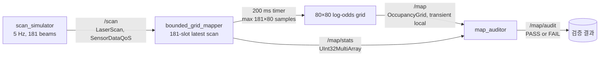

# 2026-09-18 — LaserScan 계약과 고정 용량 점유 격자

오늘의 핵심: 정지한 라이다가 `x=2 m` 벽을 보는 181광선 `LaserScan`을 발행한다. 매퍼는 콜백에서 최대 181개 범위만 고정 배열에 복사하고, 200 ms 타이머에서 최대 `181×80`개의 5 cm 광선 샘플로 80×80 점유 격자를 갱신한다. 별도 감사 노드가 자유공간, 벽, 벽 뒤 미관측 영역을 확인한다.

## 학습 순서 (Reading Order)

1. [LaserScan 메시지 계약](../../knowledge/sensors/laser_scan_contract.md): 각도, 취득 시각, 유효 범위, 좌표계.
2. [점유 격자와 로그 오즈](../../knowledge/mapping/occupancy_grid.md): 광선 역센서 모델, 셀 인덱스, 미관측 값.
3. [고정 용량 처리](../../knowledge/realtime/bounded_grid_processing.md): 입력/반복 횟수의 상한과 RT 경계.
4. `src/scan_simulator.cpp` → `src/bounded_grid_mapper.cpp` → `src/map_auditor.cpp`를 읽고 실행한다.
5. [논문 리뷰](paper_review.md)에서 역사적 sonar 증거 격자와 오늘의 laser 데모를 비교한다.

## 오늘의 시스템 구조



| 학습 축 | 오늘의 핵심 |
| --- | --- |
| 기초 실무 | `LaserScan`의 `header.stamp`는 첫 광선 시각이다. `angle_min + i×angle_increment`는 i번째 광선 방향이고, `frame_id=map`은 **정지 센서가 map 원점과 정확히 일치한다**는 이번 실습 전제다. 실기에서는 TF와 운동 보정이 필요하다. |
| 심화/RT | 센서 콜백은 최대 181개 `float`를 복사하며, 이전 미처리 스캔을 새 스캔으로 교체할 때 `replaced_scans`를 센다. 타이머의 광선 추적은 최대 181×80번이다. `OccupancyGrid` 생성·발행, DDS, executor, OS 스케줄링은 동적 메모리/지터가 가능해 hard RT 보장은 없다. |
| 알고리즘 | 각 유효 광선의 끝점 **앞** 셀에는 자유 증거 `−0.4`, 실제 반사 끝점에는 점유 증거 `+0.85`를 더한다. `l=log(p/(1−p))`, `p=1/(1+exp(−l))`이며 누적 `l`을 `[−4,4]`로 제한한다. 한 광선이 같은 셀을 두 번 갱신하지 않는다. |

`/map/stats.data` 순서는 `[수신 스캔, 계약 거절, 처리, 최신값 교체, 관찰된 최대 광선 스텝]`이다. 계약을 벗어난 전체 스캔과 NaN/Inf·범위 밖 개별 광선은 지도에 넣지 않는다. `range==range_max`는 이 **데모가 정한** 반사 없음 규칙으로 자유공간만 갱신한다. 실제 라이다 드라이버의 무반사 표현은 반드시 확인해야 한다.

## 실행과 확인

Ubuntu 24.04 / ROS 2 Jazzy의 `colcon` 환경에서 저장소 루트 기준:

```bash
source /opt/ros/jazzy/setup.bash
colcon --log-base log/2026-09-18 build --base-paths daily_robotics/2026-09-18 \
  --build-base build/2026-09-18 --install-base install/2026-09-18 \
  --event-handlers console_direct+
source install/2026-09-18/setup.bash
ros2 launch daily_robotics_2026_09_18 daily_demo.launch.py
```

다른 터미널에서도 ROS 환경과 같은 `ROS_DOMAIN_ID`를 설정한다.

```bash
ros2 topic echo /map/audit std_msgs/msg/String --once \
  --qos-reliability reliable --qos-durability transient_local
ros2 topic echo /map/stats std_msgs/msg/UInt32MultiArray --once \
  --qos-reliability reliable --qos-durability transient_local
# 자동 통합 검사: bash daily_robotics/2026-09-18/scripts/smoke_test.sh
```

감사는 최소 세 스캔 처리 후 `x=1 m` 자유 셀 ≤35%, `x=2 m` 벽 셀 ≥65%, `x=3 m` 벽 뒤 셀 `−1`(unknown), 최대 광선 스텝 ≤80을 요구한다. Jazzy 컨테이너 검증에서는 `PASS free=2 wall=98 behind=-1 received=3 processed=3 rejected=0 replaced=0 max_steps=79`를 얻었다. `build/`, `install/`, `log/`는 Git 무시 대상이다.

이 예제는 센서가 움직이지 않고 지도 좌표와 정렬되어 있으며, 벽이 움직이지 않는다고 가정한다. 실기 적용 전에는 TF/외부 보정, 스캔 내 이동 보정, 센서별 반사·무반사 모델, 포즈 오차, 셀 간 상관, 동적 장애물, 지도의 장기 관리가 필요하다. 같은 고정 스캔을 반복하면 독립 관측이라는 근사가 깨져 확률이 과신될 수 있다. 이 지도는 위치 추정이나 완성된 SLAM 시스템이 아니다.

## 참고 자료

- [ROS 2 Jazzy `LaserScan` 메시지 정의](https://github.com/ros2/common_interfaces/blob/jazzy/sensor_msgs/msg/LaserScan.msg): `Header.stamp`, 각도·범위 필드.
- [ROS 2 Jazzy `OccupancyGrid` 메시지 정의](https://github.com/ros2/common_interfaces/blob/jazzy/nav_msgs/msg/OccupancyGrid.msg): row-major 인덱스와 셀 값 계약.
- [ROS 2 Jazzy `SensorDataQoS`](https://docs.ros.org/en/jazzy/p/rclcpp/generated/classrclcpp_1_1SensorDataQoS.html): keep-last 5, best-effort, volatile 기본값.
- [Moravec & Elfes, *High Resolution Maps from Wide Angle Sonar*, ICRA 1985](https://ieeexplore.ieee.org/document/1087316/), [CMU 원문 PDF](https://www.ri.cmu.edu/pub_files/pub3/moravec_hans_1985_2/moravec_hans_1985_2.pdf).
