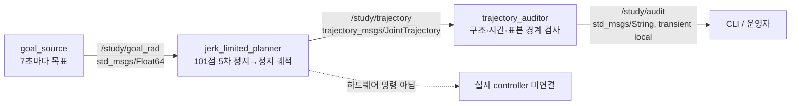

# 2026-09-19 — 관절 궤적 계약과 jerk 제한 시간 조정

**핵심 요약:** ROS 2 `JointTrajectory`의 관절 이름·시작 시각·상대 시간을 익히고, 정지→정지 단일 관절 목표에 5차 다항식과 해석적 시간 상한을 적용한다. 101개 표본만 생성하는 계획 경로를 별도 노드가 감사한다. 이는 **궤적 생성 실습**이지 모터 제어, 충돌 안전 또는 하드 실시간 보증이 아니다.

## 학습 순서 (Reading Order)

1. 이 문서의 메시지 계약과 구조도를 읽고 목표/계획/감사를 구별한다.
2. [`knowledge/control/jerk_bounded_timing.md`](../../knowledge/control/jerk_bounded_timing.md)에서 수식과 시간 하한을 확인한다.
3. `src/goal_source.cpp` → `src/jerk_limited_planner.cpp` → `src/trajectory_auditor.cpp` 순서로 주석과 구현을 따라간다.
4. [`paper_review.md`](paper_review.md)를 읽고 Ruckig과 오늘의 제한된 데모를 비교한다.
5. 빌드·실행·bag 기록 후 감사 출력을 확인한다.

## 노드와 Topic



`JointTrajectory.header.stamp`는 ROS 시계로 찍은 생성 시각이며 `points[i].time_from_start`는 그 시작으로부터의 상대 Duration이다. `joint_names=["joint1"]`과 각 점의 `positions`, `velocities`, `accelerations` 배열 길이가 일치해야 한다. `goal_rad`는 위치 목표이며 피드백을 받지 않으므로 두 번째 계획의 시작점은 **이전 목표에 도착했다고 가정**한다. 실기 적용 전에는 실제 JointState, stale-goal 검출, controller 상태, 충돌/관절 한계 및 긴급정지가 필요하다. 본 데모의 `header.stamp`를 실제 `joint_trajectory_controller` 시작 시각 계약과 곧바로 혼동하지 말 것.

## 알고리즘과 RT 경계

거리 `Δ=q_goal-q_start`, 정규화 시간 `s=t/T`에 대해 `q=q_start+Δ(10s³−15s⁴+6s⁵)`를 쓴다. 시작/끝의 속도와 가속도가 0이다. `max|v|=15|Δ|/(8T)`, `max|a|=10|Δ|/(√3 T²)`, `max|jerk|=60|Δ|/T³`이므로 `T=max(0.5, 1.875|Δ|/v_max, sqrt((10/√3)|Δ|/a_max), cbrt(60|Δ|/j_max))`. 기본 제한은 0.7 rad/s, 1.0 rad/s², 1.5 rad/s³이다. 101개 표본의 산술 루프는 고정 크기 `std::array`; ROS 메시지 벡터 할당과 DDS publish/스케줄링은 별도이며 WCET 또는 hard RT를 주장하지 않는다. 5차 위치식의 **연속시간 jerk**는 제한되지만 controller가 점들을 어떤 방식으로 보간하는지에 따라 실기 경로의 성질은 달라진다.

감사 노드는 메시지 길이, 단조 시간, 유한값, 시작/끝 속도·가속도 0, 모든 표본의 5차 모델 일치 여부, 그리고 독립 계산한 연속시간 극댓값을 검사한다. 가속도 차분 jerk도 보고하지만 구간 평균이므로 이것만으로 표본 밖 피크를 증명하지 않는다. 연속시간 경계는 *표본 사이에도 지정된 5차 식을 실제로 실행한다*는 전제의 해석적 식에서 온다. 입력 거절은 비유한값 또는 절댓값 π rad 초과이며, 실제 기계적 조인트 한계와 무관하다.

## 빌드 및 실습 (ROS 2 Jazzy)

저장소 루트에서:

```bash
source /opt/ros/jazzy/setup.bash
colcon --log-base log/2026-09-19 build --base-paths daily_robotics/2026-09-19 \
  --build-base build/2026-09-19 --install-base install/2026-09-19 \
  --cmake-args -DCMAKE_BUILD_TYPE=Release
source install/2026-09-19/setup.bash
ros2 launch daily_robotics_2026_09_19 daily_demo.launch.py
```

다른 터미널에서도 ROS/overlay를 source한 뒤 `ros2 topic echo /study/audit --qos-durability transient_local`로 PASS와 측정 피크를 본다. 자동 검증은 `bash daily_robotics/2026-09-19/scripts/smoke_test.sh` (빌드된 저장소 루트). 기록은 별도 터미널에서 `ros2 bag record -o /tmp/study_trajectory_2026_09_19 /study/goal_rad /study/trajectory /study/audit`; 이는 디스크/스케줄링에 영향을 주므로 제어 루프와 분리한다. `/tmp` 기록을 커밋하지 않는다. `ros2 bag info /tmp/study_trajectory_2026_09_19`로 메시지 수를 확인할 수 있다.

## 참고 자료

- [ROS 2 Jazzy ros2_control 궤적 표현/보간 계약](https://control.ros.org/jazzy/doc/ros2_controllers/joint_trajectory_controller/doc/trajectory.html)
- [ROS 2 rosbag2 기록 CLI](https://github.com/ros2/rosbag2/blob/rolling/README.md)
- [RSS 2021 Ruckig 논문 원문](https://www.roboticsproceedings.org/rss17/p015.pdf)
