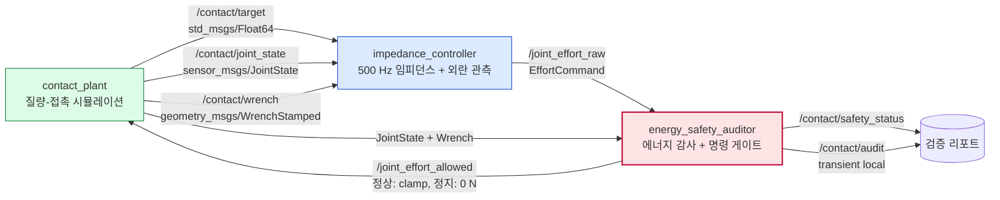

# 2026-09-23 — 접촉 안전 임피던스 제어와 독립 에너지 감사

오늘은 **ROS 2 센서/명령 Topic 계약**, **500 Hz bounded hot path와 안전 게이트 분리**, **임피던스 제어·외란 관측·수동성 에너지 수지**를 하나의 실행 가능한 패키지로 연결한다. 핵심 관점은 “제어기가 접촉을 잘 다루는가?”와 “제어기가 고장 나도 별도 경로가 명령을 차단하는가?”를 서로 다른 문제로 보는 것이다.

> 이 코드는 개념 검증용 1자유도 시뮬레이션이다. 일반 Linux/DDS 위에서 hard real-time이나 기능 안전을 보증하지 않으며, 실제 협동로봇에는 토크 센서 검증, WCET 분석, PREEMPT_RT, 드라이브 STO와 인증된 안전 회로가 별도로 필요하다.

## 학습 순서 (Reading Order)

1. 이 README의 통신 구조와 세 개의 수식을 먼저 읽는다.
2. [`src/contact_plant.cpp`](src/contact_plant.cpp)에서 `JointState`, `WrenchStamped`, Kelvin-Voigt 접촉 모델을 연결한다.
3. [`src/impedance_controller.cpp`](src/impedance_controller.cpp)에서 임피던스 식과 모델 잔차 외란 관측기를 따라간다.
4. [`src/energy_safety_auditor.cpp`](src/energy_safety_auditor.cpp)에서 3-sample trip, 복구 히스테리시스, 에너지 수지를 확인한다.
5. [`paper_review.md`](paper_review.md)로 Hogan의 근간 논문과 오늘 구현의 차이를 구분한다.
6. 빌드 후 `scripts/smoke_test.sh`를 실행해 의도적 35 N 결함이 정확히 한 번 차단·복구되는지 확인한다.

## 오늘의 세 축

### 1) 기초 실무 — ROS 2 센서와 명령의 계약

- `sensor_msgs/JointState`: `name`, `position`, `velocity`, `effort`의 인덱스가 같은 관절을 가리켜야 한다. 제어기는 배열 길이와 관절 이름을 먼저 검증한다.
- `geometry_msgs/WrenchStamped`: 힘/토크뿐 아니라 **측정 시각**과 **표현 좌표계**(`tool0`)를 함께 운반한다.
- 센서 스트림은 `SensorDataQoS`(best effort, keep last 5), 원시/허용 힘 명령은 reliable QoS를 사용한다.
- 플랜트는 `/joint_effort_raw`를 구독하지 않는다. 반드시 안전 게이트가 발행한 `/joint_effort_allowed`만 받는다.

### 2) 심화·RT — 계산 경로와 안전 경계 분리

- 500 Hz 제어 콜백은 고정 횟수 스칼라 산술만 수행하고 로그, 파일 I/O, 대기, 반복 수렴을 넣지 않는다.
- 사용자 메시지는 동적 배열 없이 고정 크기 필드만 가진다. 단, `publish()` 내부 DDS 직렬화/할당까지 제거한 것은 아니므로 zero-allocation을 주장하지 않는다.
- 문자열 리포트는 2 Hz 타이머로 분리한다. 수치 `SafetyStatus`도 약 50 Hz로 낮춰 직렬화 비용을 줄인다.
- 안전 감사기는 원시 힘, 접촉력, 샘플 나이, 에너지 수지를 독립 검사한다. 3회 연속 위반 후 정지하고, 최소 400 ms와 50회 연속 정상 샘플을 모두 만족해야 복구한다.

### 3) 알고리즘 — 임피던스, 외란 관측, 수동성

1축 임피던스 제어기는 다음 가상 스프링-댐퍼를 만든다.

```text
tau = K (q_d - q) + D (v_d - v),    K = 60 N/m, D = 14 N·s/m, v_d = 0
```

플랜트는 벽을 unilateral Kelvin-Voigt 요소로 모델링한다.

```text
F_env = min(0, -K_env max(0, q-q_wall) - D_env v)
m q_ddot = tau_allowed + F_env - b v
```

외란 관측기는 측정 속도의 차분과 알려진 입력으로 접촉력을 추정한다.

```text
F_hat_raw = m (v_k-v_{k-1})/dt - tau_{k-1} + b v_k
F_hat_k   = F_hat_{k-1} + alpha (F_hat_raw-F_hat_{k-1}),  alpha = 0.08
```

감사기는 저장 에너지 `E`와 공급/소산 에너지의 부등식을 계산한다.

```text
E(t)-E(0) <= integral(tau_allowed * v) dt - integral(b v^2) dt
residual   = left - right
```

양의 residual이 허용 오차를 계속 넘는다면 모델에 없는 에너지가 생성되는 신호다. 다만 모델 오차와 센서 잡음도 residual을 키우므로, 이 값 하나만으로 안전을 판정해서는 안 된다.

## rqt_graph 형태 통신 구조



더 큰 화면에서 관계를 탐색하려면 [`architecture.html`](architecture.html)을 연다. 작성 콘텐츠는 한국어이며 Archify 뷰어의 고정 UI는 영어로 표시된다.

## 노드별 역할

| 노드 | 입력 | 출력 | 책임 |
|---|---|---|---|
| `contact_plant` | 허용 힘 | 목표, JointState, WrenchStamped | 500 Hz 물리 적분과 접촉 센서 모사 |
| `impedance_controller` | 목표, 관절 상태, 힘 | 원시 힘 명령 | 임피던스 제어, 외란 추정, 4.00~4.14 s 시험 결함 주입 |
| `energy_safety_auditor` | 원시 힘, 관절 상태, 힘 | 허용 힘, SafetyStatus, audit | 명령 차단, 복구 히스테리시스, 에너지 독립 검증 |

## 빌드와 실행

ROS 2 Jazzy 환경에서 저장소 루트를 기준으로 실행한다.

```bash
source /opt/ros/jazzy/setup.bash
colcon --log-base log/2026-09-23 build \
  --base-paths daily_robotics/2026-09-23 \
  --build-base build/2026-09-23 \
  --install-base install/2026-09-23 \
  --event-handlers console_direct+
source install/2026-09-23/setup.bash
ros2 launch daily_robotics_2026_09_23 daily_demo.launch.py
```

다른 터미널에서 상태를 본다.

```bash
source /opt/ros/jazzy/setup.bash
source install/2026-09-23/setup.bash
ros2 topic echo /contact/safety_status
```

자동 통합 검증은 다음 한 줄이다.

```bash
bash daily_robotics/2026-09-23/scripts/smoke_test.sh
```

공식 `ros:jazzy-ros-base` 이미지에서 확인한 대표 결과는 다음과 같다.

```text
PASS contact=1 stop=1 recovery=1 force_n=4.581 energy_j=0.052
trip_count=1, recovery_count=1, max_controller_callback=5.931 us, max_gate_callback=127.939 us
```

이는 컨테이너 부하에서 관찰한 표본이지 WCET나 hard-RT 증명이 아니다.

## 생각해 볼 실습

1. `K=60`을 120으로 바꾸고 정상 접촉력·정착시간·에너지 residual의 변화를 설명한다.
2. `kObserverAlpha`를 0.02와 0.3으로 바꾸어 지연과 노이즈 증폭의 절충을 비교한다.
3. 안전 게이트 프로세스를 강제 종료했을 때 플랜트가 마지막 명령을 계속 쓰는 문제를 찾고, 로컬 command-age watchdog을 추가한다.
4. 실제 로봇으로 옮길 때 `/joint_effort_allowed` 소프트웨어 경로와 드라이브 STO 사이의 신뢰 경계를 그린다.

## 참고 자료

- [ROS 2 Jazzy `SensorDataQoS`](https://docs.ros.org/en/ros2_packages/jazzy/api/rclcpp/generated/classrclcpp_1_1SensorDataQoS.html)
- [ROS 2 Jazzy `sensor_msgs/JointState`](https://docs.ros.org/en/jazzy/p/sensor_msgs/msg/JointState.html)
- [ROS 2 Jazzy `geometry_msgs/Wrench`](https://docs.ros.org/en/jazzy/p/geometry_msgs/msg/Wrench.html)
- [ROS 2 Jazzy real-time programming demo](https://docs.ros.org/en/ros2_documentation/jazzy/Tutorials/Demos/Real-Time-Programming.html)
- [Hogan, “Impedance Control: An Approach to Manipulation: Part I—Theory”](https://doi.org/10.1115/1.3140702)
