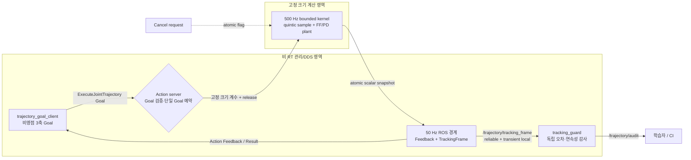

# 2026-09-25 — 3축 비영점 5차 궤적, Action 허용오차, RT 경계

## 오늘의 핵심 요약

- **기초 실무:** ROS 2 Action의 Goal/Feedback/Result/Cancel 수명주기와 “동시에 한 Goal” 정책, 실행 허용오차의 의미를 익힌다.
- **심화·RT:** 동적 메모리·DDS가 있는 50 Hz 관리 경로와 `std::array`/atomic만 쓰는 500 Hz 계산 경로를 분리한다. 절대 시각 sleep, `mlockall`, `SCHED_FIFO` 요청도 코드로 확인한다.
- **알고리즘:** 세 관절 각각에 대해 비영점 시작/종료 위치·속도·가속도를 만족하는 정규화 5차 다항식을 만들고, feed-forward+PD 모의 plant로 추종한다.
- **검증:** Action client와 별도 `tracking_guard`가 각각 Result와 원시 추종 frame을 검사한다. 한쪽의 자기보고만으로 PASS를 만들지 않는다.

> 이 패키지는 수치 커널과 ROS 경계를 학습하는 모의 환경이다. 일반 Linux, ROS executor, DDS, 모의 plant 전체의 hard real-time이나 실제 로봇의 기능 안전을 보증하지 않는다. 실장비에는 PREEMPT_RT, CPU/IRQ 격리, WCET 측정, hardware watchdog, STO, 관절/토크/충돌 제한이 별도로 필요하다.

## 학습 순서 (Reading Order)

1. 아래 구조도에서 **Action 관리 경로**와 **500 Hz 계산 경로**를 분리해 본다.
2. [`action/ExecuteJointTrajectory.action`](action/ExecuteJointTrajectory.action)에서 Goal/Result/Feedback 계약을 읽는다.
3. [`src/trajectory_goal_client.cpp`](src/trajectory_goal_client.cpp)에서 비영점 3축 경계조건과 비동기 Action callback을 확인한다.
4. [`src/bounded_trajectory_server.cpp`](src/bounded_trajectory_server.cpp)에서 계수 생성 → release/acquire handoff → 절대 주기 루프 → 50 Hz 직렬화 순서를 따라간다.
5. [`src/tracking_guard.cpp`](src/tracking_guard.cpp)에서 서버 Result와 독립된 합격 조건을 확인한다.
6. [`paper_review.md`](paper_review.md)를 읽고 오늘의 “고정 시간 다항식”과 Bobrow 등의 “동역학 제약 시간최적화”를 비교한다.
7. 누적 노트 [`비영점 5차 궤적`](../../knowledge/control/nonzero_boundary_quintic.md), [`Action–제어 경계`](../../knowledge/realtime/action_control_boundary.md), [`ROS 2 Actions`](../../knowledge/ros2/actions.md)를 복습한다.

## 시스템 구조

아래 Mermaid는 GitHub에서 바로 읽는 요약이며, 확대·검색·경로 강조가 필요한 경우 [`architecture.html`](architecture.html)을 연다. 작성 내용은 한국어지만 Archify viewer의 고정 UI는 영어로 표시된다.



핵심은 Action 자체를 “RT API”로 착각하지 않는 것이다. Goal에는 문자열/공유 포인터/ROSIDL 객체가 있고 Feedback publish는 DDS 직렬화와 잠금을 포함할 수 있다. 서버는 Goal을 받은 일반 callback에서 18개 경계값을 3×6 고정 계수로 바꾸고, 마지막에 `control_active_.store(true, release)`로 계산 스레드에 공개한다. 계산 스레드는 `acquire`로 이를 본 뒤 GoalHandle이나 ROS publisher에 접근하지 않는다.

## 1. 기초 실무 — Action 실행 계약

Topic 명령은 fire-and-forget에 적합하지만 실행 수락, 진행률, 취소, 최종 성공/실패를 한 계약으로 묶지 않는다. 궤적 실행은 시간이 걸리고 허용오차가 중요하므로 Action이 자연스럽다.

| 단계 | 오늘 코드의 정책 | 실무 질문 |
|---|---|---|
| Goal | 유한값, 상태 범위, `T∈[0.5,10] s`, 허용오차 검사 | 잘못된 명령을 하드웨어에 쓰기 전에 막는가? |
| Accepted | 세 관절 계수를 비 RT callback에서 미리 계산 | 제어 루프 안에서 행렬 분해/할당을 하지 않는가? |
| Feedback | 500 Hz 중 최신 snapshot만 50 Hz로 전달 | UI 주기와 제어 주기를 불필요하게 같게 만들지 않았는가? |
| Cancel | atomic 요청을 계산 tick 경계에서 확인 | “Cancel 수락”과 “물리적으로 안전 정지”의 차이를 정의했는가? |
| Result | 종료 위치 오차가 Goal tolerance 이하일 때만 성공 | 완료와 성공을 구분하고 원인을 남기는가? |

오늘의 Cancel은 다음 tick에서 실행을 끝내는 교육용 의미다. 실제 로봇은 현재 속도/가속도에서 제한을 지키며 정지하는 별도 braking trajectory와 드라이브 watchdog이 필요하다.

## 2. 알고리즘 — 비영점 경계조건 5차 다항식

각 관절에 대해 정규화 시간 `s=t/T`와 다음 다항식을 쓴다.

\[
q(s)=c_0+c_1s+c_2s^2+c_3s^3+c_4s^4+c_5s^5
\]

시작 조건으로 바로 정해지는 항은 다음과 같다.

\[
c_0=q_0,\qquad c_1=T\dot q_0,\qquad c_2=\frac{T^2\ddot q_0}{2}
\]

종료 잔차를 `A=q_f-(c0+c1+c2)`, `B=T v_f-(c1+2c2)`, `C=T² a_f-2c2`로 두면:

\[
c_3=10A-4B+\frac{C}{2},\quad
c_4=-15A+7B-C,\quad
c_5=6A-3B+\frac{C}{2}
\]

코드의 `sample_quintic()`은 `q`, `dq/ds`, `d²q/ds²`를 Horner 형식으로 계산한 뒤 각각 `1/T`, `1/T²`를 적용해 실제 속도와 가속도로 되돌린다. 세 관절은 같은 `T`를 써서 동시에 끝나지만, 이것만으로 속도·가속도·jerk·토크 제한을 만족하는 것은 아니다.

## 3. 심화·RT — 두 주기의 이유

### 500 Hz 계산 경로

- `std::array`만 사용하고 실행 중 컨테이너 크기를 바꾸지 않는다.
- `clock_nanosleep(..., TIMER_ABSTIME, ...)`으로 이전 tick 지연이 다음 deadline에 누적되지 않게 한다.
- Goal 객체가 아니라 미리 계산한 `FixedPlan`만 한 번 복사한다.
- ROS publish, 로그, mutex, `new/delete`를 호출하지 않는다.
- `qdd_cmd = qdd_des + Kp(q_des-q) + Kd(v_des-v)`를 계산하고 한 tick 모의 plant를 적분한다.

### 50 Hz 관리 경로

- atomic scalar snapshot을 `TrackingFrame`과 Action Feedback으로 직렬화한다.
- `GoalHandle`과 Result 상태 전이는 일반 executor에서만 다룬다.
- 문자열, shared pointer, DDS publish 비용은 이 경로에 남긴다.

`mlockall`과 `SCHED_FIFO`는 권한이 있어야 성공한다. 성공해도 WCET, 캐시/IRQ 간섭, DDS, 장치 버스까지 자동으로 hard RT가 되는 것은 아니다. 코드가 출력하는 lateness는 단일 실행의 관측값이지 최악 실행시간 증명이 아니다.

## 4. 독립 검증 조건

`tracking_guard`는 Action Result payload를 구독하지 않는다. 대신 `/trajectory/tracking_frame`에서 다음을 다시 계산한다.

- 표본 80개 이상, 모든 수치가 finite
- `control_ticks`가 단조 증가
- 첫/마지막 목표 속도가 0이 아님
- 인접 50 Hz 목표 위치 jump가 `0.08 rad` 이하
- 서버 보고 오차와 `|q_des-q_actual|` 재계산 값의 차이가 `1e-9 rad` 이하
- 목표 종점 오차 `1e-6 rad` 이하, 실제 종점 오차 `0.025 rad` 이하

## 5. 빌드와 실행

Ubuntu 24.04 + ROS 2 Jazzy 기준:

```bash
source /opt/ros/jazzy/setup.bash
colcon --log-base log/2026-09-25 build \
  --base-paths daily_robotics/2026-09-25 \
  --build-base build/2026-09-25 \
  --install-base install/2026-09-25 \
  --event-handlers console_direct+
source install/2026-09-25/setup.bash
ros2 launch daily_robotics_2026_09_25 daily_demo.launch.py
```

별도 터미널에서 통합 검증:

```bash
bash daily_robotics/2026-09-25/scripts/smoke_test.sh
```

예상 종료 표식은 `CLIENT_PASS`와 `/trajectory/audit`의 `AUDIT_PASS`다. 숫자는 호스트 부하와 스케줄러에 따라 달라지므로 README의 예시보다 PASS 조건과 원시 로그를 우선한다.

## 6. 검증 결과 (2026-09-25)

- 공식 `ros:jazzy-ros-base` 컨테이너, GCC 13.3에서 `colcon build`가 compiler warning 없이 통과했다.
- 최종 smoke test를 서로 다른 `ROS_DOMAIN_ID`로 4회 연속 실행했고 모두 Action/세 노드 발견, `CLIENT_PASS`, `AUDIT_PASS`를 만족했다.
- 최종 네 실행은 `1301~1302` control ticks, `130~131` Action feedback, `131~132` audit samples를 기록했다.
- 네 실행의 최대 추종 오차는 `0.001699~0.001700 rad`, 최대 50 Hz 목표 step은 `0.016793~0.016802 rad`, terminal 오차는 `0.000226~0.000426 rad`였다.
- 관측된 최대 wake-up lateness는 `0.471~0.689 ms`였다. 이는 컨테이너 일반 스케줄러에서 얻은 표본이며 WCET나 hard-RT 보증이 아니다.
- 컨테이너에서는 `mlockall`이 memlock 제한으로, `SCHED_FIFO`가 권한 부족으로 실패했고 서버가 이를 경고한 뒤 일반 스케줄러로 실행했다.
- 반복 검증 중 첫 control tick 전 zero snapshot이 발행될 수 있는 race와 DDS discovery를 고정 1초로 가정한 smoke-test race를 발견했다. telemetry 초기화/sequence snapshot과 최대 5초 bounded graph polling으로 수정한 뒤 위 4회 연속 PASS를 얻었다.
- Archify 구조도는 showcase 검사 `9/9`, composition 오류/경고 `0/0`으로 통과했다. specification SHA-256은 `288dfcc4e3535de048f9b7a4e95bc0d11aaf53ae7c87e697601348c3fcbd74d2`, HTML SHA-256은 `8857feffae11973b75fd683a8f46c3a680df3dd3b1ad8580b59aa098b62cf72a`다.
- 브라우저 자동 검사는 1440×900, 1600×1000, 1920×1080, 2048×1320에서 overflow·readability·viewer chrome을 통과했다. 1440 light와 2048 dark 캡처도 직접 확인해 노드/라벨 겹침과 잘림이 없음을 확인했다.

## 실무 확장 과제

1. custom Action을 `control_msgs/action/FollowJointTrajectory`로 바꾸고 path/goal tolerance를 관절별로 적용한다.
2. Cancel 시 즉시 종료하지 말고 현재 `(q,v,a)`에서 jerk/acceleration 제한 정지 궤적을 다시 만든다.
3. `FixedPlan` handoff를 두 슬롯 generation buffer로 확장해 명시적인 선점 정책을 구현한다.
4. 모의 plant 대신 `ros2_control` state/command interface를 연결하되 RT loop 안에서 ROS 메시지를 만들지 않는다.
5. `cyclictest`, `ros2_tracing`, page fault counters로 지연 분포를 수집하고 worst observed와 WCET 주장을 구분한다.

## 참고 자료

- [ROS 2 Jazzy — C++ Action server/client tutorial](https://docs.ros.org/en/jazzy/Tutorials/Intermediate/Writing-an-Action-Server-Client/Cpp.html)
- [ROS 2 Jazzy — Understanding real-time programming](https://docs.ros.org/en/jazzy/Tutorials/Demos/Real-Time-Programming.html)
- [ros2_control Jazzy — joint_trajectory_controller](https://control.ros.org/jazzy/doc/ros2_controllers/joint_trajectory_controller/doc/userdoc.html)
- [rclcpp_action C++ API](https://docs.ros2.org/latest/api/rclcpp_action/)
- [Bobrow, Dubowsky, Gibson (1985) 원문 PDF](https://jebobrow.eng.uci.edu/sites/default/files/IJRR1985.PDF)
- [DOI: 10.1177/027836498500400301](https://doi.org/10.1177/027836498500400301)
