# 2026-09-26 — Wrench·Jacobian 정역학, Bounded 접촉력 QP, 전신 제어 감사

## 오늘의 핵심 요약

오늘은 “상위 제어기가 요구한 로봇 전체 힘/모멘트를 두 발이 각각 얼마씩 만들어야 하는가?”를 ROS 2 실습으로 연결한다.

| 영역 | 오늘 배우는 것 | 구현에서 확인할 지점 |
|---|---|---|
| 기초 실무 | `geometry_msgs/WrenchStamped`, 좌표계가 있는 힘/토크, `tau = J^T f` | `wrench_command_publisher.cpp`, `whole_body_auditor.cpp` |
| 심화·RT | ROS callback과 200 Hz 수치 커널 분리, 고정 배열, SPSC queue, 64회 고정 반복, solver 잔차/제약/시간 공개 | `bounded_contact_allocator.cpp` |
| 알고리즘 | 마찰 원뿔과 수직력 상·하한을 가진 다중 접촉 힘 분배 QP | `solve()`, `project_contact()` |

핵심 메시지는 단순하다. **QP가 숫자를 반환했다는 사실은 안전성의 증거가 아니다.** 반복 상한, 최적성 잔차, 제약 위반, 입력 신선도, 독립 재계산을 함께 계약으로 만들어야 제품 코드가 된다.

## 학습 순서 (Reading Order)

1. 이 문서의 구조도와 “문제 모델”을 읽어 Topic과 수식의 연결을 잡는다.
2. [`src/wrench_command_publisher.cpp`](src/wrench_command_publisher.cpp)에서 `WrenchStamped`, frame, stamp를 확인한다.
3. [`src/bounded_contact_allocator.cpp`](src/bounded_contact_allocator.cpp)의 `multiply_wrench_map()` → `gradient()` → `project_contact()` → `solve()` 순서로 읽는다.
4. [`src/whole_body_auditor.cpp`](src/whole_body_auditor.cpp)에서 `w = Af` 독립 재계산과 `tau = J^T f`를 따라간다.
5. [`paper_review.md`](paper_review.md)에서 Khatib의 operational space가 왜 “관절”보다 “작업 힘/운동”을 중심에 두는지 읽는다.
6. 누적 노트인 [`knowledge/dynamics/centroidal_wrench_and_jacobian_transpose.md`](../../knowledge/dynamics/centroidal_wrench_and_jacobian_transpose.md), [`knowledge/control/multicontact_force_qp.md`](../../knowledge/control/multicontact_force_qp.md), [`knowledge/realtime/bounded_qp_solver_diagnostics.md`](../../knowledge/realtime/bounded_qp_solver_diagnostics.md)를 복습한다.
7. 빌드와 smoke test를 실행한 뒤 `/wbc/contact_solution`의 residual, constraint violation, solve time을 직접 비교한다.

## 시스템 아키텍처

```mermaid
flowchart LR
    CMD["wrench_command_publisher<br/>20 Hz non-RT"]
    SUB["ROS subscription callback<br/>message → fixed command"]
    CQ[("SPSC command queue<br/>16 fixed slots")]
    QP["200 Hz numerical kernel<br/>std::array + 64 iterations<br/>projected-gradient QP"]
    SQ[("SPSC solution queue<br/>64 fixed slots")]
    PUB["50 Hz non-RT publisher<br/>ROS message conversion"]
    AUD["whole_body_auditor<br/>independent w=Af<br/>tau=Jᵀf"]
    FEET["left/right foot wrench<br/>JointState effort"]
    SAFE["/wbc/safe<br/>/wbc/audit"]

    CMD -->|"/wbc/desired_wrench<br/>WrenchStamped"| SUB
    SUB --> CQ
    CQ --> QP
    QP --> SQ
    SQ --> PUB
    PUB -->|"/wbc/contact_solution<br/>ContactSolution"| AUD
    PUB -->|"left/right WrenchStamped"| FEET
    AUD -->|"sensor_msgs/JointState"| FEET
    AUD --> SAFE

    classDef rt fill:#5b2333,color:#fff,stroke:#ff9db6,stroke-width:2px;
    classDef queue fill:#183c5a,color:#fff,stroke:#7fd4ff,stroke-width:2px;
    class QP rt;
    class CQ,SQ queue;
```



실선의 앞뒤가 모두 같은 시간 특성을 갖는 것은 아니다. DDS 수신과 publish는 non-RT 경로다. 가운데 계산 커널만 고정 크기 데이터와 고정 반복 횟수를 사용한다. 따라서 이 예제는 **bounded numerical kernel**을 보여 주지만, PREEMPT_RT 설정과 WCET 분석까지 끝난 hard real-time 시스템이라고 주장하지 않는다.

## 1. 기초 실무: Wrench와 Jacobian transpose

### Wrench의 좌표계

`geometry_msgs/msg/Wrench`는 선형 힘 `force`와 모멘트 `torque`를 담는다. `WrenchStamped`를 쓰면 `header.frame_id`와 `stamp`가 추가된다. 같은 숫자 `[10, 0, 0] N`도 `base_link` 기준인지 `left_foot` 기준인지에 따라 뜻이 달라지므로 frame 없는 힘은 실무에서 위험하다.

오늘 목표는 `base_link` 질량중심 기준 평면 wrench다.

```text
w_des = [Fx, Fz, tau_y]^T
```

각 발 접촉력은 다음 순서로 쌓는다.

```text
f = [Fx_left, Fz_left, Fx_right, Fz_right]^T
```

### 힘에서 관절 토크로

발 위치의 미소 변화가 `dx = J dq`이면 가상일은 다음과 같다.

```text
tau^T dq = f^T dx = f^T J dq
tau = J^T f
```

즉 Jacobian transpose는 작업공간 접촉력을 관절 일반화 힘으로 옮긴다. 오늘 auditor는 평면 2R 다리 두 개에 이 식을 적용해 네 관절의 `JointState.effort`를 발행한다. 실제 로봇에서는 중력·관성·마찰 보상과 actuator sign convention이 더 필요하다.

## 2. 알고리즘: 두 발 접촉력 QP

접점 위치를 질량중심 기준 `r=(x, 0, -h)`라고 하면 `r × F`의 y 성분은 다음이다.

```text
tau_y = -h Fx - x Fz
```

왼발 `x=-a`, 오른발 `x=+a`를 합치면 `w = A f`다.

```text
     [ 1    0    1    0 ]
A =  [ 0    1    0    1 ]
     [-h   +a   -h   -a ]
```

오늘 QP는 목표 wrench 오차와 이전 해 대비 힘 변화량을 최소화한다.

```text
min_f  1/2 ||A f - w_des||²_W + lambda/2 ||f - f_prev||²

subject to
  Fz_min <= Fz_i <= Fz_max
  |Fx_i| <= mu Fz_i       for i in {left, right}
```

`|Fx| <= mu Fz`는 발이 미끄러지지 않는다고 가정하는 평면 Coulomb friction cone이다. 3D에서는 원뿔 또는 선형화한 friction pyramid, CoP, torsional friction, 접촉 활성 상태가 추가된다.

구현은 `alpha = 1/L`인 projected gradient를 정확히 64회 수행한다. 각 step 뒤 `(Fx,Fz)`를 잘린 마찰 원뿔 사다리꼴의 네 변에 투영하고 가장 가까운 후보를 선택한다. 변수나 제약 수가 데이터에 따라 늘지 않아 한 tick의 연산 상한을 읽을 수 있다.

## 3. RT 관점: 무엇이 bounded인가

- 수치 커널의 모든 벡터와 행렬은 `std::array`이며 solve 중 heap 할당이 없다.
- 반복 수는 수렴 여부와 무관하게 항상 64회다. worst-case 경로가 데이터 의존적으로 길어지지 않는다.
- ROS callback → 커널, 커널 → ROS publisher는 고정 용량 SPSC queue로 분리된다.
- queue가 꽉 차면 대기하지 않고 drop counter를 증가시킨다. 정책의 손실을 숨기지 않는다.
- `sleep_until` 절대 주기로 누적 drift를 줄이고, 심한 overrun 뒤 밀린 tick 폭주를 막는다.
- `projected_gradient_norm`, `wrench_residual`, `max_constraint_violation`, `solve_time_us`, drop 수, atomic index lock-free 여부를 메시지로 내보낸다.

주의할 점도 분명하다.

- `std::atomic<T>`는 모든 플랫폼에서 무조건 lock-free가 아니다. 그래서 실행 시 `is_lock_free()` 결과를 공개한다.
- ROS publish, logging, `JointState` vector 생성은 non-RT 경로에 남겨 두었다.
- 평균 또는 관측 최대 시간은 WCET가 아니다. CPU isolation, page fault, cache interference, IRQ, thermal throttling을 포함한 별도 검증이 필요하다.
- 고정 반복은 “항상 최적”을 뜻하지 않는다. 종료 시 residual과 feasibility를 소비자가 검사해야 한다.

## Topic 계약

| Topic | Type | 생산자 → 소비자 | 의미 |
|---|---|---|---|
| `/wbc/desired_wrench` | `geometry_msgs/WrenchStamped` | command → allocator | `base_link` 기준 목표 `[Fx,Fz,tau_y]` |
| `/wbc/contact_solution` | `ContactSolution` | allocator → auditor | 좌/우 힘, achieved wrench, QP 진단 |
| `/wbc/left_contact_wrench` | `geometry_msgs/WrenchStamped` | allocator → tools | `left_foot` 접촉력 |
| `/wbc/right_contact_wrench` | `geometry_msgs/WrenchStamped` | allocator → tools | `right_foot` 접촉력 |
| `/wbc/joint_effort` | `sensor_msgs/JointState` | auditor → tools | `J^T f`로 계산한 4개 관절 effort |
| `/wbc/safe` | `std_msgs/Bool` | auditor → supervisor | 샘플 단위 독립 안전 판정 |
| `/wbc/audit` | `std_msgs/String` | auditor → operator/test | 40개 이상 샘플의 종합 PASS/FAIL |

## 빌드와 실행

ROS 2 Jazzy workspace 루트에서 실행한다.

```bash
source /opt/ros/jazzy/setup.bash
colcon build \
  --base-paths daily_robotics/2026-09-26 \
  --build-base build/2026-09-26 \
  --install-base install/2026-09-26
source install/2026-09-26/setup.bash
ros2 launch daily_robotics_2026_09_26 daily_demo.launch.py
```

다른 터미널에서 관찰한다.

```bash
source /opt/ros/jazzy/setup.bash
source install/2026-09-26/setup.bash
ros2 topic echo /wbc/contact_solution
ros2 topic echo /wbc/audit --qos-reliability reliable --qos-durability transient_local
```

자동 smoke test:

```bash
bash daily_robotics/2026-09-26/scripts/smoke_test.sh
```

## 자체 검증 결과

공식 `ros:jazzy-ros-base` 컨테이너(GCC 13.3, Fast DDS)에서 검증했다.

- `colcon build`: 성공, `-Wall -Wextra -Wpedantic` compiler warning 없음
- 3개 노드와 7개 `/wbc/*` Topic discovery: 성공
- generated `ContactSolution` type support: 성공
- 64회 고정 반복과 양발 마찰/수직력 제약: 확인
- 통합 smoke: `AUDIT_PASS`, 136개 표본, 최대 독립 wrench residual `0.0804725`, 최대 constraint violation `0`
- 관측 solve time: 대표 표본 `8.503 us`, 해당 실행 최대 `52.481 us`
- SPSC atomic index: 해당 x86_64 컨테이너에서 `lock_free=true`
- `J^T f` 네 관절 토크: 모든 표본 finite

이 시간은 일반 Docker 환경의 관측값이며 hard-RT 보장이나 WCET 증명이 아니다.

## 실습 확장 과제

1. 목표 `Fx`를 마찰 한계 밖으로 보내 residual은 커지지만 constraint violation은 0으로 유지되는지 본다.
2. 한 발의 `Fz_max`를 낮춰 하중 이동과 infeasible 목표를 관찰한다.
3. 3D 변수 `[Fx,Fy,Fz,Mx,My,Mz]`와 friction pyramid/CoP 제약으로 확장한다.
4. contact state를 추가하고 double support → single support 전환 때 warm start를 어떻게 초기화할지 설계한다.
5. `ros2_tracing`으로 callback→queue→solve→publish end-to-end latency를 측정한다.

## 참고 자료

- [ROS 2 Jazzy `geometry_msgs/Wrench`](https://docs.ros.org/en/jazzy/p/geometry_msgs/msg/Wrench.html)
- [ROS 2 Jazzy `sensor_msgs/JointState`](https://docs.ros.org/en/jazzy/p/sensor_msgs/msg/JointState.html)
- [ROS 2 QoS concepts](https://docs.ros.org/en/jazzy/Concepts/Intermediate/About-Quality-of-Service-Settings.html)
- [ros2_control Jazzy `realtime_tools`](https://control.ros.org/jazzy/doc/realtime_tools/doc/index.html)
- [Khatib, 1987, 원문 PDF](https://khatib.stanford.edu/publications/pdfs/Khatib_1987_RA.pdf)
- [DOI: 10.1109/JRA.1987.1087068](https://doi.org/10.1109/JRA.1987.1087068)
