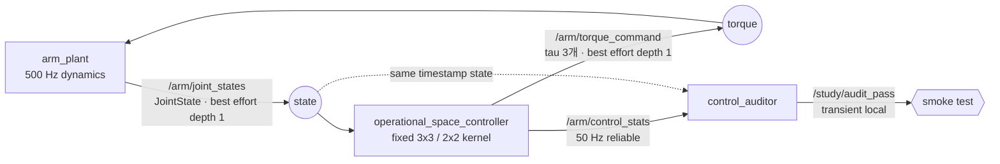

# 2026-09-28 — Operational-Space 제어와 동적 일관 Null-Space

> **오늘의 핵심:** ROS 2 `JointState` 피드백으로 3-DoF 평면 팔의 손끝 2D 원 궤적을 추종하고, 남는 1 자유도는 주 작업을 방해하지 않는 자세 제어에 사용한다. 500 Hz 수치 경로는 고정 크기 3×3/2×2 배열과 유한 반복만 사용하며, 별도 감사 노드가 동일 timestamp의 원본 상태로 FK·추종 오차·null-space leakage·실행시간을 재검산한다.

## 학습 순서 (Reading Order)

1. 이 문서의 **ROS 통신 구조**에서 세 노드와 네 topic의 책임을 먼저 본다.
2. [`arm_model.hpp`](include/daily_robotics_2026_09_28/arm_model.hpp)에서 `M(q)`, `J(q)`, `J_dot*q_dot`이 코드로 옮겨지는 방식을 읽는다.
3. [`arm_plant.cpp`](src/arm_plant.cpp)에서 `JointState` 배열 계약과 `M q_ddot + bias = tau` 적분을 확인한다.
4. [`operational_space_controller.cpp`](src/operational_space_controller.cpp)에서 `Lambda`, `J_bar`, `N^T`를 순서대로 추적한다.
5. [`control_auditor.cpp`](src/control_auditor.cpp)에서 제어 경로 밖의 독립 검증 기준을 확인한다.
6. [`paper_review.md`](paper_review.md)에서 이 단순한 고정베이스 실습이 multi-contact whole-body control로 어떻게 확장되는지 읽는다.

## 오늘의 세 영역

### 1) 기초 실무 — `JointState`와 topic 계약

- `sensor_msgs/msg/JointState`의 `name[i]`, `position[i]`, `velocity[i]`, `effort[i]`는 같은 관절을 가리켜야 한다.
- controller와 auditor는 배열 순서를 가정하지 않고 `joint_1..3` 이름으로 인덱스를 찾는다.
- `Header.stamp`는 상태가 유효한 측정 시각이며, 감사 노드는 이 stamp가 정확히 같은 원본 상태와 통계를 짝짓는다.
- 빠른 상태/토크 경로는 `best_effort + keep_last(1)`, 50 Hz 감사 통계는 `reliable + keep_last(10)`을 쓴다.
- `Float64MultiArray`는 길이를 강제하지 않으므로 plant가 매번 정확히 3개인지 검사한다. 제품 코드에서는 typed command interface나 고정 길이 custom message가 더 안전하다.

### 2) 심화 및 RT — 고정 크기 커널과 특이점 감독

- 핵심 계산은 `std::array` 기반 3×3, 2×3, 2×2 행렬뿐이며 동적 크기 선형대수 객체를 만들지 않는다.
- 3×3/2×2 역행렬은 연산 수가 고정된 닫힌형 계산이고, determinant 하한을 통과하지 못하면 bias 보상만 내보낸다.
- `det(J M^-1 J^T)`가 작으면 `lambda^2 I` 감쇠를 켜 역행렬 폭주를 억제하고, 활성 여부를 통계에 남긴다.
- 500 Hz 상태마다 제어하지만 통계 직렬화는 10샘플마다 한 번만 수행해 수치 경로와 관측 경로를 분리한다.
- pre-sized ROS 메시지를 재사용하지만 `rclcpp::publish`, DDS, OS scheduler까지 allocation-free/WCET임을 증명한 것은 아니다. 이 실습은 **구조적 결정론 학습**이지 hard-RT 인증이 아니다.

### 3) 로보틱스 알고리즘 — Operational Space + Null Space

로봇 관절 동역학과 말단 기구학을 다음처럼 둔다.

```text
M(q) q_ddot + bias(q, q_dot) = tau
x_dot  = J(q) q_dot
x_ddot = J(q) q_ddot + J_dot(q, q_dot) q_dot
```

작업공간 관성, 동적 일관 generalized inverse, null-space projector는 다음과 같다.

```text
Lambda  = (J M^-1 J^T + lambda^2 I)^-1
J_bar   = M^-1 J^T Lambda
N^T     = I - J^T J_bar^T

a*      = x_ddot_d + Kd(x_dot_d - x_dot) + Kp(x_d - x) - J_dot q_dot
tau     = bias + J^T Lambda a* + N^T tau_0
```

`tau_0`는 home posture를 향한 관절 PD 토크다. 비감쇠·full-rank 조건에서는
`J M^-1 N^T tau_0 = 0`이므로, 보조 자세 토크가 주 작업 말단 가속도에 영향을 주지 않는다. 코드의 `nullspace_leakage`는 바로 이 식의 노름을 측정한다.

## ROS 통신 구조



더 자세한 상호작용형 구조도는 [`architecture/architecture.html`](architecture/architecture.html)에서 볼 수 있다. 작성 내용은 한국어/영문 식별자를 혼용하며, 뷰어 고정 UI는 영어로 표시된다.

## 노드별 책임

| 노드 | 입력 | 출력 | 실패 시 동작 |
|---|---|---|---|
| `arm_plant` | 3개 토크 | `JointState` | 100 ms command timeout이면 현재 `bias` 토크로 자세 유지 |
| `operational_space_controller` | `JointState` | torque, `ControlStats` | `M`/작업 관성 역행렬 실패 시 유한한 bias-only command |
| `control_auditor` | 원본 상태, 통계 | latched pass | 30개 연속 정상 샘플 전에는 PASS를 내지 않음 |

감사기는 controller의 FK 함수를 재사용하지 않는다. 64칸 고정 ring에서 같은 timestamp의 `q`를 찾고 독립식으로 말단 위치를 다시 계산한다. 따라서 controller 내부 통계만 믿는 자기검증보다 오류 공통 원인이 작다.

## 빌드와 실행

ROS 2 Jazzy 작업공간의 `src/` 아래에 이 저장소가 있다고 가정한다.

```bash
source /opt/ros/jazzy/setup.bash
colcon build --packages-select daily_robotics_2026_09_28 \
  --cmake-args -DCMAKE_BUILD_TYPE=RelWithDebInfo
source install/setup.bash
ros2 launch daily_robotics_2026_09_28 study.launch.py
```

별도 터미널에서 관측한다.

```bash
source /opt/ros/jazzy/setup.bash
source install/setup.bash
ros2 topic echo /arm/control_stats
bash src/RoboticsStudy/daily_robotics/2026-09-28/test/smoke_test.sh
```

## 자체 검증 결과

- 환경: 공식 `ros:jazzy-ros-base`, GCC 13.3, Fast DDS, `RelWithDebInfo`.
- `-Wall -Wextra -Wpedantic -Wconversion -Wshadow` 조건에서 compiler warning 없이 `colcon build` 통과.
- 통합 smoke는 ROS domain 136–139에서 4회 연속 통과했다. 반복 기록은 추종 오차 `0.000003–0.000004 m`, null-space leakage `0.99e-7–1.04e-7`, `det(JM^-1J^T)=2.075089–2.082032`, 토크 노름 `25.744–25.813 Nm`, 전체 관측 최대 controller callback `47.875 us`였고 singularity guard는 정상 궤적에서 비활성이었다.
- acceptance: 동일 timestamp FK 오차 `<1e-9 m`, 보고 오차 재계산 차이 `<1e-9 m`, 추종 오차 `<0.045 m`, leakage `<0.05`, callback `<5 ms`인 샘플 30개 연속.
- 위 시간은 Docker에서 관측한 표본 최대값이다. 부하를 포함한 WCET, deadline guarantee, PREEMPT_RT 증거가 아니다.

## 파일 지도

```text
2026-09-28/
├── README.md
├── paper_review.md
├── CMakeLists.txt / package.xml
├── architecture/architecture.{json,html}
├── include/.../arm_model.hpp
├── msg/ControlStats.msg
├── src/arm_plant.cpp
├── src/operational_space_controller.cpp
├── src/control_auditor.cpp
├── launch/study.launch.py
└── test/smoke_test.sh
```

## 다음 실무 확장

1. `Float64MultiArray`를 `ros2_control` effort interface와 `controller_interface::ControllerInterface`로 교체한다.
2. 완전한 `C(q,q_dot)q_dot` 모델, 관절 마찰 식별, actuator saturation/rate limit을 추가한다.
3. determinant 한 값 대신 singular value/condition number로 방향별 조작성 저하를 진단한다.
4. torque saturation이 걸려도 task priority가 유지되도록 hierarchical QP나 SNS를 적용한다.
5. `SCHED_FIFO`, memory locking, tracing, cyclic latency 측정과 독립 hardware stop을 결합한다.

## 참고 자료

- ROS 2 Jazzy [`sensor_msgs/JointState`](https://docs.ros.org/en/jazzy/p/sensor_msgs/msg/JointState.html)
- ROS 2 Jazzy [QoS concepts](https://docs.ros.org/en/jazzy/Concepts/Intermediate/About-Quality-of-Service-Settings.html)
- ROS 2 [Executors concept](https://docs.ros.org/en/jazzy/Concepts/Intermediate/About-Executors.html)
- ROS 2 [Real-time programming demo](https://docs.ros.org/en/jazzy/Tutorials/Demos/Real-Time-Programming.html)
- Khatib et al. (2022), [Constraint-consistent task-oriented whole-body robot formulation](https://doi.org/10.1177/02783649221120029)
- Khatib (1993), [The Operational Space Framework](https://doi.org/10.1299/jsmec1993.36.277)
