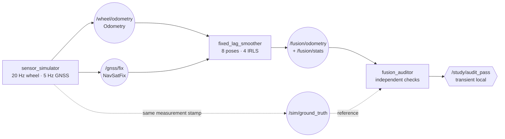

# 2026-09-29 — GNSS/오도메트리 강건 Fixed-Lag 팩터 그래프

> **오늘의 핵심:** `Odometry`와 `NavSatFix`의 측정 시각·frame·covariance 계약을 지키고, wheel odometry 상대 factor와 GNSS 절대 factor를 8-pose 고정 지연 창에서 결합한다. 최대 16×16 고정 배열, 4회 IRLS, Schur complement marginalization으로 계산 상한을 두며, Huber loss가 주기적인 약 10 m GNSS 이상치를 약화하는지 별도 감사 노드가 검증한다.

## 학습 순서 (Reading Order)

1. 이 문서의 **ROS 통신 구조**에서 측정 경로와 독립 감사 경로를 구분한다.
2. [`sensor_simulator.cpp`](src/sensor_simulator.cpp)에서 `Odometry`/`NavSatFix` stamp, frame, covariance가 채워지는 위치를 본다.
3. [`fixed_lag_smoother.cpp`](src/fixed_lag_smoother.cpp)에서 GNSS local ENU 변환과 stamp association 계약을 확인한다.
4. [`fixed_lag_solver.hpp`](include/daily_robotics_2026_09_29/fixed_lag_solver.hpp)에서 factor 조립 → Huber IRLS → 고정 크기 선형 풀이 → Schur marginalization 순서로 읽는다.
5. [`fusion_auditor.cpp`](src/fusion_auditor.cpp)에서 estimator 밖의 ground-truth 오차와 실행 상한 검증을 확인한다.
6. [`paper_review.md`](paper_review.md)에서 오늘의 작은 dense fixed-lag 실습과 iSAM2 Bayes tree의 차이를 읽는다.

## 오늘의 세 영역

### 1) 기초 실무 — `Odometry`, `NavSatFix`, 측정 시각 계약

- `nav_msgs/msg/Odometry.header.frame_id`는 pose가 표현된 frame, `child_frame_id`는 움직이는 body frame이다. 이 실습의 wheel pose는 `odom → base_link`다.
- `sensor_msgs/msg/NavSatFix.header.stamp`는 DDS 도착 시각이 아니라 GNSS 측정 시각이다. covariance는 안테나 frame의 ENU convention을 따르며 `[0]`, `[4]`, `[8]`이 east/north/up 분산이다.
- 두 센서는 arrival 순서 대신 `Header.stamp`가 60 ms 이내인 state와 짝짓는다. 초과 표본은 “가장 가까우니 사용”하지 않고 거부한다.
- 작은 지역에서만 위경도를 local ENU로 근사한다. 넓은 지도, 극지방, 고도까지 포함하면 GeographicLib 또는 `navsat_transform_node`와 정확한 datum/TF 관리가 필요하다.
- covariance가 “숫자 하나”가 아니라 factor의 정보 행렬 `Ω=Σ⁻¹`을 결정하므로, 단위·축·frame 오류는 추정기의 신뢰 비율을 직접 망가뜨린다.

### 2) 심화 및 RT — 고정 용량 smoother와 수치 감독

- 활성 pose는 최대 8개, 변수는 `[x,y]×8=16`, Hessian은 최대 16×16이다. `std::array`만 써 수치 hot path의 크기를 컴파일 때 고정한다.
- Huber weight를 갱신하는 IRLS는 정확히 4회다. 선형 풀이는 부분 pivot Gaussian elimination으로 최대 16 pivot만 처리한다.
- 창이 가득 차면 가장 오래된 pose를 단순 삭제하지 않고 `H_m=H_rr-H_ro H_oo⁻¹ H_or` Schur complement로 다음 pose에 Gaussian prior를 남긴다.
- pivot 비율 proxy, 최신 marginal variance, 최대 solve 시간, association/rejection/outlier/marginalization 횟수를 `FusionStats`로 내보낸다.
- 고정 배열과 유한 반복은 **계산량 상한을 설계**한 것이지 DDS publish, executor scheduling, OS page fault까지 포함한 allocation-free/WCET 증명은 아니다.

### 3) 로보틱스 알고리즘 — Robust Fixed-Lag Factor Graph

활성 위치 `x_i=[x_i,y_i]ᵀ`에 대해 prior, wheel odometry, GNSS factor를 합친다.

```text
x* = arg min_x  ||x_0-μ_0||²_P
                + Σ ||(x_i-x_{i-1})-Δz_i^odom||²_Ωodom
                + Σ ρ_Huber(||x_i-z_i^gnss||_Ωgnss)
```

GNSS normalized residual `s=||r||/σ`에 대한 IRLS weight는 다음과 같다.

```text
w(s) = 1          (s ≤ δ)
       δ / s      (s > δ),  δ=2
```

따라서 큰 GNSS residual은 완전히 삭제되지는 않지만 normal equation에 들어가는 정보량이 `wΩ`로 줄어든다. 창 밖 상태는 Schur complement로 요약되므로 메모리는 일정하지만, 오래된 비선형 정보를 현재 선형화점의 Gaussian prior로 압축하면서 생기는 일관성 손실은 별도로 관리해야 한다.

## ROS 통신 구조



더 자세한 상호작용형 구조도는 [`architecture/architecture.html`](architecture/architecture.html)에서 볼 수 있다. 작성 내용은 한국어와 코드 식별자를 혼용하며, 뷰어 고정 UI는 영어로 표시된다.

## 노드별 책임과 실패 처리

| 노드 | 입력 | 출력 | 경계/실패 처리 |
|---|---|---|---|
| `sensor_simulator` | 50 ms wall timer | odom, GNSS, truth | 매 6번째 GNSS에 의도적 `(8,-6) m` 이상치 |
| `fixed_lag_smoother` | odom, GNSS | fused odom, stats | 60 ms 초과 pair 거부, non-finite 거부, 수치 실패 시 publish 중단 |
| `fusion_auditor` | fused odom, stats, truth | latched PASS | 같은 stamp만 비교하고 모든 acceptance 조건이 충족될 때만 PASS |

`SingleThreadedExecutor`가 smoother의 odometry/GNSS callback을 순차 실행한다. `MultiThreadedExecutor`로 바꾸면 두 callback이 같은 solver 상태를 동시에 수정하지 않도록 callback group 또는 명시적 동기화가 필요하다.

## 빌드와 실행

ROS 2 Jazzy 작업공간의 `src/` 아래에 이 저장소가 있다고 가정한다.

```bash
source /opt/ros/jazzy/setup.bash
colcon build --packages-select daily_robotics_2026_09_29 \
  --cmake-args -DCMAKE_BUILD_TYPE=RelWithDebInfo
source install/setup.bash
ros2 launch daily_robotics_2026_09_29 study.launch.py
```

별도 터미널에서 통계와 통합 검증을 본다.

```bash
source /opt/ros/jazzy/setup.bash
source install/setup.bash
ros2 topic echo /fusion/stats
bash src/RoboticsStudy/daily_robotics/2026-09-29/test/smoke_test.sh
```

## 자체 검증 결과

- 환경: 공식 `ros:jazzy-ros-base`, GCC 13.3, Fast DDS, `RelWithDebInfo`.
- `-Wall -Wextra -Wpedantic -Wconversion -Wshadow` 조건에서 compiler warning 없이 `colcon build` 통과.
- 통합 smoke는 ROS domain 140–143에서 4회 연속 PASS했다. 각 run은 70개 timestamp-matched 표본을 사용했고, 평균 위치 오차 `0.270034–0.292880 m`, 최대 오차 `0.545096–0.549945 m`, marginalization `62–65`회, Huber로 약화된 이상치 `2–3`개, 관측 최소 weight `0.081195–0.081252`, 최대 solve `11.297–21.495 us`, 최신 x/y 분산 `0.051875–0.065519 m²`였다.
- acceptance: 8-pose/4-IRLS 고정, marginalization ≥50, GNSS association ≥15, downweighted outlier ≥2, reject=0, 최소 weight `<0.2`, pair skew `≤60 ms`, 양의 finite variance, solve `<5 ms`, 평균 오차 `<0.45 m`, 최대 오차 `<0.90 m`.
- solve 시간은 이 Docker 실행의 표본 최대값이며 WCET 또는 hard-RT 보장이 아니다.
- Archify 구조도는 showcase 9/9 검사, 오류/경고 0으로 통과했다. 1440×900, 1600×1000, 1920×1080, 2048×1320 light/dark 브라우저 containment가 통과했고, 1440 light와 2048 dark 캡처를 육안 확인했다.

## 파일 지도

```text
2026-09-29/
├── README.md / paper_review.md
├── CMakeLists.txt / package.xml
├── architecture/architecture.{json,html}
├── include/.../fixed_lag_solver.hpp
├── msg/FusionStats.msg
├── src/sensor_simulator.cpp
├── src/fixed_lag_smoother.cpp
├── src/fusion_auditor.cpp
├── launch/study.launch.py
└── test/smoke_test.sh
```

## 실무 확장과 한계

1. 평면 `[x,y]`를 SE(2)/SE(3) manifold pose로 확장하고 IMU preintegration, camera reprojection factor를 추가한다.
2. dense elimination을 sparse Cholesky/QR, GTSAM iSAM2/Bayes tree로 교체해 큰 그래프의 affected clique만 갱신한다.
3. 단일 Huber threshold 대신 sensor health, innovation χ² gate, switchable constraint, max-mixture를 비교한다.
4. covariance를 message 값 그대로 신뢰하지 말고 NIS/NEES, Allan variance, bag replay로 보정한다.
5. fixed-lag prior의 linearization point 이동과 first-estimate Jacobian/observability 문제를 시험한다.
6. 실제 RT 목표에서는 estimator thread와 ROS serialization을 분리하고 `mlockall`, scheduler, tracing, deadline miss fallback을 함께 설계한다.

## 참고 자료

- ROS 2 Jazzy [`nav_msgs/Odometry`](https://docs.ros.org/en/jazzy/p/nav_msgs/msg/Odometry.html)
- ROS 2 Jazzy [`sensor_msgs/NavSatFix`](https://docs.ros.org/en/jazzy/p/sensor_msgs/msg/NavSatFix.html)
- ROS 2 Jazzy [QoS concepts](https://docs.ros.org/en/jazzy/Concepts/Intermediate/About-Quality-of-Service-Settings.html)
- ROS 2 Jazzy [`message_filters` ApproximateTime](https://docs.ros.org/en/ros2_packages/jazzy/api/message_filters/doc/Tutorials/Approximate-Synchronizer-Cpp.html)
- Kaess et al. (2012), [iSAM2: Incremental Smoothing and Mapping Using the Bayes Tree](https://doi.org/10.1177/0278364911430419)
- GTSAM [`IncrementalFixedLagSmoother`](https://gtsam.org/doxygen/a05927.html)
