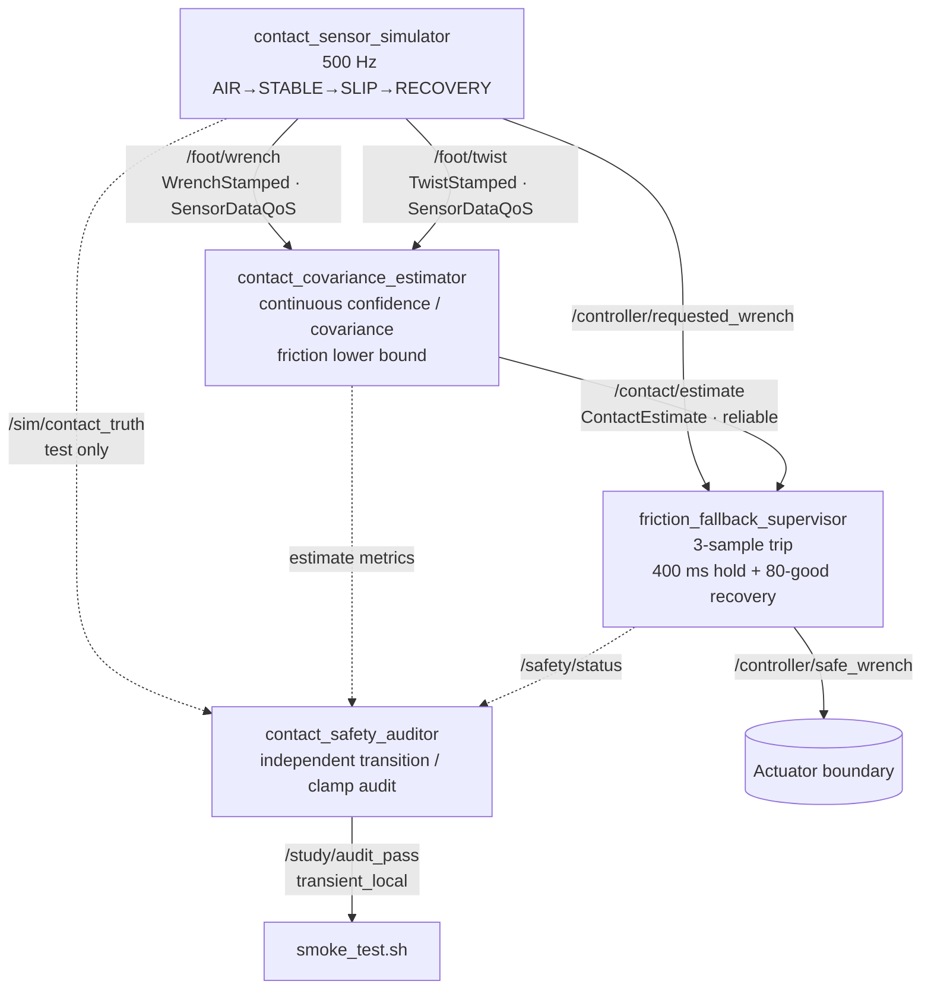

# 2026-09-30 — 연속 접촉 공분산과 마찰 여유 폴백

## 오늘의 핵심

오늘은 발 접촉을 단순한 `contact=true/false`로 자르지 않고, **접촉 확률과 속도 분산을 연속값으로 전달**한다. 그 위에서 마찰계수의 보수적 하한을 추정하고, 독립 감독기가 `mu_lower * F_n - |F_t|` 여유를 검사하여 slip 때 명령을 차단한다.

- 기초 실무: `WrenchStamped`/`TwistStamped`의 `header.stamp`, `frame_id`, SensorDataQoS 계약
- 심화·RT: 500 Hz 고정 상태 EWMA 커널, 상수 시간 분기, 3-sample trip + hold/recovery hysteresis
- 알고리즘: 연속 접촉 confidence/covariance, Coulomb friction margin, 독립 safety audit
- 논문: RSS 2026 **CoCo-InEKF** — binary contact를 learned continuous contact velocity covariance로 바꾸는 관점

> 이 예제의 EWMA/시그모이드 추정기는 논문의 신경망+InEKF를 재현한 것이 아니다. 논문의 핵심 설계 원리인 “접촉 불확실성을 연속 covariance로 필터에 전달”을 작은 C++ 커널로 학습하기 위한 축약 모델이다.

## 학습 순서 (Reading Order)

1. [paper_review.md](paper_review.md)에서 binary contact의 한계와 covariance의 역할을 이해한다.
2. `msg/*.msg`에서 추정기와 감독기 사이의 고정 크기 계약을 확인한다.
3. `contact_sensor_simulator.cpp`에서 stamp/frame과 Coulomb slip 시나리오를 읽는다.
4. `contact_covariance_estimator.cpp`에서 접촉 확률, EWMA 분산, 마찰 하한 수식을 코드와 연결한다.
5. `friction_fallback_supervisor.cpp`에서 debounce/hold/recovery와 force clamp를 추적한다.
6. `contact_safety_auditor.cpp`와 `test/smoke_test.sh`로 자기 보고가 아닌 독립 검증을 확인한다.

## 시스템 아키텍처



안전 경계는 다음 순서다.

```text
requested F_t ── clamp(|F_t| <= max(0, μ_lower F_n - 5 N)) ── safe F_t
                           │
              SLIP / stale / margin<5 N
                           ▼
                    FALLBACK: F_t = 0
```

## 수식과 코드 연결

접촉 확률은 정상력에 대한 부드러운 sigmoid다.

```text
p_contact = 1 / (1 + exp(-(F_n - 20) / 6))
```

이진 threshold와 달리 `p_contact≈0.5`인 애매한 표본을 숨기지 않는다. 발 속도 covariance는 접촉 불확실성과 slip 속도에 따라 증가한다.

```text
sigma_v² = 1e-5 + (1 - p_contact) * 0.04 + |v_slip|²
```

고정 메모리 EWMA는 마찰 evidence의 평균/분산을 추적한다.

```text
mu_mean <- mu_mean + alpha * (evidence - mu_mean)
sigma_mu² <- (1-alpha) sigma_mu² + alpha (evidence - mu_mean_old)²
mu_lower = clamp(mu_mean - 2 sigma_mu, 0.05, 1.20)
margin = mu_lower F_n - |F_t|
```

`alpha`는 정상 접촉에서 0.03, slip에서 0.35다. 위험은 빨리 반영하고 정상 복귀는 천천히 확인하는 비대칭 설계다.

## ROS 2/API 포인트

- `WrenchStamped`: 힘/토크 값뿐 아니라 **측정 시각과 표현 좌표계**가 계약의 일부다. frame이 다른 힘을 그대로 비교하면 물리적으로 틀리다.
- `SensorDataQoS`: best-effort와 작은 history로 최신 센서 표본을 우선한다. 안전 상태와 명령은 reliable QoS로 분리했다.
- `rclcpp::Time(...).nanoseconds()`: 두 topic의 동일 물리 표본을 3 ms 이내로 pairing한다.
- `rclcpp::spin`: 각 노드의 `SingleThreadedExecutor`가 callback을 순차 실행하므로 이 실습의 latest-message 멤버에는 mutex가 필요 없다.
- `transient_local`: 감사 PASS를 한 번만 발행해도 늦게 시작한 smoke subscriber가 마지막 값을 수신한다.

## 빌드 및 실행

ROS 2 Jazzy workspace의 `src` 아래에 이 폴더를 패키지로 놓았다고 가정한다.

```bash
colcon build --packages-select daily_robotics_2026_09_30 --event-handlers console_direct+
source install/setup.bash
ros2 launch daily_robotics_2026_09_30 study.launch.py
```

다른 터미널에서 핵심 출력과 검증을 본다.

```bash
source install/setup.bash
ros2 topic echo /contact/estimate daily_robotics_2026_09_30/msg/ContactEstimate
ros2 topic echo /safety/status daily_robotics_2026_09_30/msg/SafetyStatus
ros2 run daily_robotics_2026_09_30 smoke_test.sh
```

## 기대 관찰

- AIR에서 감독기는 `DISARMED(0)`이며 허용 접선력은 0 N이다.
- 안정 접촉 100 ms 뒤 `ACTIVE(1)`로 전환하고 보수 한계 안에서 명령을 통과시킨다.
- 마찰 저하로 slip이 생기면 3개 연속 위험 표본 뒤 `FALLBACK(2)`으로 전환한다.
- 최소 400 ms hold와 80개 연속 정상 표본 뒤 `ACTIVE`로 복귀한다.
- 감사기는 contact/slip/fallback/recovery, 30 ms 이내 trip, 한계 초과 0회, callback/age 상한을 모두 확인해야 PASS한다.

측정된 callback 시간은 특정 Docker 실행의 관찰값일 뿐 WCET나 hard real-time 보증이 아니다. 실제 제품은 PREEMPT_RT, CPU isolation, priority, page locking, DDS 설정과 HIL fault injection을 별도로 검증해야 한다.

## 자체 검증 결과

공식 `ros:jazzy-ros-base` 컨테이너(GCC 13.3, Fast DDS)에서 `colcon build`가 compiler warning 없이 통과했다. ROS domain 148~151의 네 번 연속 smoke run도 모두 PASS했다.

- accepted sample: 4,808~4,879개
- fallback trip: 매 run 정확히 1회, recovery 관찰
- 위험 slip 시작 → fallback: 23.997~24.074 ms
- estimator callback 관찰 최대: 8.547~22.837 us
- force clamp 위반 / fallback 중 non-zero 출력: 0회
- paired sensor skew 관찰 최대: 2.591~2.757 ms (계약 3 ms 이하)
- estimate sample age 관찰 최대: 1.424~2.354 ms (감독 deadline 20 ms 이하)

이 값은 컨테이너에서 얻은 표본 범위이며 WCET/hard-RT 증명이 아니다.

## 파일 지도

```text
2026-09-30/
├── CMakeLists.txt
├── package.xml
├── README.md
├── paper_review.md
├── launch/study.launch.py
├── msg/{ContactEstimate,ContactTruth,SafetyStatus}.msg
├── src/
│   ├── contact_sensor_simulator.cpp
│   ├── contact_covariance_estimator.cpp
│   ├── friction_fallback_supervisor.cpp
│   └── contact_safety_auditor.cpp
└── test/smoke_test.sh
```

## 참고 자료

- [ROS 2 Jazzy QoS concepts](https://docs.ros.org/en/jazzy/Concepts/Intermediate/About-Quality-of-Service-Settings.html)
- [rclcpp SensorDataQoS API](https://docs.ros.org/en/jazzy/p/rclcpp/generated/classrclcpp_1_1SensorDataQoS.html)
- [ROS 2 Jazzy Executors](https://docs.ros.org/en/jazzy/Concepts/Intermediate/About-Executors.html)
- [geometry_msgs/WrenchStamped message](https://docs.ros.org/en/jazzy/p/geometry_msgs/msg/WrenchStamped.html)
- [CoCo-InEKF, arXiv:2605.15122](https://arxiv.org/abs/2605.15122)
- [CoCo-InEKF HTML full text](https://arxiv.org/html/2605.15122)
