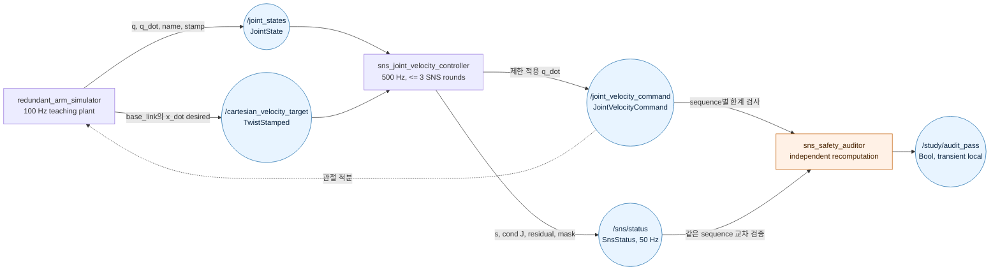

# 2026-10-01 — ROS 2 SNS 관절 속도 제한과 조건수 감시

## 오늘의 핵심 요약

- **기초 실무:** `JointState.name/stamp/position`, `TwistStamped.frame_id`, custom message의 `Header + sequence`, 최신값 중심 QoS 계약을 연결한다.
- **심화/RT:** 500 Hz 경로를 2×3/3×3 `std::array`, 최대 3회 active-set 반복, 10:1 진단 decimation으로 제한하고 stale/NaN/rank 실패 시 0 명령으로 폴백한다.
- **알고리즘:** 중복 3R 팔에서 Saturation in the Null Space(SNS)가 관절 속도 한계를 넘는 축을 고정한 뒤 남은 null space를 쓰고, 불가능할 때만 Cartesian 목표를 `s∈[0,1]`로 축소한다.
- **안전 검증:** 별도 노드가 동일 sequence의 명령/진단을 짝지어 관절 한계와 `J(q)q_dot`, task scale residual을 독립 재계산한다.

> 이 실습의 “bounded”는 배열 크기와 SNS 반복 횟수가 정해졌다는 뜻이다. 일반 Linux, ROS executor, DDS를 포함한 hard real-time/WCET 보장은 아니다.

## 학습 순서 (Reading Order)

1. 아래 구조도에서 세 노드와 네 Topic의 책임을 파악한다.
2. [메시지 정의](msg/JointVelocityCommand.msg)와 [진단 정의](msg/SnsStatus.msg)에서 cross-topic `sequence` 계약을 읽는다.
3. [시뮬레이터](src/redundant_arm_simulator.cpp)에서 `JointState`, `TwistStamped`, QoS와 폐루프 연결을 본다.
4. [SNS 제어기](src/sns_joint_velocity_controller.cpp)에서 `q_dot(s)=a s+b`, active set, 조건수 guard를 수식과 코드로 연결한다.
5. [독립 감사기](src/sns_safety_auditor.cpp)에서 실행 경로의 계산을 믿지 않고 다시 검증하는 패턴을 익힌다.
6. [논문 리뷰](paper_review.md)로 원 논문의 다중 task/최적 변형과 이 교육용 구현의 차이를 확인한다.

## ROS 2 통신 구조



상세 탐색용 인터랙티브 구조도 원본은 [`architecture_archify.json`](architecture_archify.json)이며, `architecture.html`은 같은 topology를 Archify로 검증한 산출물이다.

## 1. ROS 메시지 계약

### `sensor_msgs/msg/JointState`

- `name[i]`, `position[i]`, `velocity[i]`는 같은 관절을 뜻한다.
- 배열 순서를 하드코딩하지 않고 `joint_1..3` 이름으로 위치를 찾는다.
- 상태는 최신값 하나가 중요하므로 `SensorDataQoS().keep_last(1)`을 사용한다.

### `geometry_msgs/msg/TwistStamped`

- `header.frame_id="base_link"`는 선속도 `(vx, vy)`가 base 좌표계 표현임을 뜻한다.
- stamp 없는 `Twist` 대신 `TwistStamped`를 써서 시간과 좌표계 계약을 함께 전달한다.
- 이 예제는 선속도 x/y만 지원하고 다른 frame과 NaN/Inf는 거부한다.

### custom command/status

서로 다른 Topic은 DDS에서 하나의 원자적 묶음이 아니다. 그래서 명령과 상태에 같은 `sequence`를 넣고 감사기는 64칸 고정 ring에서 같은 번호끼리만 비교한다. `Header.stamp`는 생성 시각, `sequence`는 cross-topic 결합 키다.

## 2. SNS 수학과 코드

3R 평면 팔의 미분 기구학은 다음과 같다.

```text
x_dot = J(q) q_dot,    J in R^(2x3)
-q_dot_limit <= q_dot <= q_dot_limit
```

포화된 관절 속도를 `q_N`, 아직 쓸 수 있는 관절의 대각 선택 행렬을 `W`라 하면, 한 active set에서 Damped Least Squares 해는 다음처럼 task scale `s`의 affine 함수다.

```text
q_dot(s) = q_N + W J^T (J W J^T + lambda^2 I)^-1 (s x_dot_d - J q_N)
         = a s + b
```

각 관절의 `-limit_i <= a_i s+b_i <= limit_i`가 만드는 구간을 교차하면 현재 active set의 가장 큰 실행 가능 `s`를 얻는다. SNS는 다음을 최대 3회 반복한다.

1. 현재 active set에서 가장 큰 실행 가능 scale과 명령을 저장한다.
2. `s=1` 해가 모두 한계 안이면 원래 작업을 그대로 실행한다.
3. 아니면 정규화 위반 `|q_dot_i|/limit_i`가 가장 큰 자유 관절을 해당 한계에 고정한다.
4. 남은 관절만으로 rank 2를 유지하지 못하면 지금까지 저장한 최선의 scaled 해를 반환한다.

마지막 `std::clamp`는 수치 오차에 대한 방어선일 뿐 알고리즘 대신 사후 포화만 하는 구조가 아니다. 단순 사후 포화는 `J q_dot`의 방향까지 바꿀 수 있다.

## 3. 조건수와 특이점 guard

`J J^T`의 두 고유값을 `lambda_max`, `lambda_min`이라 하면:

```text
cond(J) = sqrt(lambda_max / lambda_min)
```

`cond(J)>20`이면 `lambda=1e-4`의 작은 DLS 수치 guard를 켠다. 작은 singular direction의 관절 속도 폭주를 줄이는 대신 `||J q_dot - s x_dot_d||`가 0이 아닐 수 있다. 그래서 `condition_number`, `singularity_guard_active`, `scaled_residual_m_s`를 함께 기록한다. determinant 하나만으로는 축척과 방향별 취약성을 충분히 설명할 수 없다.

## 4. 실시간 설계 체크포인트

- 제어 수치 경로는 `std::array`만 사용하고 크기 변경/동적 컨테이너를 쓰지 않는다.
- active-set 반복 상한은 관절 수와 같은 3회다.
- 입력이 100 ms보다 오래되거나 rank/역행렬/finite 검사가 실패하면 0 속도로 폴백한다.
- 명령은 500 Hz, 상세 상태는 50 Hz로 내보내 serialization/관측 부하를 분리한다.
- `steady_clock` 실행시간은 관측치다. scheduling wakeup latency, page fault, DDS 지연을 포함한 WCET가 아니다.
- 실제 RT 시스템에서는 ROS callback → 고정 queue → RT thread → 고정 queue → ROS publisher 경계와 PREEMPT_RT/CPU affinity/메모리 고정 검증을 추가한다.

## 5. 빌드 및 실행

ROS 2 Jazzy가 source된 shell에서 저장소 루트 기준:

```bash
colcon build --packages-select daily_robotics_2026_10_01 --event-handlers console_direct+
source install/setup.bash
ros2 launch daily_robotics_2026_10_01 study.launch.py
```

다른 shell에서 핵심 값을 확인한다.

```bash
source install/setup.bash
ros2 topic echo /sns/status daily_robotics_2026_10_01/msg/SnsStatus --once
ros2 topic echo /study/audit_pass std_msgs/msg/Bool --once
```

통합 smoke test:

```bash
source install/setup.bash
ros2 run daily_robotics_2026_10_01 smoke_test.sh
```

`build/`, `install/`, `log/`는 루트 `.gitignore` 대상이며 커밋하지 않는다.

## 6. 검증 결과

공식 `ros:jazzy-ros-base` 컨테이너(GCC 13.3, Fast DDS)에서 다음을 확인했다.

- custom message 2개와 C++ 실행 파일 3개의 `colcon build` 성공, compiler warning 없음
- 실제 launch에서 80개 sequence-matched 독립 감사 샘플 통과
- `min_task_scale=0.0126`, `max_condition=38.71`, `max_scaled_residual=0.00012 m/s`
- 관측 최대 수치 커널 실행시간 `48.93 us`, 관절 속도 한계 위반 0건
- 제공된 `smoke_test.sh`가 `SMOKE_PASS` 반환
- Archify 구조도 showcase 검사 9/9, 0 errors/warnings; 1440×900~2048×1320 light/dark browser containment 및 시각 검토 통과

수치는 한 번의 Docker smoke run 관측값이라 실행마다 달라질 수 있고, WCET/hard-RT 보장이 아니다.

## 7. 실무 한계와 확장 과제

- 교육용 plant는 속도를 Euler 적분하고 기계적 관절 stop만 적용할 뿐 motor inertia, torque, friction, latency를 모델링하지 않는다.
- 구현은 하나의 2D velocity task와 고정 대칭 joint velocity bound만 다룬다.
- 원 논문의 다중 우선순위 task, 가속도/position-derived bound, 최적 SNS/QP 변형은 구현하지 않았다.
- 실무에서는 position/velocity/acceleration/torque/rate bound를 제어 주기마다 일관되게 변환하고, bound가 급변하지 않도록 검증해야 한다.
- 다음 단계는 primary Cartesian task를 유지하면서 secondary posture task를 넣고 lexicographic hierarchy를 독립 감사하는 것이다.

## 레퍼런스

- [ROS 2 Jazzy `sensor_msgs/JointState`](https://docs.ros.org/en/jazzy/p/sensor_msgs/msg/JointState.html)
- [ROS 2 Jazzy `geometry_msgs/TwistStamped`](https://docs.ros.org/en/jazzy/p/geometry_msgs/msg/TwistStamped.html)
- [ROS 2 QoS 정책 개념](https://docs.ros.org/en/jazzy/Concepts/Intermediate/About-Quality-of-Service-Settings.html)
- [ROS 2 Executors 개념](https://docs.ros.org/en/jazzy/Concepts/Intermediate/About-Executors.html)
- [Flacco, De Luca, Khatib, IEEE TRO 2015, DOI](https://doi.org/10.1109/TRO.2015.2418582)
- [Sapienza 연구 저장소의 논문 서지·postprint](https://hdl.handle.net/11573/780461)
